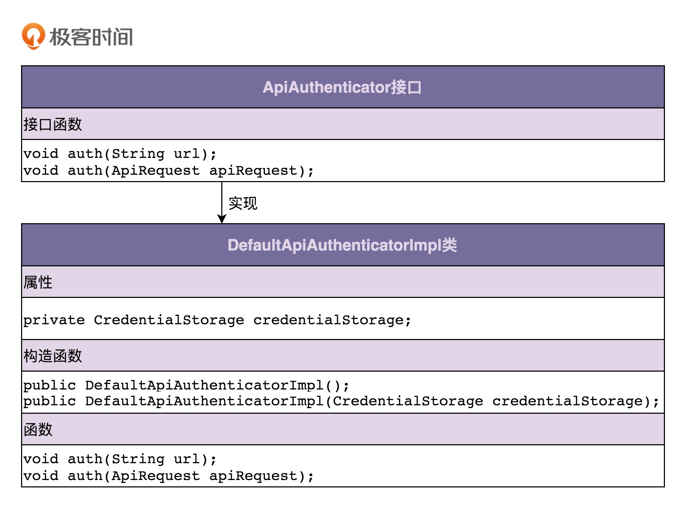
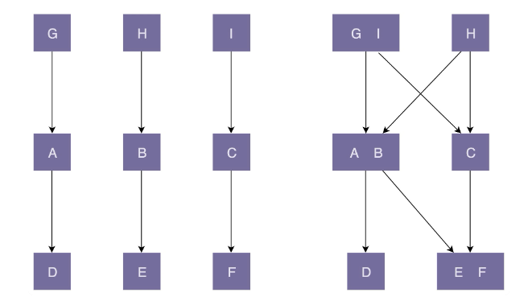

# 设计模式之美

# 编写高质量代码


关于面向对象、设计原则、设计模式、编程规范和代码重构，这五者的关系我总结梳理一下。

- 面向对象编程因为其具有丰富的特性（封装、抽象、继承、多态），可以实现很多复杂的设计思路，是很多设计原则、设计模式等编码实现的基础。
- 设计原则是指导我们代码设计的一些经验总结，对于某些场景下，是否应该应用某种设计模式，具有指导意义。比如，“开闭原则”是很多设计模式（策略、模板等）的指导原则。
- 设计模式是针对软件开发中经常遇到的一些设计问题，总结出来的一套解决方案或者设计思路。应用设计模式的主要目的是提高代码的可扩展性。从抽象程度上来讲，设计原则比设计模式更抽象。设计模式更加具体、更加可执行。
- 编程规范主要解决的是代码的可读性问题。编码规范相对于设计原则、设计模式，更加具体、更加偏重代码细节、更加能落地。持续的小重构依赖的理论基础主要就是编程规范。
- 重构作为保持代码质量不下降的有效手段，利用的就是面向对象、设计原则、设计模式、编码规范这些理论。


# 什么是面向对象

1. 什么是面向对象编程？

   面向对象编程是一种编程范式或编程风格。它以类或对象作为组织代码的基本单元，并将封装、抽象、继承、多态四个特性，作为代码设计和实现的基石 。

2.  什么是面向对象编程语言？

   面向对象编程语言是支持类或对象的语法机制，并有现成的语法机制，能方便地实现面向对象编程四大特性（封装、抽象、继承、多态）的编程语言。

3. 如何判定一个编程语言是否是面向对象编程语言？

   如果按照严格的的定义，需要有现成的语法支持类、对象、四大特性才能叫作面向对象编程语言。如果放宽要求的话，只要某种编程语言支持类、对象语法机制，那基本上就可以说这种编程语言是面向对象编程语言了，不一定非得要求具有所有的四大特性。

4. 面向对象编程和面向对象编程语言之间有何关系？

   面向对象编程一般使用面向对象编程语言来进行，但是，不用面向对象编程语言，我们照样可以进行面向对象编程。反过来讲，即便我们使用面向对象编程语言，写出来的代码也不一定是面向对象编程风格的，也有可能是面向过程编程风格的。

5. 什么是面向对象分析和面向对象设计？

   简单点讲，面向对象分析就是要搞清楚做什么，面向对象设计就是要搞清楚怎么做。两个阶段最终的产出是类的设计，包括程序被拆解为哪些类，每个类有哪些属性方法、类与类之间如何交互等等。


# 封装、抽象、继承、多态

## 封装

> 是什么

封装也叫作信息隐藏或者数据访问保护。


> 怎么实现

类通过暴露有限的访问接口，授权外部仅能通过类提供的方式（或者叫函数）来访问内部信息或者数据。

对于封装这个特性，我们需要编程语言本身提供一定的语法机制来支持。这个语法机制就是访问权限控制


> 为什么

如果我们对类中属性的访问不做限制，那任何代码都可以访问、修改类中的属性，虽然这样看起来更加灵活，但从另一方面来说，过度灵活也意味着不可控，属性可以随意被以各种奇葩的方式修改，而且修改逻辑可能散落在代码中的各个角落，势必影响代码的可读性、可维护性

除此之外，类仅仅通过有限的方法暴露必要的操作，也能提高类的易用性。

如果我们把类属性都暴露给类的调用者，调用者想要正确地操作这些属性，就势必要对业务细节有足够的了解。而这对于调用者来说也是一种负担。

相反，如果我们将属性封装起来，暴露少许的几个必要的方法给调用者使用，调用者就不需要了解太多背后的业务细节，用错的概率就减少很多。


## 抽象

> 是什么

抽象讲的是如何隐藏方法的具体实现，让调用者只需要关心方法提供了哪些功能，并不需要知道这些功能是如何实现的。


> 怎么实现

在面向对象编程中，我们常借助编程语言提供的接口类（比如 Java 中的 interface 关键字语法）或者抽象类（比如 Java 中的 abstract 关键字语法）这两种语法机制，来实现抽象这一特性。

这个很好理解，比如下面这个接口

```java
public interface IPictureStorage {
  void savePicture(Picture picture);
  Image getPicture(String pictureId);
  void deletePicture(String pictureId);
  void modifyMetaInfo(String pictureId, PictureMetaInfo metaInfo);
}

public class PictureStorage implements IPictureStorage {
  // ...省略其他属性...
  @Override
  public void savePicture(Picture picture) { ... }
  @Override
  public Image getPicture(String pictureId) { ... }
  @Override
  public void deletePicture(String pictureId) { ... }
  @Override
  public void modifyMetaInfo(String pictureId, PictureMetaInfo metaInfo) { ... }
}
```

对于这个接口类，我们不用管他具体的实现方式，只需要知道他有什么方法（当然，具体到开发，建议稍微看看，防止被坑）

实际上，我们甚至可以不要这个接口类（IPictureStorage），对于单纯的 PictureStorage 类本身就满足抽象特性。

因为，类的方法是通过编程语言中的“函数”这一语法机制来实现的。

通过函数包裹具体的实现逻辑，这本身就是一种抽象。调用者在使用函数的时候，并不需要去研究函数内部的实现逻辑，只需要通过函数的命名、注释或者文档，了解其提供了什么功能，就可以直接使用了。

比如，我们在使用 C 语言的 malloc() 函数的时候，并不需要了解它的底层代码是怎么实现的。

所以，这也就是为什么抽象他并不是面向对象的特性之一，因为他仅需要提供“函数”这一非常基础的语法机制，就可以实现抽象特性


> 为什么

其实在开发过程中，我们往往需要调一下其他的接口，我们需要用到他，但是对区其具体的实现并不是很在意，这些对我们来说，就是一些非关键性的实现细节，而抽象作为一种只关注功能点不关注实现的设计思路，正好帮我们的过滤掉许多非必要的信息。

除此之外，抽象作为一个非常宽泛的设计思想，在代码设计中，起到非常重要的指导作用。

很多设计原则都体现了抽象这种设计思想，比如基于接口而非实现编程、开闭原则（对扩展开放、对修改关闭）、代码解耦（降低代码的耦合性）等。

换一个角度来考虑，我们在定义（或者叫命名）类的方法的时候，也要有抽象思维，不要在方法定义中，暴露太多的实现细节，以保证在某个时间点需要改变方法的实现逻辑的时候，不用去修改其定义。

举个简单例子，比如 getAliyunPictureUrl() 就不是一个具有抽象思维的命名，因为某一天如果我们不再把图片存储在阿里云上，而是存储在私有云上，那这个命名也要随之被修改。相反，如果我们定义一个比较抽象的函数，比如叫作 getPictureUrl()，那即便内部存储方式修改了，我们也不需要修改命名。


## 继承

> 是什么

继承是用来表示类之间的 is-a 关系，比如猫是一种哺乳动物

。从继承关系上来讲，继承可以分为两种模式，单继承和多继承。

- 单继承表示一个子类只继承一个父类
- 多继承表示一个子类可以继承多个父类，比如猫既是哺乳动物，又是爬行动物。


> 怎么实现

对于Java来说，java使用 extends 关键字来实现继承，并只能实现单继承

但是对于C++来说，确实可以实现多继承的。


> 为什么

继承最大的一个好处就是代码复用。

假如两个类有一些相同的属性和方法，我们就可以将这些相同的部分，抽取到父类中，让两个子类继承父类。

这样，两个子类就可以重用父类中的代码，避免代码重复写多遍。

不过，这一点也并不是继承所独有的，我们也可以通过其他方式来解决这个代码复用的问题，比如利用组合关系而不是继承关系。

对于继承来说，他是非常符合我们人类的思维，比如猫属于哺乳动物，对于我们来说，是一种is a 的关系

继承的概念很好理解，也很容易使用。

不过，过度使用继承，继承层次过深过复杂，就会导致代码可读性、可维护性变差。

为了了解一个类的功能，我们不仅需要查看这个类的代码，还需要按照继承关系一层一层地往上查看“父类、父类的父类……”的代码。

还有，子类和父类高度耦合，修改父类的代码，会直接影响到子类。

所以这也就是为什么一直在倡导多组合少继承，这个问题我们往后看


## 多态

> 是什么

多态是指，子类可以替换父类


> 怎么实现

在实际的代码运行过程中，调用子类的方法实现。

这个其实我们举一个例子看一下就明白了

比如动物的叫声，对于羊来说，是咩咩咩；对于狗来说，就是汪汪汪；这其实就是多态的表现形式

看一个具体的例子

```java
public class DynamicArray {
  private static final int DEFAULT_CAPACITY = 10;
  protected int size = 0;
  protected int capacity = DEFAULT_CAPACITY;
  protected Integer[] elements = new Integer[DEFAULT_CAPACITY];
  
  public int size() { return this.size; }
  public Integer get(int index) { return elements[index];}
  //...省略n多方法...
  
  public void add(Integer e) {
    ensureCapacity();
    elements[size++] = e;
  }
  
  protected void ensureCapacity() {
    //...如果数组满了就扩容...代码省略...
  }
}

public class SortedDynamicArray extends DynamicArray {
  @Override
  public void add(Integer e) {
    ensureCapacity();
    int i;
    for (i = size-1; i>=0; --i) { //保证数组中的数据有序
      if (elements[i] > e) {
        elements[i+1] = elements[i];
      } else {
        break;
      }
    }
    elements[i+1] = e;
    ++size;
  }
}

public class Example {
  public static void test(DynamicArray dynamicArray) {
    dynamicArray.add(5);
    dynamicArray.add(1);
    dynamicArray.add(3);
    for (int i = 0; i < dynamicArray.size(); ++i) {
      System.out.println(dynamicArray.get(i));
    }
  }
  
  public static void main(String args[]) {
    DynamicArray dynamicArray = new SortedDynamicArray();
    test(dynamicArray); // 打印结果：1、3、5
  }
}
```

多态这种特性也需要编程语言提供特殊的语法机制来实现。

- 第一个语法机制是编程语言要支持父类对象可以引用子类对象，也就是可以将 SortedDynamicArray 传递给 DynamicArray。
- 第二个语法机制是编程语言要支持继承，也就是 SortedDynamicArray 继承了 DynamicArray，才能将 SortedDyamicArray 传递给 DynamicArray。
- 第三个语法机制是编程语言要支持子类可以重写（override）父类中的方法，也就是 SortedDyamicArray 重写了 DynamicArray 中的 add() 方法。

通过这三种语法机制配合在一起，我们就实现了在 test() 方法中，子类 SortedDyamicArray 替换父类 DynamicArray，执行子类 SortedDyamicArray 的 add() 方法，也就是实现了多态特性。

对于多态特性的实现方式，除了利用“继承加方法重写”这种实现方式之外，我们还有其他两种比较常见的的实现方式，一个是利用接口类语法，另一个是利用 duck-typing 语法（python）。


接下来，我们先来看如何利用接口类来实现多态特性。

```java
public interface Iterator {
  boolean hasNext();
  String next();
  String remove();
}

public class Array implements Iterator {
  private String[] data;
  
  public boolean hasNext() { ... }
  public String next() { ... }
  public String remove() { ... }
  //...省略其他方法...
}

public class LinkedList implements Iterator {
  private LinkedListNode head;
  
  public boolean hasNext() { ... }
  public String next() { ... }
  public String remove() { ... }
  //...省略其他方法... 
}

public class Demo {
  private static void print(Iterator iterator) {
    while (iterator.hasNext()) {
      System.out.println(iterator.next());
    }
  }
  
  public static void main(String[] args) {
    Iterator arrayIterator = new Array();
    print(arrayIterator);
    
    Iterator linkedListIterator = new LinkedList();
    print(linkedListIterator);
  }
}
```

在这段代码中，Iterator 是一个接口类，定义了一个可以遍历集合数据的迭代器。

Array 和 LinkedList 都实现了接口类 Iterator。我们通过传递不同类型的实现类（Array、LinkedList）到 print(Iterator iterator) 函数中，支持动态的调用不同的 next()、hasNext() 实现。

duck-typing因为本人对python不熟悉，在这里就不展开描述了。


> 为什么

多态特性能提高代码的可扩展性和复用性。

像上面的例子中，我们仅用一个print就完成了Array和LinkedList的打印；

如果用的不是多态的特性，我们就要分别进行实现，针对每一种集合都要写一个print方法

除此之外，多态也是很多设计模式、设计原则、编程技巧的代码实现基础，比如策略模式、基于接口而非实现编程、依赖倒置原则、里式替换原则、利用多态去掉冗长的 if-else 语句等等。


## 总结

1. 关于封装特性
   - 封装也叫作信息隐藏或者数据访问保护。
   - 类通过暴露有限的访问接口，授权外部仅能通过类提供的方式来访问内部信息或者数据。
   - 它需要编程语言提供权限访问控制语法来支持，例如 Java 中的 private、protected、public 关键字。
   - 封装特性存在的意义，一方面是保护数据不被随意修改，提高代码的可维护性；
   - 另一方面是仅暴露有限的必要接口，提高类的易用性。
2. 关于抽象特性
   - 抽象讲如何隐藏方法的具体实现，让使用者只需要关心方法提供了哪些功能，不需要知道这些功能是如何实现的。
   - 抽象可以通过接口类或者抽象类来实现，但也并不需要特殊的语法机制来支持。
   - 抽象存在的意义，一方面是提高代码的可扩展性、维护性，修改实现不需要改变定义，减少代码的改动范围；
   - 另一方面，它也是处理复杂系统的有效手段，能有效地过滤掉不必要关注的信息。
3. 关于继承特性
   - 继承是用来表示类之间的 is-a 关系，分为两种模式：单继承和多继承。
   - 单继承表示一个子类只继承一个父类，多继承表示一个子类可以继承多个父类。
   - 为了实现继承这个特性，编程语言需要提供特殊的语法机制来支持。继承主要是用来解决代码复用的问题。
4. 关于多态特性
   - 多态是指子类可以替换父类，在实际的代码运行过程中，调用子类的方法实现。
   - 多态这种特性也需要编程语言提供特殊的语法机制来实现，比如继承、接口类、duck-typing。
   - 多态可以提高代码的扩展性和复用性，是很多设计模式、设计原则、编程技巧的代码实现基础。


# 面向过程和面向对象

其实在开发过程中，我们虽然用的是面向对象的语言，但是在实际开发中，实际上是在编写面对过程的代码

所以我们通过以下几个问题，来对比一下，这两者的区别：

- 什么是面向过程编程与面向过程编程语言？
- 面向对象编程相比面向过程编程有哪些优势？
- 为什么说面向对象编程语言比面向过程编程语言更高级？
- 有哪些看似是面向对象实际是面向过程风格的代码？
- 在面向对象编程中，为什么容易写出面向过程风格的代码？
- 面向过程编程和面向过程编程语言就真的无用武之地了吗？


## 什么是面向过程编程与面向过程编程语言

我相信很多人接触的第一门语言，都是C，所以对面向过程这个概念应该都不陌生

我们回顾以下面向对象的定义

- 面向对象编程是一种编程范式或编程风格。它以类或对象作为组织代码的基本单元，并将封装、抽象、继承、多态四个特性，作为代码设计和实现的基石 。
- 面向对象编程语言是支持类或对象的语法机制，并有现成的语法机制，能方便地实现面向对象编程四大特性（封装、抽象、继承、多态）的编程语言。

那么我们用同样的方式定义以下面对过程（非官方）

- 面向过程编程也是一种编程范式或编程风格。它以过程（可以理解为方法、函数、操作）作为组织代码的基本单元，以数据（可以理解为成员变量、属性）与方法相分离为最主要的特点。面向过程风格是一种流程化的编程风格，通过拼接一组顺序执行的方法来操作数据完成一项功能。
- 面向过程编程语言首先是一种编程语言。它最大的特点是不支持类和对象两个语法概念，不支持丰富的面向对象编程特性（比如继承、多态、封装），仅支持面向过程编程。

简单的看一下下面这个例子

假设我们有一个记录了用户信息的文本文件 users.txt，每行文本的格式是 name&age&gender（比如，小王 &28& 男）。我们希望写一个程序，从 users.txt 文件中逐行读取用户信息，然后格式化成 name\tage\tgender（其中，\t 是分隔符）这种文本格式，并且按照 age 从小到大排序之后，重新写入到另一个文本文件 formatted_users.txt 中。针对这样一个小程序的开发，我们一块来看看，用面向过程和面向对象两种编程风格，编写出来的代码有什么不同。

C 语言：

```c
struct User {
  char name[64];
  int age;
  char gender[16];
};

struct User parse_to_user(char* text) {
  // 将text(“小王&28&男”)解析成结构体struct User
}

char* format_to_text(struct User user) {
  // 将结构体struct User格式化成文本（"小王\t28\t男"）
}

void sort_users_by_age(struct User users[]) {
  // 按照年龄从小到大排序users
}

void format_user_file(char* origin_file_path, char* new_file_path) {
  // open files...
  struct User users[1024]; // 假设最大1024个用户
  int count = 0;
  while(1) { // read until the file is empty
    struct User user = parse_to_user(line);
    users[count++] = user;
  }
  
  sort_users_by_age(users);
  
  for (int i = 0; i < count; ++i) {
    char* formatted_user_text = format_to_text(users[i]);
    // write to new file...
  }
  // close files...
}

int main(char** args, int argv) {
  format_user_file("/home/zheng/user.txt", "/home/zheng/formatted_users.txt");
}
```


java：

```java
 public class User {
  private String name;
  private int age;
  private String gender;
  
  public User(String name, int age, String gender) {
    this.name = name;
    this.age = age;
    this.gender = gender;
  }
  
  public static User praseFrom(String userInfoText) {
    // 将text(“小王&28&男”)解析成类User
  }
  
  public String formatToText() {
    // 将类User格式化成文本（"小王\t28\t男"）
  }
}

public class UserFileFormatter {
  public void format(String userFile, String formattedUserFile) {
    // Open files...
    List users = new ArrayList<>();
    while (1) { // read until file is empty 
      // read from file into userText...
      User user = User.parseFrom(userText);
      users.add(user);
    }
    // sort users by age...
    for (int i = 0; i < users.size(); ++i) {
      String formattedUserText = user.formatToText();
      // write to new file...
    }
    // close files...
  }
}

public class MainApplication {
  public static void main(String[] args) {
    UserFileFormatter userFileFormatter = new UserFileFormatter();
    userFileFormatter.format("/home/zheng/users.txt", "/home/zheng/formatted_users.txt");
  }
}
```

对比上面的两种编码方式，我们可以很明显的看出来：

- 对于面对过程的编程风格，其代码被组织成了一组方法集合及其数据结构（struct User），方法和数据结构的定义是分开的
- 对于面对对象的编程风格，其代码被组织成一组类，方法和数据结构被绑定一起，定义在类中。


## 面向对象编程相比面向过程编程有哪些优势

### OOP 更加能够应对大规模复杂程序的开发

对于简单程序的开发来说，不管是用面向过程编程风格，还是用面向对象编程风格，差别不会很大，甚至有的时候，面向过程的编程风格反倒更有优势。

因为需求足够简单，整个程序的处理流程只有一条主线，很容易被划分成顺序执行的几个步骤，然后逐句翻译成代码，这就非常适合采用面向过程这种面条式的编程风格来实现。

但对于大规模复杂程序的开发来说，整个程序的处理流程错综复杂，并非只有一条主线。如果把整个程序的处理流程画出来的话，会是一个网状结构。

如果我们再用面向过程编程这种流程化、线性的思维方式，去翻译这个网状结构，去思考如何把程序拆解为一组顺序执行的方法，就会比较吃力。这个时候，面向对象的编程风格的优势就比较明显了。

**面向对象编程是以类为思考对象。**

在进行面向对象编程的时候，我们并不是一上来就去思考，如何将复杂的流程拆解为一个一个方法，而是采用曲线救国的策略，先去思考如何给业务建模，如何将需求翻译为类，如何给类之间建立交互关系，而完成这些工作完全不需要考虑错综复杂的处理流程。

当我们有了类的设计之后，然后再像搭积木一样，按照处理流程，将类组装起来形成整个程序。这种开发模式、思考问题的方式，能让我们在应对复杂程序开发的时候，思路更加清晰。

除此之外，**面向对象编程还提供了一种更加清晰的、更加模块化的代码组织方式**。

比如，我们开发一个电商交易系统，业务逻辑复杂，代码量很大，可能要定义数百个函数、数百个数据结构，那如何分门别类地组织这些函数和数据结构，才能不至于看起来比较凌乱呢？类就是一种非常好的组织这些函数和数据结构的方式，是一种将代码模块化的有效手段。

对于面对过程来说，其实也可以将方法和数据结构放到不同的文件中去，但是这毕竟不是强制的，而且其付出的代价，肯定是没有面对对象低。

这里要明确一点：面对对象和面对过程不是对立的，很多时候，我们在写代码的时候，也会借鉴面向过程的优点


### OOP 风格的代码更易复用、易扩展、易维护

面向过程编程是一种非常简单的编程风格，并没有像面向对象编程那样提供丰富的特性。

而面向对象编程提供的封装、抽象、继承、多态这些特性，能极大地满足复杂的编程需求，能方便我们写出更易复用、易扩展、易维护的代码。

我们简单的回顾一下，面对对象的四大特性

首先，我们先来看下**封装特性**。

封装特性是面向对象编程相比于面向过程编程的一个最基本的区别，因为它基于的是面向对象编程中最基本的类的概念。

面向对象编程通过类这种组织代码的方式，将数据和方法绑定在一起，通过访问权限控制，只允许外部调用者通过类暴露的有限方法访问数据，而不会像面向过程编程那样，数据可以被任意方法随意修改。

因此，面向对象编程提供的封装特性更有利于提高代码的易维护性。

其次，我们再来看下**抽象特性**。

我们知道，函数本身就是一种抽象，它隐藏了具体的实现。

我们在使用函数的时候，只需要了解函数具有什么功能，而不需要了解它是怎么实现的。从这一点上，不管面向过程编程还是是面向对象编程，都支持抽象特性。

不过，面向对象编程还提供了其他抽象特性的实现方式。这些实现方式是面向过程编程所不具备的，比如基于接口实现的抽象。

基于接口的抽象，可以让我们在不改变原有实现的情况下，轻松替换新的实现逻辑，提高了代码的可扩展性。

再次，我们来看下**继承特性**。

继承特性是面向对象编程相比于面向过程编程所特有的两个特性之一（另一个是多态）。

如果两个类有一些相同的属性和方法，我们就可以将这些相同的代码，抽取到父类中，让两个子类继承父类。这样两个子类也就可以重用父类中的代码，避免了代码重复写多遍，提高了代码的复用性。

最后，我们来看下多态特性。

基于这个特性，我们在需要修改一个功能实现的时候，可以通过实现一个新的子类的方式，在子类中重写原来的功能逻辑，用子类替换父类。

在实际的代码运行过程中，调用子类新的功能逻辑，而不是在原有代码上做修改。这就遵从了“对修改关闭、对扩展开放”的设计原则，提高代码的扩展性。除此之外，利用多态特性，不同的类对象可以传递给相同的方法，执行不同的代码逻辑，提高了代码的复用性。

当然，我们不是说面向过程就不能做到这样，但是付出的代价可能要高一些


### OOP 语言更加人性化、更加高级、更加智能

跟二进制指令、汇编语言、面向过程编程语言相比，面向对象编程语言的编程套路、思考问题的方式，是完全不一样的。

前三者是一种计算机思维方式，而面向对象是一种人类的思维方式。

我们在用前面三种语言编程的时候，我们是在思考，如何设计一组指令，告诉机器去执行这组指令，操作某些数据，帮我们完成某个任务。

而在进行面向对象编程时候，我们是在思考，如何给业务建模，如何将真实的世界映射为类或者对象，这让我们更加能聚焦到业务本身，而不是思考如何跟机器打交道。可以这么说，越高级的编程语言离机器越“远”，离我们人类越“近”，越“智能”。


### 总结

> 什么是面向过程编程？什么是面向过程编程语言？

实际上，面向过程编程和面向过程编程语言并没有严格的官方定义。

理解这两个概念最好的方式是跟面向对象编程和面向对象编程语言进行对比。

相较于面向对象编程以类为组织代码的基本单元，面向过程编程则是以过程（或方法）作为组织代码的基本单元。它最主要的特点就是数据和方法相分离。

相较于面向对象编程语言，面向过程编程语言最大的特点就是不支持丰富的面向对象编程特性，比如继承、多态、封装。


> 面向对象编程相比面向过程编程有哪些优势？

- 对于大规模复杂程序的开发，程序的处理流程并非单一的一条主线，而是错综复杂的网状结构。面向对象编程比起面向过程编程，更能应对这种复杂类型的程序开发。
- 面向对象编程相比面向过程编程，具有更加丰富的特性（封装、抽象、继承、多态）。利用这些特性编写出来的代码，更加易扩展、易复用、易维护。
- 从编程语言跟机器打交道的方式的演进规律中，我们可以总结出：面向对象编程语言比起面向过程编程语言，更加人性化、更加高级、更加智能。


## 哪些代码设计看似是面向对象，实际是面向过程的？

在用面向对象编程语言进行软件开发的时候，我们有时候会写出面向过程风格的代码。有些是有意为之，并无不妥；而有些是无意为之，会影响到代码的质量。

我们通过下面几个例子来看看


> 滥用 getter、setter 方法

在开发的时候，我们很经常会看到，在定义完属性之后，就顺手把这些数据的get和set方法通过idea或者Lombok 插件自动生成

很多时候我们都会认为，迟早会用到，定义上去似乎也无伤大雅

但是实际上，它违反了面向对象编程的封装特性，相当于将面向对象编程风格退化成了面向过程编程风格。我们一旦将所有的set方法都定义出来了，那所有的属性都可以随意的操作，那和面向对象有什么区别呢

我们来看一个例子

```java

public class ShoppingCart {
  private int itemsCount;
  private double totalPrice;
  private List<ShoppingCartItem> items = new ArrayList<>();
  
  public int getItemsCount() {
    return this.itemsCount;
  }
  
  public void setItemsCount(int itemsCount) {
    this.itemsCount = itemsCount;
  }
  
  public double getTotalPrice() {
    return this.totalPrice;
  }
  
  public void setTotalPrice(double totalPrice) {
    this.totalPrice = totalPrice;
  }

  public List<ShoppingCartItem> getItems() {
    return this.items;
  }
  
  public void addItem(ShoppingCartItem item) {
    items.add(item);
    itemsCount++;
    totalPrice += item.getPrice();
  }
  // ...省略其他方法...
}
```

在这段代码中，ShoppingCart 是一个简化后的购物车类，有三个私有（private）属性：itemsCount、totalPrice、items。

对于 itemsCount、totalPrice 两个属性，我们定义了它们的 getter、setter 方法。对于 items 属性，我们定义了它的 getter 方法和 addItem() 方法。代码很简单，理解起来不难。那你有没有发现，这段代码有什么问题呢？

我们先来看前两个属性，itemsCount 和 totalPrice。虽然我们将它们定义成 private 私有属性，但是提供了 public 的 getter、setter 方法，这就跟将这两个属性定义为 public 公有属性，没有什么两样了。外部可以通过 setter 方法随意地修改这两个属性的值。

除此之外，任何代码都可以随意调用 setter 方法，来重新设置 itemsCount、totalPrice 属性的值，这也会导致其跟 items 属性的值不一致。

而面向对象封装的定义是：通过访问权限控制，隐藏内部数据，外部仅能通过类提供的有限的接口访问、修改内部数据。所以，暴露不应该暴露的 setter 方法，明显违反了面向对象的封装特性。数据没有访问权限控制，任何代码都可以随意修改它，代码就退化成了面向过程编程风格的了。

看完了前两个属性，我们再来看 items 这个属性。

对于 items 这个属性，我们定义了它的 getter 方法和 addItem() 方法，并没有定义它的 setter 方法。这样的设计貌似看起来没有什么问题，但实际上并不是。对于 itemsCount 和 totalPrice 这两个属性来说，定义一个 public 的 getter 方法，确实无伤大雅，毕竟 getter 方法不会修改数据。但是，对于 items 属性就不一样了，这是因为 items 属性的 getter 方法，返回的是一个 List集合容器。外部调用者在拿到这个容器之后，是可以操作容器内部数据的，也就是说，外部代码还是能修改 items 中的数据。比如像下面这样：

```java
ShoppingCart cart = new ShoppCart();
...
cart.getItems().clear(); // 清空购物车
```

看起来似乎没什么问题，但是这会导致itemsCount、totalPrice、items 三者数据不一致。

我们不应该将清空购物车的业务逻辑暴露给上层代码。正确的做法应该是，在 ShoppingCart 类中定义一个 clear() 方法，将清空购物车的业务逻辑封装在里面，透明地给调用者使用。ShoppingCart 类的 clear() 方法的具体代码实现如下：

```java
public class ShoppingCart {
  // ...省略其他代码...
  public void clear() {
    items.clear();
    itemsCount = 0;
    totalPrice = 0.0;
  }
}
```

你可能还会说，我有一个需求，需要查看购物车中都买了啥，那这个时候，ShoppingCart 类不得不提供 items 属性的 getter 方法了，那又该怎么办才好呢？

我们可以通过 Java 提供的 Collections.unmodifiableList() 方法，让 getter 方法返回一个不可被修改的 UnmodifiableList 集合容器，而这个容器类重写了 List 容器中跟修改数据相关的方法，比如 add()、clear() 等方法。一旦我们调用这些修改数据的方法，代码就会抛出 UnsupportedOperationException 异常，这样就避免了容器中的数据被修改。具体的代码实现如下所示。

```java
public class ShoppingCart {
  // ...省略其他代码...
  public List<ShoppingCartItem> getItems() {
    return Collections.unmodifiableList(this.items);
  }
}

public class UnmodifiableList<E> extends UnmodifiableCollection<E>
                          implements List<E> {
  public boolean add(E e) {
    throw new UnsupportedOperationException();
  }
  public void clear() {
    throw new UnsupportedOperationException();
  }
  // ...省略其他代码...
}

ShoppingCart cart = new ShoppingCart();
List<ShoppingCartItem> items = cart.getItems();
items.clear();//抛出UnsupportedOperationException异常
```

不过，这样的实现思路还是有点问题。因为当调用者通过 ShoppingCart 的 getItems() 获取到 items 之后，虽然我们没法修改容器中的数据，但我们仍然可以修改容器中每个对象（ShoppingCartItem）的数据。

```java
ShoppingCart cart = new ShoppingCart();
cart.add(new ShoppingCartItem(...));
List<ShoppingCartItem> items = cart.getItems();
ShoppingCartItem item = items.get(0);
item.setPrice(19.0); // 这里修改了item的价格属性
```

这个问题其实很多人都遇到过，就涉及到浅复制和深复制了，具体就不展开了

getter、setter 问题我们就讲完了，我稍微总结一下，在设计实现类的时候，除非真的需要，否则，尽量不要给属性定义 setter 方法。除此之外，尽管 getter 方法相对 setter 方法要安全些，但是如果返回的是集合容器（比如例子中的 List 容器），也要防范集合内部数据被修改的危险。

这个地方和我上次做的奖金池有点类似，但是我也是直接将所有的属性的set方法暴露出来，这确实会存在一些问题。


>滥用全局变量和全局方法

另外一个违反面向对象编程风格的例子，那就是滥用全局变量和全局方法。首先，我们先来看，什么是全局变量和全局方法？

对于面对过程的编程语言来说，全局变量和全局方法是十分常用的，但是对于面对对象的编程语言来说，还是比较少的

在面向对象编程中，常见的全局变量有单例类对象、静态成员变量、常量等，常见的全局方法有静态方法。

单例类对象在全局代码中只有一份，所以，它相当于一个全局变量。

静态成员变量归属于类上的数据，被所有的实例化对象所共享，也相当于一定程度上的全局变量。而常量是一种非常常见的全局变量，比如一些代码中的配置参数，一般都设置为常量，放到一个 Constants 类中。

静态方法一般用来操作静态变量或者外部数据。你可以联想一下我们常用的各种 Utils 类，里面的方法一般都会定义成静态方法，可以在不用创建对象的情况下，直接拿来使用。静态方法将方法与数据分离，破坏了封装特性，是典型的面向过程风格。

在刚刚介绍的这些全局变量和全局方法中，Constants 类和 Utils 类最常用到。现在，我们就结合这两个几乎在每个软件开发中都会用到的类，来深入探讨一下全局变量和全局方法的利与弊。

**我们先来看一下，在我过去参与的项目中，一种常见的 Constants 类的定义方法。**

```java
public class Constants {
  public static final String MYSQL_ADDR_KEY = "mysql_addr";
  public static final String MYSQL_DB_NAME_KEY = "db_name";
  public static final String MYSQL_USERNAME_KEY = "mysql_username";
  public static final String MYSQL_PASSWORD_KEY = "mysql_password";
  
  public static final String REDIS_DEFAULT_ADDR = "192.168.7.2:7234";
  public static final int REDIS_DEFAULT_MAX_TOTAL = 50;
  public static final int REDIS_DEFAULT_MAX_IDLE = 50;
  public static final int REDIS_DEFAULT_MIN_IDLE = 20;
  public static final String REDIS_DEFAULT_KEY_PREFIX = "rt:";
  
  // ...省略更多的常量定义...
}
```

在这段代码中，我们把程序中所有用到的常量，都集中地放到这个 Constants 类中。不过，定义一个如此大而全的 Constants 类，并不是一种很好的设计思路。为什么这么说呢？原因主要有以下几点：

- 影响代码的可维护性

   如果参与开发的工程师有很多个，在开发的过程中，往往都要修改到这个类，那这个类就会愈发的庞大，会导致查找的困难以及冲突的几率增大

- 增加代码的编译时间

  当这个类定义了很多的变量的时候，依赖这个类的代码就会有很多。那每次修改这个类之后，都会导致需要用到它的其他类都要进行重编译，就会浪费大量的时间。

- 影响代码的复用性

  如果我们要在其他的类复用用到这个常量类的类时，我们不管怎么，都要把整个常量类都拷贝过去，也就会引入许多无关变量。

那怎么解决呢？

- 第一个是将这个庞大的常量类进行拆分，拆成多个具体到功能的常量类，RedisConstants，MySqlConstants...
- 第二个是不额外定义一个常量类，而是直接将常量定义到使用他的类中，这样可以提高内聚性和复用性。

对于开发来说，正常来讲，对于多个类都会用到的常量，我们会放到常量类中，并标明其作用

对于单个类自己用到的，我们都会直接写到对应的类中去，实现高内聚。


**讲完了 Constants 类，我们再来讨论一下 Utils 类。**

实际上，Utils 类的出现是基于这样一个问题背景：如果我们有两个类 A 和 B，它们要用到一块相同的功能逻辑，为了避免代码重复，我们不应该在两个类中，将这个相同的功能逻辑，重复地实现两遍。

可能有的人会想到可以利用继承特性，我们把相同的属性和方法，抽取出来，定义到父类中。子类复用父类中的属性和方法，达到代码复用的目的。

但是，有的时候，从业务含义上，A 类和 B 类并不一定具有继承关系，比如 Crawler 类和 PageAnalyzer 类，它们都用到了 URL 拼接和分割的功能，但并不具有继承关系（既不是父子关系，也不是兄弟关系）。仅仅为了代码复用，生硬地抽象出一个父类出来，会影响到代码的可读性。如果不熟悉背后设计思路的同事，发现 Crawler 类和 PageAnalyzer 类继承同一个父类，而父类中定义的却是 URL 相关的操作，会觉得这个代码写得莫名其妙，理解不了。

既然继承不能解决这个问题，我们可以定义一个新的类，实现 URL 拼接和分割的方法。而拼接和分割两个方法，不需要共享任何数据，所以新的类不需要定义任何属性，这个时候，我们就可以把它定义为只包含静态方法的 Utils 类了。

实际上，只包含静态方法不包含任何属性的 Utils 类，是彻彻底底的面向过程的编程风格。但这并不是说，我们就要杜绝使用 Utils 类了。实际上，从刚刚讲的 Utils 类存在的目的来看，它在软件开发中还是挺有用的，能解决代码复用问题。所以，这里并不是说完全不能用 Utils 类，而是说，要尽量避免滥用，不要不加思考地随意去定义 Utils 类。因为即便在面向对象编程中，我们也并不是完全排斥面向过程风格的代码。只要它能为我们写出好的代码贡献力量，我们就可以适度地去使用。

除此之外，类比 Constants 类的设计，我们设计 Utils 类的时候，最好也能细化一下，针对不同的功能，设计不同的 Utils 类，比如 FileUtils、IOUtils、StringUtils、UrlUtils 等，不要设计一个过于大而全的 Utils 类。


> 定义数据和方法分离的类

最后一种十分常见，就是数据定义在一个类中，方法定义在另一个类中。

如果你是基于 MVC 三层结构做 Web 方面的后端开发，这样的代码你可能天天都在写。

传统的 MVC 结构分为 Model 层、Controller 层、View 层这三层。

不过，在做前后端分离之后，三层结构在后端开发中，会稍微有些调整，被分为 Controller 层、Service 层、Repository 层。

- Controller 层负责暴露接口给前端调用
- Service 层负责核心业务逻辑
- Repository 层负责数据读写。

而在每一层中，我们又会定义相应的 VO（View Object）、BO（Business Object）、Entity。一般情况下，VO、BO、Entity 中只会定义数据，不会定义方法，所有操作这些数据的业务逻辑都定义在对应的 Controller 类、Service 类、Repository 类中。这就是典型的面向过程的编程风格。

实际上，这种开发模式叫作基于贫血模型的开发模式，也是我们现在非常常用的一种 Web 项目的开发模式。看到这里，你内心里应该有很多疑惑吧？既然这种开发模式明显违背面向对象的编程风格，为什么大部分 Web 项目都是基于这种开发模式来开发呢？

这就涉及到充血模型和贫血模型之前的区别，我们后面再详细的讲讲这个问题。

那么问题来了，**在面向对象编程中，为什么容易写出面向过程风格的代码？**

这是因为我们人的思维的问题，对于一件事情，我们正常来说，都是想着一步步解决，面向过程编程风格恰恰符合人的这种流程化思维方式。

而面向对象编程风格正好相反。它是一种自底向上的思考方式。它不是先去按照执行流程来分解任务，而是将任务翻译成一个一个的小的模块（也就是类），设计类之间的交互，最后按照流程将类组装起来，完成整个任务。

这也就是说，为什么说面对对象只是适合处理复杂程序的开发，但不是特别符合人类的思维习惯

除此之外，向对象编程要比面向过程编程难一些。在面向对象编程中，类的设计还是挺需要技巧，挺需要一定设计经验的。你要去思考如何封装合适的数据和方法到一个类里，如何设计类之间的关系，如何设计类之间的交互等等诸多设计问题。


但是这里并不是就说面向过程编程及面向过程编程语言就真的无用武之地

如果我们开发的是微小程序，或者是一个数据处理相关的代码，以算法为主，数据为辅，那脚本式的面向过程的编程风格就更适合一些。

其实我们在开发到具体的方法的时候，用的还是面对过程的编程思想。面向过程编程是面向对象编程的基础，面向对象编程离不开基础的面向过程编程。

除此之外，面向对象和面向过程两种编程风格，也并不是非黑即白、完全对立的。在用面向对象编程语言开发的软件中，面向过程风格的代码并不少见，甚至在一些标准的开发库（比如 JDK、Apache Commons、Google Guava）中，也有很多面向过程风格的代码。

记住一个点，我们的目标是写出易维护，易读，易复用，易扩展的高质量代码。只要我们能避免面向过程编程风格的一些弊端，控制好它的副作用，在掌控范围内为我们所用，我们就大可不用避讳在面向对象编程中写面向过程风格的代码。


### 总结：

三种违反面向对象编程风格的典型代码设计

- 滥用 getter、setter 方法

  在设计实现类的时候，除非真的需要，否则尽量不要给属性定义 setter 方法。

  除此之外，尽管 getter 方法相对 setter 方法要安全些，但是如果返回的是集合容器，那也要防范集合内部数据被修改的风险。

- Constants 类、Utils 类的设计问题

  对于这两种类的设计，我们尽量能做到职责单一，定义一些细化的小类，比如 RedisConstants、FileUtils，而不是定义一个大而全的 Constants 类、Utils 类。

  除此之外，如果能将这些类中的属性和方法，划分归并到其他业务类中，那是最好不过的了，能极大地提高类的内聚性和代码的可复用性。

- 基于贫血模型的开发模式

  关于这一部分，我们只讲了为什么这种开发模式是彻彻底底的面向过程编程风格的。

  这是因为数据和操作是分开定义在 VO/BO/Entity 和 Controler/Service/Repository 中的。


## 接口vs抽象类的区别

开始之前我们先提几个面试中常见的问题：

- 接口和抽象类的区别是什么？
- 什么时候用接口？什么时候用抽象类？
- 抽象类和接口存在的意义是什么？能解决哪些编程问题？

带着问题我们开始学习。


> 什么是抽象类和接口？区别在哪里？

因为java即支持接口，又支持抽象类，所以我们就拿Java这门编程语言来讲

1、抽象

下面这段代码是一个比较典型的抽象类的使用场景（模板设计模式）。

Logger 是一个记录日志的抽象类，FileLogger 和 MessageQueueLogger 继承 Logger，分别实现两种不同的日志记录方式：记录日志到文件中和记录日志到消息队列中。

FileLogger 和 MessageQueueLogger 两个子类复用了父类 Logger 中的 name、enabled、minPermittedLevel 属性和 log() 方法，但因为这两个子类写日志的方式不同，它们又各自重写了父类中的 doLog() 方法。

```java
// 抽象类
public abstract class Logger {
  private String name;
  private boolean enabled;
  private Level minPermittedLevel;

  public Logger(String name, boolean enabled, Level minPermittedLevel) {
    this.name = name;
    this.enabled = enabled;
    this.minPermittedLevel = minPermittedLevel;
  }
  
  public void log(Level level, String message) {
    boolean loggable = enabled && (minPermittedLevel.intValue() <= level.intValue());
    if (!loggable) return;
    doLog(level, message);
  }
  
  protected abstract void doLog(Level level, String message);
}
// 抽象类的子类：输出日志到文件
public class FileLogger extends Logger {
  private Writer fileWriter;

  public FileLogger(String name, boolean enabled,
    Level minPermittedLevel, String filepath) {
    super(name, enabled, minPermittedLevel);
    this.fileWriter = new FileWriter(filepath); 
  }
  
  @Override
  public void doLog(Level level, String mesage) {
    // 格式化level和message,输出到日志文件
    fileWriter.write(...);
  }
}
// 抽象类的子类: 输出日志到消息中间件(比如kafka)
public class MessageQueueLogger extends Logger {
  private MessageQueueClient msgQueueClient;
  
  public MessageQueueLogger(String name, boolean enabled,
    Level minPermittedLevel, MessageQueueClient msgQueueClient) {
    super(name, enabled, minPermittedLevel);
    this.msgQueueClient = msgQueueClient;
  }
  
  @Override
  protected void doLog(Level level, String mesage) {
    // 格式化level和message,输出到消息中间件
    msgQueueClient.send(...);
  }
}
```

总的来说，抽象类具有三个特性：

- 抽象类不允许被实例化，只能被继承。也就是说，你不能 new 一个抽象类的对象出来（Logger logger = new Logger(...); 会报编译错误）。
- 抽象类可以包含属性和方法。方法既可以包含代码实现（比如 Logger 中的 log() 方法），也可以不包含代码实现（比如 Logger 中的 doLog() 方法）。不包含代码实现的方法叫作抽象方法。
- 子类继承抽象类，必须实现抽象类中的所有抽象方法。对应到例子代码中就是，所有继承 Logger 抽象类的子类，都必须重写 doLog() 方法。

2、接口

```java

// 接口
public interface Filter {
  void doFilter(RpcRequest req) throws RpcException;
}
// 接口实现类：鉴权过滤器
public class AuthencationFilter implements Filter {
  @Override
  public void doFilter(RpcRequest req) throws RpcException {
    //...鉴权逻辑..
  }
}
// 接口实现类：限流过滤器
public class RateLimitFilter implements Filter {
  @Override
  public void doFilter(RpcRequest req) throws RpcException {
    //...限流逻辑...
  }
}
// 过滤器使用Demo
public class Application {
  // filters.add(new AuthencationFilter());
  // filters.add(new RateLimitFilter());
  private List<Filter> filters = new ArrayList<>();
  
  public void handleRpcRequest(RpcRequest req) {
    try {
      for (Filter filter : filters) {
        filter.doFilter(req);
      }
    } catch(RpcException e) {
      // ...处理过滤结果...
    }
    // ...省略其他处理逻辑...
  }
}
```

我们通过 Java 中的 interface 关键字定义了一个 Filter 接口。AuthencationFilter 和 RateLimitFilter 是接口的两个实现类，分别实现了对 RPC 请求鉴权和限流的过滤功能。

总的来说，接口具有三个特性：

- 接口不能包含属性（也就是成员变量）。
- 接口只能声明方法，方法不能包含代码实现。
- 类实现接口的时候，必须实现接口中声明的所有方法。

这样看下来，我们还是能比较明显的看出二者的区别。比如抽象类中可以定义属性、方法的实现，而接口中不能定义属性，方法也不能包含代码实现等等。除了语法特性，从设计的角度，两者也有比较大的区别

抽象类实际上就是类，只不过是一种特殊的类，这种类不能被实例化为对象，只能被子类继承。我们知道，继承关系是一种 is-a 的关系，那抽象类既然属于类，也表示一种 is-a 的关系。

相对于抽象类的 is-a 关系来说，接口表示一种 has-a 关系，表示具有某些功能。对于接口，有一个更加形象的叫法，那就是协议（contract）。


> 抽象类和接口能解决什么编程问题

**首先，我们来看一下，我们为什么需要抽象类？它能够解决什么编程问题？**

抽象类不能实例化，只能被继承。而前面我们还讲到，继承能解决代码复用的问题。

所以，抽象类也是为代码复用而生的。多个子类可以继承抽象类中定义的属性和方法，避免在子类中，重复编写相同的代码。

除此之外，抽象类还为了能够实现多态这种特性。

可能你会说，既然继承本身就能达到代码复用的目的，而继承也并不要求父类一定是抽象类，那我们不使用抽象类，照样也可以实现继承和复用，对于这个多态的实现，大不了我定义一个空的方法，交给子类去实现，这样也能达到同样的效果

但是其实这样可能会不太优雅，有以下几个原因

- 在 Logger 中定义一个空的方法，会影响代码的可读性。如果我们不熟悉 Logger 背后的设计思想，代码注释又不怎么给力，我们在阅读 Logger 代码的时候，就可能对为什么定义一个空的 log() 方法而感到疑惑，需要查看 Logger、FileLogger、MessageQueueLogger 之间的继承关系，才能弄明白其设计意图。
- 当创建一个新的子类继承 Logger 父类的时候，我们有可能会忘记重新实现 log() 方法。之前基于抽象类的设计思路，编译器会强制要求子类重写 log() 方法，否则会报编译错误。你可能会说，我既然要定义一个新的 Logger 子类，怎么会忘记重新实现 log() 方法呢？我们举的例子比较简单，Logger 中的方法不多，代码行数也很少。但是，如果 Logger 有几百行，有 n 多方法，除非你对 Logger 的设计非常熟悉，否则忘记重新实现 log() 方法，也不是不可能的。
- Logger 可以被实例化，换句话说，我们可以 new 一个 Logger 出来，并且调用空的 log() 方法。这也增加了类被误用的风险。当然，这个问题可以通过设置私有的构造函数的方式来解决。不过，显然没有通过抽象类来的优雅。


**其次，我们再来看一下，我们为什么需要接口？它能够解决什么编程问题？**

抽象类更多的是为了代码复用，而接口就更侧重于解耦。

接口是对行为的一种抽象，相当于一组协议或者契约，你可以联想类比一下 API 接口。调用者只需要关注抽象的接口，不需要了解具体的实现，具体的实现代码对调用者透明。接口实现了约定和实现相分离，可以降低代码间的耦合性，提高代码的可扩展性。

实际上，接口是一个比抽象类应用更加广泛、更加重要的知识点。比如，我们经常提到的“基于接口而非实现编程”，就是一条几乎天天会用到，并且能极大地提高代码的灵活性、扩展性的设计思想。


> 如何模拟抽象类和接口两个语法概念

实际上，我们可以通过抽象类来模拟接口。怎么来模拟呢？这是一个不错的面试题，你可以先思考一下，然后再来看下面这个例子。

我们先来回忆一下接口的定义：接口中没有成员变量，只有方法声明，没有方法实现，实现接口的类必须实现接口中的所有方法。只要满足这样几点，从设计的角度上来说，我们就可以把它叫作接口。

我们拿C++来说，C++只有抽象类，并没有接口，那我们怎么实现呢？其实就可以用抽象类来模拟

```c++
class Strategy { // 用抽象类模拟接口
  public:
    ~Strategy();
    virtual void algorithm()=0;
  protected:
    Strategy();
};
```

抽象类 Strategy 没有定义任何属性，并且所有的方法都声明为 virtual 类型（等同于 Java 中的 abstract 关键字），这样，所有的方法都不能有代码实现，并且所有继承这个抽象类的子类，都要实现这些方法。从语法特性上来看，这个抽象类就相当于一个接口。

除此之外，可能有些语言，连抽象类都没有，这时候，我们可以直接用普通类来模拟接口

```java
public class MockInteface {
  protected MockInteface() {}
  public void funcA() {
    throw new MethodUnSupportedException();
  }
}
```

我们知道类中的方法必须包含实现，这个不符合接口的定义。但是，我们可以让类中的方法抛出 MethodUnSupportedException 异常，来模拟不包含实现的接口，并且能强迫子类在继承这个父类的时候，都去主动实现父类的方法，否则就会在运行时抛出异常。

我们将构造函数设置成 protected 属性的，这样就能避免非同包下的类去实例化 MockInterface。不过，这样还是无法避免同包中的类去实例化 MockInterface。

为了解决这个问题，我们可以学习 Google Guava 中 @VisibleForTesting 注解的做法，自定义一个注解，人为表明不可实例化。

> 如何决定该用抽象类还是接口

讲完了二者的区别，那我们来看看，如何决定该用抽象类还是接口

实际上，判断的标准很简单。如果我们要表示一种 is-a 的关系，并且是为了解决代码复用的问题，我们就用抽象类；如果我们要表示一种 has-a 关系，并且是为了解决抽象而非代码复用的问题，那我们就可以使用接口。

从类的继承层次上来看，抽象类是一种自下而上的设计思路，先有子类的代码重复，然后再抽象成上层的父类（也就是抽象类）。而接口正好相反，它是一种自上而下的设计思路。我们在编程的时候，一般都是先设计接口，再去考虑具体的实现。


> 总结

1、抽象类和接口的语法特性

抽象类不允许被实例化，只能被继承。它可以包含属性和方法。方法既可以包含代码实现，也可以不包含代码实现。不包含代码实现的方法叫作抽象方法。子类继承抽象类，必须实现抽象类中的所有抽象方法。

接口不能包含属性，只能声明方法，方法不能包含代码实现。类实现接口的时候，必须实现接口中声明的所有方法。


2、抽象类和接口存在的意义

抽象类是对成员变量和方法的抽象，是一种 is-a 关系，是为了解决代码复用问题。

接口仅仅是对方法的抽象，是一种 has-a 关系，表示具有某一组行为特性，是为了解决解耦问题，隔离接口和具体的实现，提高代码的扩展性。


3、抽象类和接口的应用场景区别

什么时候该用抽象类？什么时候该用接口？实际上，判断的标准很简单。如果要表示一种 is-a 的关系，并且是为了解决代码复用问题，我们就用抽象类；如果要表示一种 has-a 关系，并且是为了解决抽象而非代码复用问题，那我们就用接口。


## 为什么基于接口而非实现编程，有必要为每个类都定义接口吗？

有了解的同学都知道，Java提倡基于接口而非实现编程。

那我们来理解一下这个问题，并真正掌握这条原则如何应用


> 原则中的“接口”

“基于接口而非实现编程”这条原则的英文描述是：“Program to an interface, not an implementation”。

我们理解这条原则的时候，千万不要一开始就与具体的编程语言挂钩，局限在编程语言的“接口”语法中（比如 Java 中的 interface 接口语法）

之前我们提到，从本质上来看，接口就是一组协议或者约定，是功能给使用者提供 一个功能列表

“接口”在不同的应用场景下会有不同的解读，比如服务端与客户端之间的“接口”，类库提供的“接口”，甚至是一组通信的协议都可以叫作“接口”

如果落实到具体的编码，“基于接口而非实现编程”这条原则中的“接口”，可以理解为编程语言中的接口或者抽象类。

我们说，这条规则能够非常有效的提高代码质量，之所以这么说，那是因为，应用这条原则，可以将接口和实现分离，封装不稳定的实现，暴露稳定的接口，上游系统面向接口而非面向实现编程，不依赖不稳定的细节，这样当实现发生变化的时候，上游系统的代码基本上不需要做改动，以此来降低耦合性，提高扩展性


实际上，“基于接口而非实现编程”这条原则的另一个表述方式，是“基于抽象而非实现编程”。后者的表述方式其实更能体现这条原则的设计初衷。

在软件开发中，最大的挑战之一就是需求的不断变化，这也是考验代码设计好坏的一个标准。

越抽象、越顶层、越脱离具体某一实现的设计，越能提高代码的灵活性，越能应对未来的需求变化。好的代码设计，不仅能应对当下的需求，而且在将来需求发生变化的时候，仍然能够在不破坏原有代码设计的情况下灵活应对。

而抽象就是提高代码扩展性、灵活性、可维护性最有效的手段之一。

我们结合一个案例来看看

假设我们的系统中有很多设计图片处理和存储的业务逻辑，图片经过处理之后被上传到阿里云

为了代码复用，我们封装了图片存储的相关代码逻辑，提供了一个统一的AliyunImageStore 类

```java
public class AliyunImageStore {
  //...省略属性、构造函数等...
  
  public void createBucketIfNotExisting(String bucketName) {
    // ...创建bucket代码逻辑...
    // ...失败会抛出异常..
  }
  
  public String generateAccessToken() {
    // ...根据accesskey/secrectkey等生成access token
  }
  
  public String uploadToAliyun(Image image, String bucketName, String accessToken) {
    //...上传图片到阿里云...
    //...返回图片存储在阿里云上的地址(url）...
  }
  
  public Image downloadFromAliyun(String url, String accessToken) {
    //...从阿里云下载图片...
  }
}

// AliyunImageStore类的使用举例
public class ImageProcessingJob {
  private static final String BUCKET_NAME = "ai_images_bucket";
  //...省略其他无关代码...
  
  public void process() {
    Image image = ...; //处理图片，并封装为Image对象
    AliyunImageStore imageStore = new AliyunImageStore(/*省略参数*/);
    imageStore.createBucketIfNotExisting(BUCKET_NAME);
    String accessToken = imageStore.generateAccessToken();
    imagestore.uploadToAliyun(image, BUCKET_NAME, accessToken);
  }
}
```

整个上传流程包含三个步骤：

- 创建 bucket（你可以简单理解为存储目录）
- 生成 access token 访问凭证
- 携带 access token 上传图片到指定的 bucket 中

这看起来似乎没什么问题，代码很整洁，很干净

但是如果有一天，我们自建了私有云，不在将图片上传到阿里云了，这时候问题就来了

我们需要重新设计实现一个存储图片到私有云的 PrivateImageStore 类，并用它替换掉项目中所有的 AliyunImageStore 类对象。

正常，按照正常的想法，我们必须将 AliyunImageStore 类中所定义的所有 public 方法，在 PrivateImageStore 类中都逐一定义并重新实现一遍。但是这里我们会发现几个问题

- AliyunImageStore 类中有些函数命名暴露了实现细节，比如，uploadToAliyun() 和 downloadFromAliyun()。
- 将图片存储到阿里云的流程，跟存储到私有云的流程，可能并不是完全一致的

其实主要问题，我们发现，在写阿里云类的时候，我们用的还是基于实现编写代码

那如何做到“基于接口而非实现编程”的原则

- **函数的命名不能暴露任何实现细节。**比如，前面提到的 uploadToAliyun() 就不符合要求，应该改为去掉 aliyun 这样的字眼，改为更加抽象的命名方式，比如：upload()。
- **封装具体的实现细节。**比如，跟阿里云相关的特殊上传（或下载）流程不应该暴露给调用者。我们对上传（或下载）流程进行封装，对外提供一个包裹所有上传（或下载）细节的方法，给调用者使用。
- **实现类定义抽象的接口。**具体的实现类都依赖统一的接口定义，遵从一致的上传功能协议。使用者依赖接口，而不是具体的实现类来编程。

我们重构一下代码

```java
public interface ImageStore {
  String upload(Image image, String bucketName);
  Image download(String url);
}

public class AliyunImageStore implements ImageStore {
  //...省略属性、构造函数等...

  public String upload(Image image, String bucketName) {
    createBucketIfNotExisting(bucketName);
    String accessToken = generateAccessToken();
    //...上传图片到阿里云...
    //...返回图片在阿里云上的地址(url)...
  }

  public Image download(String url) {
    String accessToken = generateAccessToken();
    //...从阿里云下载图片...
  }

  private void createBucketIfNotExisting(String bucketName) {
    // ...创建bucket...
    // ...失败会抛出异常..
  }

  private String generateAccessToken() {
    // ...根据accesskey/secrectkey等生成access token
  }
}

// 上传下载流程改变：私有云不需要支持access token
public class PrivateImageStore implements ImageStore  {
  public String upload(Image image, String bucketName) {
    createBucketIfNotExisting(bucketName);
    //...上传图片到私有云...
    //...返回图片的url...
  }

  public Image download(String url) {
    //...从私有云下载图片...
  }

  private void createBucketIfNotExisting(String bucketName) {
    // ...创建bucket...
    // ...失败会抛出异常..
  }
}

// ImageStore的使用举例
public class ImageProcessingJob {
  private static final String BUCKET_NAME = "ai_images_bucket";
  //...省略其他无关代码...
  
  public void process() {
    Image image = ...;//处理图片，并封装为Image对象
    ImageStore imageStore = new PrivateImageStore(...);
    imagestore.upload(image, BUCKET_NAME);
  }
}
```

当然，如果想要再灵活一点，我们还可以用工厂的方式，通过一个构造函数来实现存储方式的切换

总结一下，我们在做软件开发的时候，一定要有抽象意识、封装意识、接口意识。在定义接口的时候，不要暴露任何实现细节。接口的定义只表明做什么，而不是怎么做。

而且，在设计接口的时候，我们要多思考一下，这样的接口设计是否足够通用，是否能够做到在替换具体的接口实现的时候，不需要任何接口定义的改动。


>是否需要为每个类定义接口？

做任何事情都要讲求一个“度”，过度使用这条原则，非得给每个类都定义接口，接口满天飞，也会导致不必要的开发负担。

这条原则的设计初衷是，将接口和实现相分离，封装不稳定的实现，暴露稳定的接口。上游系统面向接口而非实现编程，不依赖不稳定的实现细节，这样当实现发生变化的时候，上游系统的代码基本上不需要做改动，以此来降低代码间的耦合性，提高代码的扩展性。

从这个设计初衷上来看，如果在我们的业务场景中，某个功能只有一种实现方式，未来也不可能被其他实现方式替换，那我们就没有必要为其设计接口，也没有必要基于接口编程，直接使用实现类就可以了。

越是不稳定的系统，我们越是要在代码的扩展性、维护性上下功夫。相反，如果某个系统特别稳定，在开发完之后，基本上不需要做维护，那我们就没有必要为其扩展性，投入不必要的开发时间。


## 为何说要多用组合少用继承？如何决定该用组合还是继承？

在面向对象编程中，有一条非常经典的设计原则，那就是：组合优于继承，多用组合少用继承。

那这里就会有三个问题：

- 为什么不推荐使用继承？
- 组合相比继承有哪些优势？
- 如何判断该用组合还是继承？


> 为什么不推荐使用继承

继承是面向对象的四大特性之一，用来表示类之间的 is-a 关系，可以解决代码复用的问题。

虽然继承有诸多作用，但继承层次过深、过复杂，也会影响到代码的可维护性。

我们来看一个例子

假设我们要设计一个关于鸟的类。我们将“鸟类”这样一个抽象的事物概念，定义为一个抽象类 AbstractBird。所有更细分的鸟，比如麻雀、鸽子、乌鸦等，都继承这个抽象类。

我们知道，大部分鸟都会飞，那我们可不可以在 AbstractBird 抽象类中，定义一个 fly() 方法呢？答案是否定的。尽管大部分鸟都会飞，但也有特例，比如鸵鸟就不会飞。鸵鸟继承具有 fly() 方法的父类，那鸵鸟就具有“飞”这样的行为，这显然不符合我们对现实世界中事物的认识。

当然，我们可以去子类重写一下，抛出错误

```java
public class AbstractBird {
  //...省略其他属性和方法...
  public void fly() { //... }
}

public class Ostrich extends AbstractBird { //鸵鸟
  //...省略其他属性和方法...
  public void fly() {
    throw new UnSupportedMethodException("I can't fly.'");
  }
}
```

但是很明显，这很不优雅，而且违背了我们之后要讲的最小知识原则（Least Knowledge Principle，也叫最少知识原则或者迪米特法则）

这时候可能会想到，通过 AbstractBird 类派生出两个更加细分的抽象类：会飞的鸟类 AbstractFlyableBird 和不会飞的鸟类 AbstractUnFlyableBird，


但是如果后面我们还关注会不会叫呢，那就变成了四种情况


如果我们还需要考虑“是否会下蛋”这样一个行为，那估计就要组合爆炸了。类的继承层次会越来越深、继承关系会越来越复杂。

而这种层次很深、很复杂的继承关系，一方面，会导致代码的可读性变差。因为我们要搞清楚某个类具有哪些方法、属性，必须阅读父类的代码、父类的父类的代码……一直追溯到最顶层父类的代码。另一方面，这也破坏了类的封装特性，将父类的实现细节暴露给了子类。子类的实现依赖父类的实现，两者高度耦合，一旦父类代码修改，就会影响所有子类的逻辑。

总之，继承最大的问题就在于：继承层次过深、继承关系过于复杂会影响到代码的可读性和可维护性。


> 组合相比继承有哪些优势

实际上，我们可以利用组合（composition）、接口、委托（delegation）三个技术手段，一块儿来解决刚刚继承存在的问题。

我们针对于我们注重的行为，依次定义接口

针对“会飞”这样一个行为特性，我们可以定义一个 Flyable 接口，只让会飞的鸟去实现这个接口。

对于会叫、会下蛋这些行为特性，我们可以类似地定义 Tweetable 接口、EggLayable 接口。

```java
public interface Flyable {
  void fly();
}
public interface Tweetable {
  void tweet();
}
public interface EggLayable {
  void layEgg();
}
public class Ostrich implements Tweetable, EggLayable {//鸵鸟
  //... 省略其他属性和方法...
  @Override
  public void tweet() { //... }
  @Override
  public void layEgg() { //... }
}
public class Sparrow impelents Flyable, Tweetable, EggLayable {//麻雀
  //... 省略其他属性和方法...
  @Override
  public void fly() { //... }
  @Override
  public void tweet() { //... }
  @Override
  public void layEgg() { //... }
}
```

不过，对于接口来说，是不实现的，所以对于每一个会下蛋的鸟都要实现一遍，这就会导致代码重复

那这时候，我们可以针对这三个接口进行实现，然后通过组合和委托来消除代码重复

```java

public interface Flyable {
  void fly()；
}
public class FlyAbility implements Flyable {
  @Override
  public void fly() { //... }
}
//省略Tweetable/TweetAbility/EggLayable/EggLayAbility

public class Ostrich implements Tweetable, EggLayable {//鸵鸟
  private TweetAbility tweetAbility = new TweetAbility(); //组合
  private EggLayAbility eggLayAbility = new EggLayAbility(); //组合
  //... 省略其他属性和方法...
  @Override
  public void tweet() {
    tweetAbility.tweet(); // 委托
  }
  @Override
  public void layEgg() {
    eggLayAbility.layEgg(); // 委托
  }
}
```

这样之后，对比起继承，很明显优雅了很多


> 如何判断该用组合还是继承

尽管对于继承来说，可能有些缺点，但是也并非一无是处

从上面的例子来看，我们可以很清晰的看到，继承改写成组合就意味着要做更细粒度的类的拆分，也意味着我们要定义更多的类和接口，也就增加了维护成本。

所以，我们还是要根据具体的情况，来具体选择该用继承还是组合。

如果类之间的继承结构稳定（不会轻易改变），继承层次比较浅（比如，最多有两层继承关系），继承关系不复杂，我们就可以大胆地使用继承。反之，系统越不稳定，继承层次很深，继承关系复杂，我们就尽量使用组合来替代继承。

除此之外，还有一些设计模式会固定使用继承或者组合。比如，装饰者模式（decorator pattern）、策略模式（strategy pattern）、组合模式（composite pattern）等都使用了组合关系，而模板模式（template pattern）使用了继承关系。

还有一些特殊的场景要求我们必须使用继承。如果你不能改变一个函数的入参类型，而入参又非接口，为了支持多态，只能采用继承来实现。比如下面这样一段代码，其中 FeignClient 是一个外部类，我们没有权限去修改这部分代码，但是我们希望能重写这个类在运行时执行的 encode() 函数。这个时候，我们只能采用继承来实现了。

```java

public class FeignClient { // Feign Client框架代码
  //...省略其他代码...
  public void encode(String url) { //... }
}

public void demofunction(FeignClient feignClient) {
  //...
  feignClient.encode(url);
  //...
}

public class CustomizedFeignClient extends FeignClient {
  @Override
  public void encode(String url) { //...重写encode的实现...}
}

// 调用
FeignClient client = new CustomizedFeignClient();
demofunction(client);
```


> 总结

1、为什么不推荐使用继承？

继承是面向对象的四大特性之一，用来表示类之间的 is-a 关系，可以解决代码复用的问题。

虽然继承有诸多作用，但继承层次过深、过复杂，也会影响到代码的可维护性。在这种情况下，我们应该尽量少用，甚至不用继承。


2、组合相比继承有哪些优势？

继承主要有三个作用：表示 is-a 关系，支持多态特性，代码复用。而这三个作用都可以通过组合、接口、委托三个技术手段来达成。

除此之外，利用组合还能解决层次过深、过复杂的继承关系影响代码可维护性的问题。


3、如何判断该用组合还是继承？

尽管我们鼓励多用组合少用继承，但组合也并不是完美的，继承也并非一无是处。

在实际的项目开发中，我们还是要根据具体的情况，来选择该用继承还是组合。如果类之间的继承结构稳定，层次比较浅，关系不复杂，我们就可以大胆地使用继承。反之，我们就尽量使用组合来替代继承。

除此之外，还有一些设计模式、特殊的应用场景，会固定使用继承或者组合。


## 业务开发常用的基于贫血模型的MVC架构违背OOP吗？

大部分工程师做的业务开发，基本上都是基于MVC三层架构来开发的。实际上，切却来讲，这是一种基于贫血模型的MVC三层架构开发模式

虽然这种开发模式已经成为标准的 Web 项目的开发模式，但它却违反了面向对象编程风格，是一种彻彻底底的面向过程的编程风格，因此而被有些人称为反模式（anti-pattern）。特别是领域驱动设计（Domain Driven Design，简称 DDD）盛行之后，这种基于贫血模型的传统的开发模式就更加被人诟病。而基于充血模型的 DDD 开发模式越来越被人提倡。

我们先看看几个问题：

- 什么是贫血模型？什么是充血模型？
- 为什么说基于贫血模型的传统开发模式违反 OOP?
- 基于贫血模型的传统开发模式既然违反 OOP，那又为什么如此流行？
- 什么情况下我们应该考虑使用基于充血模型的 DDD 开发模式？


### 什么是贫血模型？什么是充血模型？

我们先简单的过一下MVC三层架构

MVC 三层架构中的 M 表示 Model，V 表示 View，C 表示 Controller。它将整个项目分为三层：展示层、逻辑层、数据层。

当然这并不是固定的，比如一些前后端分离的项目，我们一般就将后端项目分为 Repository 层、Service 层、Controller 层。其中，Repository 层负责数据访问，Service 层负责业务逻辑，Controller 层负责暴露接口。只要是依赖数据库开发的 Web 项目，基本的分层思路都大差不差。

那什么是贫血模型

只包含数据，不包含业务逻辑的类，就叫作贫血模型

这种贫血模型将数据与操作分离，破坏了面向对象的封装特性，是一种典型的面向过程的编程风格。

也就是我们最经常做的把数据接口定义在model里，然后把业务写在service层


#### 什么是基于充血模型的 DDD 开发模式？

>什么是充血模型？

在贫血模型什么是充血模型？中，数据和业务逻辑被分割到不同的类中。

充血模型（Rich Domain Model）正好相反，数据和对应的业务逻辑被封装到同一个类中。

因此，这种充血模型满足面向对象的封装特性，是典型的面向对象编程风格。


> 什么是领域驱动设计

领域驱动设计，即 DDD，主要是用来指导如何解耦业务系统，划分业务模块，定义业务领域模型及其交互。

领域驱动设计这个概念并不新颖，早在 2004 年就被提出了，到现在已经有十几年的历史了。不过，它被大众熟知，还是基于另一个概念的兴起，那就是微服务。

我们知道，除了监控、调用链追踪、API 网关等服务治理系统的开发之外，微服务还有另外一个更加重要的工作，那就是针对公司的业务，合理地做微服务拆分。而领域驱动设计恰好就是用来指导划分服务的。所以，微服务加速了领域驱动设计的盛行。

这个概念其实不重要，做好领域驱动设计的关键是，看你对自己所做业务的熟悉程度，而并不是对领域驱动设计这个概念本身的掌握程度。即便你对领域驱动搞得再清楚，但是对业务不熟悉，也并不一定能做出合理的领域设计。

所以，不要把领域驱动设计当银弹，不要花太多的时间去过度地研究它。

实际上，基于充血模型的 DDD 开发模式实现的代码，也是按照 MVC 三层架构分层的。Controller 层还是负责暴露接口，Repository 层还是负责数据存取，Service 层负责核心业务逻辑。**它跟基于贫血模型的传统开发模式的区别主要在 Service 层。**

- 在基于贫血模型的传统开发模式中，Service 层包含 Service 类和 BO 类两部分，BO 是贫血模型，只包含数据，不包含具体的业务逻辑。业务逻辑集中在 Service 类中。
- 在基于充血模型的 DDD 开发模式中，Service 层包含 Service 类和 Domain 类两部分。Domain 就相当于贫血模型中的 BO。不过，Domain 与 BO 的区别在于它是基于充血模型开发的，既包含数据，也包含业务逻辑。而 Service 类变得非常单薄。
- 总结一下的话就是，基于贫血模型的传统的开发模式，重 Service 轻 BO；基于充血模型的 DDD 开发模式，轻 Service 重 Domain。


### 为什么基于贫血模型的传统开发模式如此受欢迎

这时候，我们会很疑惑，明明是有点问题的东西，怎么会这么流行呢？

现在几乎所有的 Web 项目，都是基于这种贫血模型的开发模式，甚至连 Java Spring 框架的官方 demo，都是按照这种开发模式来编写的。

总结下来，大概有三个原因：

- 第一点原因是，大部分情况下，我们开发的系统业务可能都比较简单
  - 平时的开发，基本上都是基于 SQL 的 CRUD 操作，所以，我们根本不需要动脑子精心设计充血模型，贫血模型就足以应付这种简单业务的开发工作。
  - 除此之外，因为业务比较简单，即便我们使用充血模型，那模型本身包含的业务逻辑也并不会很多，设计出来的领域模型也会比较单薄，跟贫血模型差不多，没有太大意义。
- 第二点原因是，充血模型的设计要比贫血模型更加有难度。
  - 因为充血模型是一种面向对象的编程风格。我们从一开始就要设计好针对数据要暴露哪些操作，定义哪些业务逻辑。
  - 而贫血模型那样，我们只需要定义数据，之后有什么功能开发需求，我们就在 Service 层定义什么操作，不需要事先做太多设计。
- 第三点原因是，思维已固化，转型有成本。
  - 基于贫血模型的传统开发模式经历了这么多年，已经深得人心、习以为常。你随便问一个旁边的大龄同事，基本上他过往参与的所有 Web 项目应该都是基于这个开发模式的，而且也没有出过啥大问题。
  - 如果转向用充血模型、领域驱动设计，那势必有一定的学习成本、转型成本。很多人在没有遇到开发痛点的情况下，是不愿意做这件事情的。


### 什么项目应该考虑使用基于充血模型的 DDD 开发模式？

基于贫血模型的传统的开发模式，比较适合业务比较简单的系统开发。

相对应的，基于充血模型的 DDD 开发模式，更适合业务复杂的系统开发。

可能会有点疑惑，两者的区别不就是一个将业务逻辑放到 Service 类中，一个将业务逻辑放到 Domain 领域模型中吗？为什么基于贫血模型的传统开发模式，就不能应对复杂业务系统的开发？而基于充血模型的 DDD 开发模式就可以呢？

其实是因为这两者还有一个非常重要的区别，那就是两种不同的开发模式会导致不同的开发流程。基于充血模型的 DDD 开发模式的开发流程，在应对复杂业务系统的开发的时候更加有优势。

我们平时基于贫血模型的传统的开发模式，大部分都是 SQL 驱动（SQL-Driven）的开发模式。，先看表数据，在进行业务的编写，业务逻辑包裹在一个大的 SQL 语句中，而 Service 层可以做的事情很少。SQL 都是针对特定的业务功能编写的，复用性差。当我要开发另一个业务功能的时候，只能重新写个满足新需求的 SQL 语句，这就可能导致各种长得差不多、区别很小的 SQL 语句满天飞。

如果我们在项目中，应用基于充血模型的 DDD 的开发模式，那对应的开发流程就完全不一样了。

在这种开发模式下，我们需要事先理清楚所有的业务，定义领域模型所包含的属性和方法。领域模型相当于可复用的业务中间层。新功能需求的开发，都基于之前定义好的这些领域模型来完成。

我们知道，越复杂的系统，对代码的复用性、易维护性要求就越高，我们就越应该花更多的时间和精力在前期设计上。而基于充血模型的 DDD 开发模式，正好需要我们前期做大量的业务调研、领域模型设计，所以它更加适合这种复杂系统的开发。


> 思考

问题1：在基于充血模型的 DDD 开发模式中，将业务逻辑移动到 Domain 中，Service 类变得很薄，但在我们的代码设计与实现中，并没有完全将 Service 类去掉，这是为什么？或者说，Service 类在这种情况下担当的职责是什么？哪些功能逻辑会放到 Service 类中？

区别于 Domain 的职责，Service 类主要有下面这样几个职责。

- Service 类负责与 Repository 交流。

  之所以这样设计，是因为我们想保持领域模型的独立性，不与任何其他层的代码（Repository 层的代码）或开发框架（比如 Spring、MyBatis）耦合在一起，将流程性的代码逻辑（比如从 DB 中取数据、映射数据）与领域模型的业务逻辑解耦，让领域模型更加可复用。

- Service 类负责跨领域模型的业务聚合功能。

- Service 类负责一些非功能性及与三方系统交互的工作。


问题2：在基于充血模型的 DDD 开发模式中，尽管 Service 层被改造成了充血模型，但是 Controller 层和 Repository 层还是贫血模型，是否有必要也进行充血领域建模呢？

答案是没有必要。Controller 层主要负责接口的暴露，Repository 层主要负责与数据库打交道，这两层包含的业务逻辑并不多，前面我们也提到了，如果业务逻辑比较简单，就没必要做充血建模，即便设计成充血模型，类也非常单薄，看起来也很奇怪。

- 对于Repository 的 Entity 来说，即便它被设计成贫血模型，违反面向对象编程的封装特性，有被任意代码修改数据的风险，但 Entity 的生命周期是有限的。一般来讲，我们把它传递到 Service 层之后，就会转化成 BO 或者 Domain 来继续后面的业务逻辑。Entity 的生命周期到此就结束了，所以也并不会被到处任意修改。

- 我们再来说说 Controller 层的 VO。实际上 VO 是一种 DTO（Data Transfer Object，数据传输对象）。它主要是作为接口的数据传输承载体，将数据发送给其他系统。从功能上来讲，它理应不包含业务逻辑、只包含数据。所以，我们将它设计成贫血模型也是比较合理的。

> 个人经验

在之前公司的重构计划中，曾经有过一个中台的方案。

所谓的中台，我个人的理解，就是把原本的后台构建成一个类似于领域的方法，后台做最小单元的封装，中台负责将后台的封装进行业务组装。

这个方案的感觉，其实就有点像DDD，只是说方式不同。

但是其实在实现的过程中，还是慢慢的发现，对于这种中后台的方案，因为时间等问题，最后实现出来的样子，其实无法做到很好的封装，基本上还是将所有的属性都对外暴露。

对于DDD，其实很多的Web服务，都用不上，主要问题在于时间问题，很少说有大量的时间让你对所有的业务都进行一个熟悉，特别是产品对于客户的需求可能会有奇奇怪怪的需求，所以导致很少的项目会用DDD作为初始的设计。


## 实战练习：如何对接口鉴权这样一个功能开发做面向对象分析？

面向对象分析（OOA），面向对象设计（OOD），面向对象编程（OOP），是面向对象开发的三个主要环节，接下来我们通过一个需求，来具体看看怎么操作。

假设，你正在参与开发一个微服务。微服务通过 HTTP 协议暴露接口给其他系统调用，说直白点就是，其他系统通过 URL 来调用微服务的接口。有一天，你的 leader 找到你说，“为了保证接口调用的安全性，我们希望设计实现一个接口调用鉴权功能，只有经过认证之后的系统才能调用我们的接口，没有认证过的系统调用我们的接口会被拒绝。我希望由你来负责这个任务的开发，争取尽快上线。”


对于这种需求，你是不是一脸懵逼，完全不知道从哪里下手。两个原因：

- 需求不明确：需求过于模糊，笼统，不够具体，细化。落实到具体开发还有一定的距离。所以，我们首先要做的都是将笼统的需求细化到足够清晰、可执行。我们需要通过沟通、挖掘、分析、假设、梳理，搞清楚具体的需求有哪些，哪些是现在要做的，哪些是未来可能要做的，哪些是不用考虑做的。
- 缺少锻炼


尽管针对框架、组件、类库等非业务系统的开发，我们一定要有有组件意识，框架意识，抽象意识，开发出来的东西足够通用，不能局限于单一的某个业务需求。但是这并不代表我们就可以脱离具体的应用场景，闷头拍脑袋做需求分析，也就是闭门造车。很多同学，拿到需求，就开始想套用各种框架，最后功能没做好，或者过度设计。

我们来开始做需求分析

### OOA

> 第一轮

对于鉴权这样一个问题，最简单的就是通过用户名＋密码来认证。

我们给每一个允许我们服务的调用方，派发一个应用名（或者叫应用ID，AppID）和一个对用的密码（或者叫做密钥）。每次进行接口请求的时候，都携带自己的AppID和密码。微服务在接收到接口调用请求之后，会解析出AppID和密码，跟存储在微服务端的AppID和密码进行对比。如果一致，说明认证成功，则允许接口调用请求；否则，就拒绝接口调用请求。


> 优化

因为每次都要传输明文密码，密码很容易被截获，是不安全的，即使通过一些加密算法，黑客仍然可以截获之后携带这个加密之后的密码以及对用的AppID来访问接口。

对于刚刚这个问题，我们可以借助 OAuth 的验证思路来解决。

调用方将请求接口的 URL 跟 AppID、密码拼接在一起，然后进行加密，生成一个 token。调用方在进行接口请求的的时候，将这个 token 及 AppID，随 URL 一块传递给微服务端。微服务端接收到这些数据之后，根据 AppID 从数据库中取出对应的密码，并通过同样的 token 生成算法，生成另外一个 token。用这个新生成的 token 跟调用方传递过来的 token 对比。如果一致，则允许接口调用请求；否则，就拒绝接口调用请求。


>第三轮分析优化

不过，这样的设计仍然存在重放攻击的风险，还是不够安全。每个 URL 拼接上 AppID、密码生成的 token 都是固定的。未认证系统截获 URL、token 和 AppID 之后，还是可以通过重放攻击的方式，伪装成认证系统，调用这个 URL 对应的接口。

为了解决这个问题，我们可以进一步优化 token 生成算法，引入一个随机变量，让每次接口请求生成的 token 都不一样。我们可以选择时间戳作为随机变量。原来的 token 是对 URL、AppID、密码三者进行加密生成的，现在我们将 URL、AppID、密码、时间戳四者进行加密来生成 token。调用方在进行接口请求的时候，将 token、AppID、时间戳，随 URL 一并传递给微服务端。

微服务端在收到这些数据之后，会验证当前时间戳跟传递过来的时间戳，是否在一定的时间窗口内（比如一分钟）。如果超过一分钟，则判定 token 过期，拒绝接口请求。如果没有超过一分钟，则说明 token 没有过期，就再通过同样的 token 生成算法，在服务端生成新的 token，与调用方传递过来的 token 比对，看是否一致。如果一致，则允许接口调用请求；否则，就拒绝接口调用请求。


>第四轮分析优化

如何在微服务端存储每个授权调用方的 AppID 和密码。当然，这个问题并不难。最容易想到的方案就是存储到数据库里，比如 MySQL。不过，开发像鉴权这样的非业务功能，最好不要与具体的第三方系统有过度的耦合。

针对 AppID 和密码的存储，我们最好能灵活地支持各种不同的存储方式，比如 ZooKeeper、本地配置文件、自研配置中心、MySQL、Redis 等。我们不一定针对每种存储方式都去做代码实现，但起码要留有扩展点，保证系统有足够的灵活性和扩展性，能够在我们切换存储方式的时候，尽可能地减少代码的改动。


>最终确定需求

- 调用方进行接口请求的时候，将 URL、AppID、密码、时间戳拼接在一起，通过加密算法生成 token，并且将 token、AppID、时间戳拼接在 URL 中，一并发送到微服务端。
- 微服务端在接收到调用方的接口请求之后，从请求中拆解出 token、AppID、时间戳。
- 微服务端首先检查传递过来的时间戳跟当前时间，是否在 token 失效时间窗口内。如果已经超过失效时间，那就算接口调用鉴权失败，拒绝接口调用请求。
- 如果 token 验证没有过期失效，微服务端再从自己的存储中，取出 AppID 对应的密码，通过同样的 token 生成算法，生成另外一个 token，与调用方传递过来的 token 进行匹配；如果一致，则鉴权成功，允许接口调用，否则就拒绝接口调用。

这就是我们需求分析的整个思考过程，从最粗糙、最模糊的需求开始，通过“提出问题 - 解决问题”的方式，循序渐进地进行优化，最后得到一个足够清晰、可落地的需求描述。


### OOD

> 如何进行OOD

我们知道，面向对象分析的产出是详细的需求描述，那面向对象设计的产出就是类。在面向对象设计环节，我们将需求描述转化为具体的类的设计。我们把这一设计环节拆解细化一下，主要包含以下几个部分：

- 划分职责进而识别出有哪些类
- 定义类及属性和方法
- 定义类与类之间的交互关系
- 将类组装起来并提供执行入口

具体一步步看下来


>划分职责进而识别出有哪些类

在面向对象有关书籍中经常讲到，类是现实世界中事物的一个建模。但是，并不是每个需求都能映射到现实世界，也并不是每个类都与现实世界中的事物一一对应。对于一些抽象的概念，我们是无法通过映射现实世界中的事物的方式来定义类的。

还有另一种识别类的方法，那就是把需求描述中的**名词**罗列出来，作为可能的候选类，然后再进行筛选。对于没有经验的初学者来说，这个方法比较简单、明确，可以直接照着做。

我个人更喜欢另外一种方法，那就是根据需求描述，把其中涉及的**功能点**，一个一个罗列出来，然后再去看哪些功能点职责相近，操作同样的属性，是否应该归为同一个类。我们来看一下，针对鉴权这个例子，具体该如何来做。

我们回过头来看看之前的需求描述：

- 调用方进行接口请求的时候，将 URL、AppID、密码、时间戳拼接在一起，通过加密算法生成 token，并且将 token、AppID、时间戳拼接在 URL 中，一并发送到微服务端。
- 微服务端在接收到调用方的接口请求之后，从请求中拆解出 token、AppID、时间戳。
- 微服务端首先检查传递过来的时间戳跟当前时间，是否在 token 失效时间窗口内。如果已经超过失效时间，那就算接口调用鉴权失败，拒绝接口调用请求。
- 如果 token 验证没有过期失效，微服务端再从自己的存储中，取出 AppID 对应的密码，通过同样的 token 生成算法，生成另外一个 token，与调用方传递过来的 token 进行匹配；如果一致，则鉴权成功，允许接口调用，否则就拒绝接口调用。

首先，我们要做的是逐句阅读上面的需求描述，拆解成小的功能点，一条一条罗列下来。注意，拆解出来的每个功能点要尽可能的小。每个功能点只负责做一件很小的事情（专业叫法是“单一职责”）

1. 把 URL、AppID、密码、时间戳拼接为一个字符串；
2. 对字符串通过加密算法加密生成 token；
3. 将 token、AppID、时间戳拼接到 URL 中，形成新的 URL；
4. 解析 URL，得到 token、AppID、时间戳等信息；
5. 从存储中取出 AppID 和对应的密码；
6. 根据时间戳判断 token 是否过期失效；
7. 验证两个 token 是否匹配；

从上面的功能列表中，我们发现:

- 1、2、6、7 都是跟 token 有关，负责 token 的生成、验证；
- 3、4 都是在处理 URL，负责 URL 的拼接、解析；
- 5 是操作 AppID 和密码，负责从存储中读取 AppID 和密码。

所以，我们可以粗略地得到三个核心的类：AuthToken、Url、CredentialStorage。

- AuthToken 负责实现 1、2、6、7 这四个操作；
- Url 负责 3、4 两个操作；
- CredentialStorage 负责 5 这个操作。

当然，这是一个初步的类的划分，其他一些不重要的、边边角角的类，我们可能暂时没法一下子想全，但这也没关系，面向对象分析、设计、编程本来就是一个循环迭代、不断优化的过程。根据需求，我们先给出一个粗糙版本的设计方案，然后基于这样一个基础，再去迭代优化，会更加容易一些，思路也会更加清晰一些。

针对比较复杂的需求开发，我们首先要做的是进行模块划分，将需求先简单划分成几个小的、独立的功能模块，然后再在模块内部，应用我们刚刚讲的方法，进行面向对象设计。而模块的划分和识别，跟类的划分和识别，是类似的套路。


> 定义类及其属性和方法

刚刚我们通过分析需求描述，识别出了三个核心的类，它们分别是 AuthToken、Url 和 CredentialStorage。现在我们来看下，每个类都有哪些属性和方法。我们还是从功能点列表中挖掘。

1、AuthToken

AuthToken 类相关的功能点有四个：

- 把 URL、AppID、密码、时间戳拼接为一个字符串；
- 对字符串通过加密算法加密生成 token；
- 根据时间戳判断 token 是否过期失效；
- 验证两个 token 是否匹配。

对于方法的识别，很多面向对象相关的书籍，一般都是这么讲的，识别出需求描述中的**动词**，作为候选的方法，再进一步过滤筛选。类比一下方法的识别，我们可以把功能点中涉及的名词，作为候选属性，然后同样进行过滤筛选。

我们可以借用这个思路，根据功能点描述，识别出来 AuthToken 类的属性和方法


当然，我们肯定是不能真的就照搬照抄，肯定有一些地方做调整

比如从业务模型上来说，不应该属于这个类的属性和方法，不应该被放到这个类里。比如 URL、AppID 这些信息，从业务模型上来说，不应该属于 AuthToken，所以我们不应该放到这个类中。

同时，在设计类具有哪些属性和方法的时候，不能单纯地依赖当下的需求，还要分析这个类从业务模型上来讲，理应具有哪些属性和方法。这样可以一方面保证类定义的完整性，另一方面不仅为当下的需求还为未来的需求做些准备。


2、Url

Url 类相关的功能点有两个：

- 将 token、AppID、时间戳拼接到 URL 中，形成新的 URL；
- 解析 URL，得到 token、AppID、时间戳等信息。


3、CredentialStorage

CredentialStorage 类相关的功能点有一个：

- 从存储中取出 AppID 和对应的密码。

CredentialStorage 类非常简单，类图如下所示。为了做到抽象封装具体的存储方式，我们将 CredentialStorage 设计成了接口，基于接口而非具体的实现编程。


> 定义类与类之间的交互关系

类与类之间都有哪些交互关系呢？

UML 统一建模语言中定义了六种类之间的关系。它们分别是：泛化、实现、关联、聚合、组合、依赖。关系比较多，而且有些还比较相近，比如聚合和组合，接下来我就逐一讲解一下。

- 泛化（Generalization）可以简单理解为继承关系。
- 实现（Realization）一般是指接口和实现类之间的关系
- 聚合（Aggregation）是一种包含关系，A 类对象包含 B 类对象，B 类对象的生命周期可以不依赖 A 类对象的生命周期，也就是说可以单独销毁 A 类对象而不影响 B 对象，比如课程与学生之间的关系。
- 组合（Composition）也是一种包含关系。A 类对象包含 B 类对象，B 类对象的生命周期依赖 A 类对象的生命周期，B 类对象不可单独存在，比如鸟与翅膀之间的关系。
- 关联（Association）是一种非常弱的关系，包含聚合、组合两种关系。
- 依赖（Dependency）是一种比关联关系更加弱的关系，包含关联关系。不管是 B 类对象是 A 类对象的成员变量，还是 A 类的方法使用 B 类对象作为参数或者返回值、局部变量，只要 B 类对象和 A 类对象有任何使用关系，我们都称它们有依赖关系。

其实这样分有点细，我们只保留了四个关系：泛化、实现、组合、依赖，这样你掌握起来会更加容易。

其中，泛化、实现、依赖的定义不变，组合关系替代 UML 中组合、聚合、关联三个概念，也就相当于重新命名关联关系为组合关系，并且不再区分 UML 中的组合和聚合两个概念。

之所以这样重新命名，是为了跟我们前面讲的“多用组合少用继承”设计原则中的“组合”统一含义。只要 B 类对象是 A 类对象的成员变量，那我们就称，A 类跟 B 类是组合关系。

因为目前只有三个核心的类，所以只用到了实现关系，也即 CredentialStorage 和 MysqlCredentialStorage 之间的关系。

>将类组装起来并提供执行入口

接口鉴权并不是一个独立运行的系统，而是一个集成在系统上运行的组件。

所以，我们封装所有的实现细节，设计了一个最顶层的 ApiAuthenticator 接口类，暴露一组给外部调用者使用的 API 接口，作为触发执行鉴权逻辑的入口。具体的类的设计如下所示：




### OOP

具体的实现就不说了，也不难


# 23种设计模式（GOF23）

## 1、是什么

- 设计模式是前辈们对代码开发经验的总结，是解决特定问题的一系列套路。
- 他不是语法规则，而是一套用来提高代码可复用性，可维护性，可读性，稳健性以及安全性的解决方案
- 设计模式的本质是面向对象设计原理的实际应用，是对类的封装性，继承性和多态性以及类的关联关系和组合关系的充分理解

## 2、基本要素

- 模式名称
- 问题
- 解决方案
- 效果

## 3、有什么

- 创建型模式：帮助我们去创造对象，而不是使用 new 运算符直接实例化对象
  
  ​	这些设计模式提供了一种在**创建对象**的同时隐藏创建逻辑的方式，而不是使用 new 运算符直接实例化对象。这使得程序在判断针对某个给定实例需要创建哪些对象时更加灵活。
  
  - **单例模式**：唯一实例
  - **工厂模式**：简单工厂和工厂，简单工厂是一个工厂生产多个品牌的车，工厂是一个工厂生产一个品牌的车
  - **抽象工厂模式**：超级工厂，抽象出共同点，多维（华为和苹果都生产路由器和手机）
  - **建造者模式**：一砖一瓦的拼上去，步骤不变，但是顺序可以变，要有有个指挥者I（进阶：无指挥者，客户端自行搭配）
  - 原型模式：复制原来的类生成新的类
  
- 结构性模式
  
  ​	这些设计模式关注**类和对象的组合**。继承的概念被用来组合接口和定义组合对象获得新功能的方式。
  
  - **适配器模式**（Adapter Pattern）：通过继承和组合实现原来的类，然后实现要配对的接口
  
  - **桥接模式**（Bridge Pattern）：有点像多继承，多维度。就像一座桥，可以把两个变化的维度连接起来!
  
  - 过滤器模式（Filter Criteria Pattern）：就是通过过滤器过滤出你想要的东西
  
  - 组合模式（Composite Pattern）：统一接口，然后树状排列生成有层次的数据
  
  - **代理模式**（Proxy Pattern）：静态和动态，静态相当于一个中介，动态依赖两个类，然后实现动态生成代理的类
  
  - **装饰器模式**（Decorator Pattern）：加强原来的类的功能，一个气球经过装饰变成了红色的气球
  
  - 外观模式（Facade Pattern）：统一一个接口进行调用，controller层
  
  - 享元模式（Flyweight Pattern）：没有再创建，有就直接用（String字符串在缓存池，连接池）
  
    
  
- 行为型模式
  
  ​	这些设计模式特：别关注对象之间的**通信**
  
  - **模版方法模式**：确定一个框架，然后子类实现具体的细节
  - 命令模式：将请求封装成命令
  - **迭代器模式**：容器的迭代器
  - **观察者模式**：发布-订阅模式，一个类发生了变化，依赖他的对象自动发生相应的变化
  - 中介者模式：由多对多变成了多对一
  - 备忘录模式：快照
  - 解释器模式：编译原理的文法，通过文法来实现组合
  - **状态模式**：定义不同的状态做不同的事情
  - **策略模式**：可以根据不同的环境选择不同的算法，上下文
  - **职责链模式**：链表，一层层进行比较，能处理就处理，不能处理继续往后传递
  - 访问者模式：通过不同的方法去观察同一个东西，就能获得不同的结构，构件一个元素接口和一个访问者接口
  
- **J2EE 模式**

  ​	这些设计模式特别关注表示层。这些模式是由 Sun Java Center 鉴定的。

  - MVC 模式（MVC Pattern）
  - 业务代表模式（Business Delegate Pattern）
  - 组合实体模式（Composite Entity Pattern）
  - 数据访问对象模式（Data Access Object Pattern）
  - 前端控制器模式（Front Controller Pattern）
  - 拦截过滤器模式（Intercepting Filter Pattern）
  - 服务定位器模式（Service Locator Pattern）
  - 传输对象模式（Transfer Object Pattern）


# OOP七大原则

## 开闭原则：对扩展开放，对修改关闭

- 你扩展可以，但是不要改变之前的东西

## 里氏替换原则：继承必须确保超类所拥有的所有性质在子类中仍然成立

- 你要实现子类可以，但是你要保证能够拥有父类所有的性质
- 企鹅，鸵鸟就不符合

## 依赖倒置原则：要面向接口编程，不要面向实现编程

- 原始定义为：高层模块不应该依赖低层模块，两者都应该依赖其抽象；抽象不应该依赖细节，细节应该依赖抽象。
- 依赖倒置原则是实现开闭原则重要途径之一。
- 就是面向接口

## 单一职责原则：控制类的粒度大小，将对象解耦，提高其内聚性

- 指类变化的原因，一个类应当有且只有一个引起它变化的原因，若有多个则该类需要拆分。
  
- 如果一个对象承担了太多职责，至少会存在以下两个缺点：
  
  - 当一个职责变化时，可能会削弱或抑制该类实现其他职责的能力。
  
  - 当客户端需要该对象的某一个职责时，不得不将其他不需要的职责全都包含进来，从而造成冗余代码或代码的浪费。
  
- 单一职责同样也适用于方法。一个方法应该尽可能做好一件事情，如果一个方法处理的事情太多，其颗粒度会变得很粗，不利于重用。

- 高内聚，低耦合

## 接口隔离原则：要为各个类建立他们需要的专用接口

- 和上一个差不多，主要就是要求接口的粒度要小，一个接口做一件事
- 要为各个类建立它们需要的专用接口，而不要试图去建立一个很庞大的接口供所有依赖它的类去调用。
- 接口隔离原则和单一职责都是为了提高类的内聚性、降低它们之间的耦合性，体现了封装的思想，但两者是不同的：
- 单一职责原则注重的是职责，而接口隔离原则注重的是对接口依赖的隔离。
- 单一职责原则主要是约束类，它针对的是程序中的实现和细节；
- 接口隔离原则主要约束接口，主要针对抽象和程序整体框架的构建。

## 迪米特原则：只与你的直接朋友交谈，不跟“陌生人”说话

- 两个类的联系使用第三方，降低两个类的耦合

## 合成复用原则：尽量先试用组合或者聚合等关系关联关系来实现，其次才考虑使用继承关系来实现

- 类和类之间的关系尽量是“have a”关系（组合），而不是“is a”的关系（继承）


# 设计原则

我们知道了七大原则之后，我们开始学习一些经典的设计原则，其中包括，SOLID、KISS、YAGNI、DRY、LOD 等。

这些设计原则，看起来都不难，你一看就懂，但是真正用到项目的时候，你就会发现，“看懂”和“会用”之间还是有一段差距的，“用好”更是难上加难。

所以，我们你知其然知其所以然，才能更好用好他们，从而写出高质量代码。

## 单一职责原则

> 如何理解单一职责原则（SRP）

我们刚刚提到的SOLID原则，实际上，SOLID并不是一个原则，而是由5个设计原则组成的，他们分别是：

- 单一职责原则 -> S
- 开闭原则  ->  O
- 里式替换原则 -> L
- 接口隔离原则 -> I
- 依赖反转原则 -> D

我们先来看看第一个原则：单一职责原则


单一职责原则的英文就是Single Responsibility Principle，缩写SRP。这个原则的英文描述为：A class or module should have a single responsibility。如果我们把它翻译成中文，那就是：一个类或者模块只负责完成一个职责（或者功能）。

注意，这个原则描述的对象包含两个，一个是类，一个是模块。这里有两种理解

- 把模块看作比类更加抽象的概念，类也可以看作模块
- 把模块看作比类更加粗粒度的代码块，模块中包含多个类，多个类组成一个模块。

当然，怎么理解都是没什么问题，但是为了方便理解，接下来我们只针对于类来展开。

这个原则的描述非常的简单，理解起来也不难。一个类只负责完成一个职责或者功能。

也就是说，不要设计大而全的类，要设计粒度小，功能单一的类。如果一个类包含了两个或者两个以上业务不想干的功能，那我们就说它职责不够单一，应该进行拆分。

举一个例子，一个类中既包含订单的操作，又包含用户的一些操作，而订单和用户是两个独立的业务领域，我们把两个不相干的功能放到同一个类中，那就违反了单一职责原则，这时候我们就要拆成两个粒度更细的两个类：订单和用户。


> 如何判断类的职责是否足够单一？

从刚刚的例子来看，似乎这个原则很简单。但是往往在真实的软件开发中，对于一个类是否职责单一的判定，是很难拿捏的，我们举一个更加贴近实际的例子看看。

一个社交产品中，我们用下面的UserInfo类来记录用户的信息，你觉得这个类满足单一职责原则吗？

```java
public class UserInfo {
  private long userId;
  private String username;
  private String email;
  private String telephone;
  private long createTime;
  private long lastLoginTime;
  private String avatarUrl;
  private String provinceOfAddress; // 省
  private String cityOfAddress; // 市
  private String regionOfAddress; // 区 
  private String detailedAddress; // 详细地址
  // ...省略其他属性和方法...
}
```

简单的看一下，似乎这个类没什么问题，UserInfo类包含的都是和用户相关的信息，所有的属性和方法都属于用户这样一个业务模型，满足单一职责原则；

另一种观点是，地址信息都在UserInfo类中，所占比重比较高，可以继续拆分成独立的UserAddress类，UserInfo只保留Address之外的信息，拆分之后的两个类的职责更加  单一。

其实对于两种说法，都没什么问题，具体要使用哪个方案，其实我们要看看具体的应用场景：

- 如果在这个社交产品中，用户的地址信息跟其他信息一样，只是单纯地用来展示，那UserInfo现在的设计是合理的
- 如果后面我们添加了电商的模块，用户的地址信息要用到电商中，那我们最好将地址信息从UserInfo中拆分出来，独立成用户物流信息
- 如果在延伸一下，如果公司还出了其他产品，公司希望支持统一账号系统，也就是用户一个账号可以在公司内部的所有产品中登录。这个时候，我们就需要继续对UserInfo进行拆分，将跟身份认证相关的信息抽取成独立的类。

从上面这个例子中，我们可以看到，不同的应用场景，不同阶段的需求背景下，对同一个类的职责是否单一的判定，都可能是不一样的。在某种应用场景或者当下的需求背景下，一个类的设计可能已经满足单一职责原则了，但如果换个应用场景或者在未来的某个需求背景下，可能就不满足了，需要继续拆分成粒度更细的类。

除此之外，从不同的业务层面去看待同一个类的设计，对类是否职责单一，也会有不同的认识。比如，例子中的 UserInfo 类。如果我们从“用户”这个业务层面来看，UserInfo 包含的信息都属于用户，满足职责单一原则。如果我们从更加细分的“用户展示信息”“地址信息”“登录认证信息”等等这些更细粒度的业务层面来看，那 UserInfo 就应该继续拆分。

所以，其实对于评价一个类的职责是否足够单一，我们并没有一个非常明确的，可以量化的标准。当然，在实际的软件开发中，我们也没有必要过于未雨绸缪，过度设计，只要保持持续重构就行。

虽说如此，但是我们对于单一职责，还是有几条判断原则可以帮我们去判断的：

- 类中的代码行数、函数或属性过多，会影响代码的可读性和可维护性，我们就需要考虑对类进行拆分；
- 类依赖的其他类过多，或者依赖类的其他类过多，不符合高内聚、低耦合的设计思想，我们就需要考虑对类进行拆分；
- 私有方法过多，我们就要考虑能否将私有方法独立到新的类中，设置为 public 方法，供更多的类使用，从而提高代码的复用性；
- 比较难给类起一个合适名字，很难用一个业务名词概括，或者只能用一些笼统的 Manager、Context 之类的词语来命名，这就说明类的职责定义得可能不够清晰；
- 类中大量的方法都是集中操作类中的某几个属性，比如，在 UserInfo 例子中，如果一半的方法都是在操作 address 信息，那就可以考虑将这几个属性和对应的方法拆分出来。


> 类的职责是否设计的越单一越好

其实这个东西，肯定是否定的

实际上，不管是应用设计原则还是设计模式，最终的目的还是提高代码的可读性、可扩展性、复用性、可维护性等。我们在考虑应用某一个设计原则是否合理的时候，也可以以此作为最终的考量标准。

我们不能一味的为了追求单一职责，把所有的类的粒度都拆的很细，这样既不好维护，同时可读性也差。这也是我们所提倡的：高内聚，低耦合

1，内聚和耦合其实是对一个意思（即合在一块）从相反方向的两种阐述。

2，内聚是从功能相关来谈，主张高内聚。把功能高度相关的内容不必要地分离开，就降低了内聚性，成了低内聚。 

3，耦合是从功能无关来谈，主张低耦合。把功能明显无关的内容随意地结合起来，就增加了耦合性，成了高耦合。


> 总结

1、如何理解单一职责原则（SRP）

一个类只负责完成一个职责或者功能。不要设计大而全的类，要设计粒度小、功能单一的类。单一职责原则是为了实现代码高内聚、低耦合，提高代码的复用性、可读性、可维护性。


2、如何盘点类的职责是否足够单一

不同的应用场景、不同阶段的需求背景、不同的业务层面，对同一个类的职责是否单一，可能会有不同的判定结果。

实际上，一些侧面的判断指标更具有指导意义和可执行性，比如，出现下面这些情况就有可能说明这类的设计不满足单一职责原则：

- 类中的代码行数、函数或者属性过多；
- 类依赖的其他类过多，或者依赖类的其他类过多；
- 私有方法过多；
- 比较难给类起一个合适的名字；
- 类中大量的方法都是集中操作类中的某几个属性。


3、类的职责是否设计得越单一越好？

单一职责原则通过避免设计大而全的类，避免将不相关的功能耦合在一起，来提高类的内聚性。

同时，类职责单一，类依赖的和被依赖的其他类也会变少，减少了代码的耦合性，以此来实现代码的高内聚、低耦合。

但是，如果拆分得过细，实际上会适得其反，反倒会降低内聚性，也会影响代码的可维护性。


## 开闭原则

今天，我们来看看SOLID的第二个原则：开闭原则

这是SOLID最难理解的，也是最有用的。

说最难，是因为我们不好定义下面几个问题

- 怎样的代码改动才被定义为‘扩展’？
- 怎样的代码改动才被定义为‘修改’？
- 怎么才算满足或违反‘开闭原则’？
- 修改代码就一定意味着违反‘开闭原则’吗？

之所以说这条原则最有用，是因为扩展性是代码质量最重要的衡量标准之一。在 23 种经典设计模式中，大部分设计模式都是为了解决代码的扩展性问题而存在的，主要遵从的设计原则就是开闭原则。


> 如何理解对扩展开放，修改关闭

开闭原则的英文全称是 Open Closed Principle，简写为 OCP。它的英文描述是：software entities (modules, classes, functions, etc.) should be open for extension , but closed for modification。我们把它翻译成中文就是：软件实体（模块、类、方法等）应该“对扩展开放、对修改关闭”。

这个描述比较简略，如果我们详细描述一下，那就是，添加一个新的功能应该是在已有的代码基础上扩展代码（新增模块，类，方法等），而非修改已有代码（修改模块、类、方法等）。

我们来举一个例子，具体看看

这是一段 API 接口监控告警的代码。

- AlertRule 存储告警规则，可以自由设置。
- Notification 是告警通知类，支持邮件、短信、微信、手机等多种通知渠道。
- NotificationEmergencyLevel 表示通知的紧急程度，包括 SEVERE（严重）、URGENCY（紧急）、NORMAL（普通）、TRIVIAL（无关紧要），不同的紧急程度对应不同的发送渠道。

```java
public class Alert {
  private AlertRule rule;
  private Notification notification;

  public Alert(AlertRule rule, Notification notification) {
    this.rule = rule;
    this.notification = notification;
  }

  public void check(String api, long requestCount, long errorCount, long durationOfSeconds) {
    long tps = requestCount / durationOfSeconds;
    if (tps > rule.getMatchedRule(api).getMaxTps()) {
      notification.notify(NotificationEmergencyLevel.URGENCY, "...");
    }
    if (errorCount > rule.getMatchedRule(api).getMaxErrorCount()) {
      notification.notify(NotificationEmergencyLevel.SEVERE, "...");
    }
  }
}
```

可以看到，上面这段业务逻辑主要集中在check()函数中。当接口的TPS超过某个预先设置的最大值时，以及当接口请求出错数大于某个允许值时，就会触发告警，通知及接口的相关负责人和团队。

现在，如果我们需要添加一个功能，当每秒钟接口超时请求个数，超过某个预先设置的最大阈值时，我们也要触发告警发送通知。这个时候，我们该如何改动代码呢？

主要的改动有两处：

- 第一处是修改 check() 函数的入参，添加一个新的统计数据 timeoutCount，表示超时接口请求数；
- 第二处是在 check() 函数中添加新的告警逻辑

可以看得出，这个修改的问题是很多的

- 一方面，我们对接口进行了修改，这就意味着调用这个接口的代码都要做相应的修改。
- 另一方面，修改了 check() 函数，相应的单元测试都需要修改

可能你会想到我重载一下也可以解决，那这样你要么改动更大，要么造成代码冗余。

那如果我们遵循开闭原则，也就是“对扩展开放、对修改关闭”。那如何通过“扩展”的方式，来实现同样的功能呢？

我们先重构一下之前的 Alert 代码，让它的扩展性更好一些。重构的内容主要包含两部分：

- 第一部分是将 check() 函数的多个入参封装成 ApiStatInfo 类；
- 第二部分是引入 handler 的概念，将 if 判断逻辑分散在各个 handler 中。

```java
public class Alert {
  private List<AlertHandler> alertHandlers = new ArrayList<>();
  
  public void addAlertHandler(AlertHandler alertHandler) {
    this.alertHandlers.add(alertHandler);
  }

  public void check(ApiStatInfo apiStatInfo) {
    for (AlertHandler handler : alertHandlers) {
      handler.check(apiStatInfo);
    }
  }
}

public class ApiStatInfo {//省略constructor/getter/setter方法
  private String api;
  private long requestCount;
  private long errorCount;
  private long durationOfSeconds;
}

public abstract class AlertHandler {
  protected AlertRule rule;
  protected Notification notification;
  public AlertHandler(AlertRule rule, Notification notification) {
    this.rule = rule;
    this.notification = notification;
  }
  public abstract void check(ApiStatInfo apiStatInfo);
}

public class TpsAlertHandler extends AlertHandler {
  public TpsAlertHandler(AlertRule rule, Notification notification) {
    super(rule, notification);
  }

  @Override
  public void check(ApiStatInfo apiStatInfo) {
    long tps = apiStatInfo.getRequestCount()/ apiStatInfo.getDurationOfSeconds();
    if (tps > rule.getMatchedRule(apiStatInfo.getApi()).getMaxTps()) {
      notification.notify(NotificationEmergencyLevel.URGENCY, "...");
    }
  }
}

public class ErrorAlertHandler extends AlertHandler {
  public ErrorAlertHandler(AlertRule rule, Notification notification){
    super(rule, notification);
  }

  @Override
  public void check(ApiStatInfo apiStatInfo) {
    if (apiStatInfo.getErrorCount() > rule.getMatchedRule(apiStatInfo.getApi()).getMaxErrorCount()) {
      notification.notify(NotificationEmergencyLevel.SEVERE, "...");
    }
  }
}
```

ApplicationContext 是一个单例类，负责 Alert 的创建、组装（alertRule 和 notification 的依赖注入）、初始化（添加 handlers）工作。

```java
public class ApplicationContext {
  private AlertRule alertRule;
  private Notification notification;
  private Alert alert;
  
  public void initializeBeans() {
    alertRule = new AlertRule(/*.省略参数.*/); //省略一些初始化代码
    notification = new Notification(/*.省略参数.*/); //省略一些初始化代码
    alert = new Alert();
    alert.addAlertHandler(new TpsAlertHandler(alertRule, notification));
    alert.addAlertHandler(new ErrorAlertHandler(alertRule, notification));
  }
  public Alert getAlert() { return alert; }

  // 饿汉式单例
  private static final ApplicationContext instance = new ApplicationContext();
  private ApplicationContext() {
    initializeBeans();
  }
  public static ApplicationContext getInstance() {
    return instance;
  }
}

public class Demo {
  public static void main(String[] args) {
    ApiStatInfo apiStatInfo = new ApiStatInfo();
    // ...省略设置apiStatInfo数据值的代码
    ApplicationContext.getInstance().getAlert().check(apiStatInfo);
  }
}
```

这时候我们再来看看，对于重构后的代码，如果要添加上面讲到的新功能，每秒钟接口超时请求个数超过某个最大阈值就告警，我们又该如何改动代码呢？主要的改动有下面四处：

- 第一处改动是：在 ApiStatInfo 类中添加新的属性 timeoutCount。
- 第二处改动是：添加新的 TimeoutAlertHander 类。
- 第三处改动是：在 ApplicationContext 类的 initializeBeans() 方法中，往 alert 对象中注册新的 timeoutAlertHandler。
- 第四处改动是：在使用 Alert 类的时候，需要给 check() 函数的入参 apiStatInfo 对象设置 timeoutCount 的值。

这样改下来，如果我们要想新添加新的告警逻辑，只需要基于扩展的方式创建新的handler类即可，不需要改动原来的check()函数的逻辑。而且，我们只需要为新的handler类增单元测试，老的单元测试都不会失败，也不用修改。


> 修改代码就意味着违背开闭原则吗

看了上面重构的代码，我们会发现，其实1，3，4处改动是修改来的，不是扩展，那这不就违背原则了吗？

我们先来看看改动一：**往 ApiStatInfo 类中添加新的属性 timeoutCount**

实际上，我们不仅往ApiStatInfo 类中添加了属性，还添加了对应的 getter/setter 方法。

那这个问题就转化为：给类中添加新的属性和方法，算作“修改”还是“扩展”？


回顾一下定义：软件实体（模块、类、方法等）应该“对扩展开放、对修改关闭”

我们可以看到，开闭原则可以应用在不同粒度的代码中，可以是模块，也可以是类，还可以是方法（及其属性）。同样一个代码改动，在粗代码粒度下，被认定为“修改”，在细代码粒度下，有可以被定义为“扩展”。

对于改动一，添加属性和方法相当于修改类，在类这个层面，这个代码改动可以被认定为“修改”；但这个代码改动并没有修改已有的属性和方法，在方法（及其属性）这一层面，它又可以被认定为“扩展”。

当然，实际上，我们也没有必要纠结某个代码是“修改”还是扩展，更没必要太纠结它是否违反“开闭原则”。我们回到这条原则的初衷：只要它没有破坏原有代码的正常运行，没有破坏原有的测试单元，我们就可以说，这是一个合格的代码改动。


我们再来看看改动3和4：

- **在ApplicationContext类的initializeBeans()方法中，往 alert 对象中注册新的 timeoutAlertHandler；**
- **在使用 Alert 类的时候，需要给 check() 函数的入参 apiStatInfo 对象设置 timeoutCount 的值。**

无论怎么样，我们都可以看到，这两个地方是实实在在的修改。不过，有些修改是在所难免的，是可以被接受的。

在重构之后的Alert代码中，我们的核心逻辑集中在Alert类及各个handler中，当我们在添加新的告警逻辑的时候，Alert类完全不需要修改，而只需要扩展一个新handler类。如果我们把Alert类及各个handler类合起来看作一个“模块”，那模块本身在添加新的功能的时候，完全满足开闭原则。

而且，我们要认识到，添加一个新功能，不可能任何模块、类、方法的代码都不“修改”，这个是做不到的。类需要创建、组装、并且做一些初始化操作，才能构建成可运行的的程序，这部分代码的修改是在所难免的。我们要做的是尽量让修改操作更集中、更少、更上层，尽量让最核心、最复杂的那部分逻辑代码满足开闭原则。


> 如何做到“对扩展开放，修改关闭”

当然，对于开发经验不多的同学，可能能难能够做到这一点，这些都是需要一定的理论知识和实战经验，这都是需要慢慢积累的。

实际上，开闭原则讲的就是代码的扩展性问题，是判断一段代码是否易扩展的“金标准”。

如果某段代码在应对未来需求变化的时候，能够做到“对扩展开放、对修改关闭”，那就说明这段代码的扩展性比较好。所以，问如何才能做到“对扩展开放、对修改关闭”，也就粗略地等同于在问，如何才能写出扩展性好的代码。

**在讲具体的方法论之前，我们先来看一些更加偏向顶层的指导思想。**

为了尽量写出扩展性好的代码，我们要时刻具备扩展意识、抽象意识、封装意识。这些“潜意识”可能比任何开发技巧都重要。

在写代码的时候后，我们要多花点时间往前多思考一下，这段代码未来可能有哪些需求变更、如何设计代码结构，事先留好扩展点，以便在未来需求变更的时候，不需要改动代码整体结构、做到最小代码改动的情况下，新的代码能够很灵活地插入到扩展点上，做到“对扩展开放、对修改关闭”。

还有，在识别出代码可变部分和不可变部分之后，我们要将可变部分封装起来，隔离变化，提供抽象化的不可变接口，给上层系统使用。当具体的实现发生变化的时候，我们只需要基于相同的抽象接口，扩展一个新的实现，替换掉老的实现即可，上游系统的代码几乎不需要修改。

**现在我们再来看下，支持开闭原则的一些更加具体的方法论。**

在众多的设计原则、思想、模式中，最常用来提高代码扩展性的方法有：多态、依赖注入、基于接口而非实现编程，以及大部分的设计模式（比如，装饰、策略、模板、职责链、状态等）。

我们先来看看如何利用多态，依赖注入，基于接口而非实现编程，来实现“对扩展开放，修改关闭”

举一个实例：假如我们代码中通过Kafka来异步发送信息，对于这样一个功能的开发，我们要学会将其抽象成一组跟具体消息队列（Kafka）无关的异步消息接口。所有上层系统都依赖这组抽象的接口编程，并通过依赖注入的方式来调用。当我们要替换新的消息队列的时候，比如将Kafka换成RocketMQ，可以很方便地拔掉老的消息队列实现，插入新的消息队列实现。

```java
// 这一部分体现了抽象意识
public interface MessageQueue { //... }
public class KafkaMessageQueue implements MessageQueue { //... }
public class RocketMQMessageQueue implements MessageQueue {//...}

public interface MessageFromatter { //... }
public class JsonMessageFromatter implements MessageFromatter {//...}
public class ProtoBufMessageFromatter implements MessageFromatter {//...}

public class Demo {
  private MessageQueue msgQueue; // 基于接口而非实现编程
  public Demo(MessageQueue msgQueue) { // 依赖注入
    this.msgQueue = msgQueue;
  }
  
  // msgFormatter：多态、依赖注入
  public void sendNotification(Notification notification, MessageFormatter msgFormatter) {
    //...    
  }
}
```


> 如何在项目中灵活应用开闭原则？

前面我们提到，写出支持“对扩展开放、对修改关闭”的代码的关键是预留扩展点。那问题是如何才能识别出所有可能的扩展点呢？

无论是什么事情，我们都一定要把控一个度，“唯一不变的只有变化本身”。即便我们对业务、对系统有足够的了解，那也不可能识别出所有的扩展点，即便你能识别出所有的扩展点，为这些地方都预留扩展点，这样做的成本也是不可接受的。我们没必要为一些遥远的、不一定发生的需求去提前买单，做过度设计。

最合理的做法就是，对于一些比较确定的，短期内可能就会扩展，或者需求改动对代码结构影响比较大的情况，或者实现成本不高的扩展点，在编写代码的时候，我们就可以事先做些扩展性设计。但对于一些不确定未来是否要支持的需求，或者实现起来比较复杂的扩展点，我们可以等到有需求驱动的时候，再通过重构代码的方式来支持扩展的需求。

而且，开闭原则的实现是需要付出代价的，有些情况下，代码的扩展性会跟可读性相冲突。比如，我们之前举的Alert告警的例子，重构之后的扩展性虽然提高了，但是可读性很明显的下降了不少

很多时候，我们都需要在扩展性和可读性之间做权衡。在某些场景下，代码的扩展性很重要，我们就可以适当地牺牲一些代码的可读性；在另一些场景下，代码的可读性更加重要，那我们就适当地牺牲一些代码的可扩展性。


> 个人开发经验

之前做一个通过某个第三方平台获取数据之后进行数据查询封装的接口，当时开发的时候没想那么多，就直接写死，没有想要用拔插式的方法进行数据获取。

其实对于一个开发人员来说，在最开始进行开发的时候，一个是因为可能时间的问题，另一个也是想着后面如果业务要扩展的时候我们在进行重构的想法，往往第一版代码都会使用粗暴的方法进行实现。

到了后面，又接入几个数据源之后，这时候才进行了重构，留下了扩展点。

个人觉得，这种实际上次是比较合适的，因为对于你来说，你并不好判断他是要用多个数据源还是用像消息队列一样的拔插式，所以你无法判断要留下那种扩展点比较合适。

铁子们，记得一件事情，所有的原则，一定是根据我们具体的业务，场景来决定，在什么都不确定，并且体量不大的情况下，直接实现就完事了。


> 总结

1、如何理解“对扩展开放、对修改关闭”

添加一个新的功能，应该是通过在已有代码基础上扩展代码（新增模块、类、方法、属性等），而非修改已有代码（修改模块、类、方法、属性等）的方式来完成。

关于定义，我们有两点要注意。

- 第一点是，开闭原则并不是说完全杜绝修改，而是以最小的修改代码的代价来完成新功能的开发。
- 第二点是，同样的代码改动，在粗代码粒度下，可能被认定为“修改”；在细代码粒度下，可能又被认定为“扩展”。


2、如何做到“对扩展开放、修改关闭”？

我们要时刻具备扩展意识、抽象意识、封装意识。在写代码的时候，我们要多花点时间思考一下，这段代码未来可能有哪些需求变更，如何设计代码结构，事先留好扩展点，以便在未来需求变更的时候，在不改动代码整体结构、做到最小代码改动的情况下，将新的代码灵活地插入到扩展点上。


很多设计原则、设计思想、设计模式，都是以提高代码的扩展性为最终目的的。特别是 23 种经典设计模式，大部分都是为了解决代码的扩展性问题而总结出来的，都是以开闭原则为指导原则的。最常用来提高代码扩展性的方法有：多态、依赖注入、基于接口而非实现编程，以及大部分的设计模式（比如，装饰、策略、模板、职责链、状态）。


## 里式替换

整体上来讲，这个设计原则是比较简单、容易理解和掌握的。我们来具体看看SOLID 中的“L”对应的原则：里式替换原则。


> 如何理解“里式替换原则”

里式替换原则的英文翻译是：Liskov Substitution Principle，缩写为 LSP。

这个原则最早是在 1986 年由 Barbara Liskov 提出，他是这么描述这条原则的：

```java
If S is a subtype of T, then objects of type T may be replaced with objects of type S, without breaking the program。
```

在 1996 年，Robert Martin 在他的 SOLID 原则中，重新描述了这个原则，英文原话是这样的：

```java
Functions that use pointers of references to base classes must be able to use objects of derived classes without knowing it。
```

我们综合两者的描述，将这条原则用中文描述出来，是这样的：子类对象（object of subtype/derived class）能够替换程序（program）中父类对象（object of base/parent class）出现的任何地方，并且保证原来程序的逻辑行为（behavior）不变及正确性不被破坏。

我们举个例子来看看。父类 Transporter 使用 org.apache.http 库中的 HttpClient 类来传输网络数据。子类 SecurityTransporter 继承父类 Transporter，增加了额外的功能，支持传输 appId 和 appToken 安全认证信息。

```java
public class Transporter {
  private HttpClient httpClient;
  
  public Transporter(HttpClient httpClient) {
    this.httpClient = httpClient;
  }

  public Response sendRequest(Request request) {
    // ...use httpClient to send request
  }
}

public class SecurityTransporter extends Transporter {
  private String appId;
  private String appToken;

  public SecurityTransporter(HttpClient httpClient, String appId, String appToken) {
    super(httpClient);
    this.appId = appId;
    this.appToken = appToken;
  }

  @Override
  public Response sendRequest(Request request) {
    if (StringUtils.isNotBlank(appId) && StringUtils.isNotBlank(appToken)) {
      request.addPayload("app-id", appId);
      request.addPayload("app-token", appToken);
    }
    return super.sendRequest(request);
  }
}

public class Demo {    
  public void demoFunction(Transporter transporter) {    
    Reuqest request = new Request();
    //...省略设置request中数据值的代码...
    Response response = transporter.sendRequest(request);
    //...省略其他逻辑...
  }
}

// 里式替换原则
Demo demo = new Demo();
demo.demofunction(new SecurityTransporter(/*省略参数*/););
```

在上面的代码中，子类 SecurityTransporter 的设计完全符合里式替换原则，可以替换父类出现的任何位置，并且原来代码的逻辑行为不变且正确性也没有被破坏。

这样看下来，似乎和多态没什么差。

其实多态和里式替换原则说的是不是一回事，从刚刚的例子和定义描述来看，里式替换原则跟多态看起来确实有点类似，但实际上它们完全是两回事。

我们再来看看刚刚的那个例子

我们先把SecurityTransporter 类中 sendRequest() 函数稍加改造一下：

- 改造前，如果appId或者appToken没有设置，我们就不做校验
- 改造后，如果appId或者appToken没有设置，则直接抛出异常

```java
// 改造前：
public class SecurityTransporter extends Transporter {
  //...省略其他代码..
  @Override
  public Response sendRequest(Request request) {
    if (StringUtils.isNotBlank(appId) && StringUtils.isNotBlank(appToken)) {
      request.addPayload("app-id", appId);
      request.addPayload("app-token", appToken);
    }
    return super.sendRequest(request);
  }
}

// 改造后：
public class SecurityTransporter extends Transporter {
  //...省略其他代码..
  @Override
  public Response sendRequest(Request request) {
    if (StringUtils.isBlank(appId) || StringUtils.isBlank(appToken)) {
      throw new NoAuthorizationRuntimeException(...);
    }
    request.addPayload("app-id", appId);
    request.addPayload("app-token", appToken);
    return super.sendRequest(request);
  }
}
```

在改造后，如果传递进demoFunction()函数的是父类Transporter对象，那demoFunction()函数并不会抛出异常。

但如果传递给demoFunction()函数的是子类SecurityTransporter对象，demoFunction() 有可能会有异常抛出。

这时候，子类替换父类传递进 demoFunction 函数之后，整个程序的逻辑行为有了改变。这就违背了里式替换原则

稍微总结一下：

- 多态是面向对象编程的一大特性，也是面向对象编程语言的一种语法。它是一种代码实现思路。
- 里式替换是一种设计原则，是用来指导继承关系中子类该如何设计的，子类的设计要保证在替换父类的时候，不改变原有程序的逻辑以及不破坏原有程序的正确性。


> 哪些代码明显违背了LSP

实际上，里式替换原则还有另一个更加能落地，更有指导意义的描述，那就是“Design By Contract”，中文翻译就是“按照协议来设计”

子类在设计的时候，要遵守父类的行为约定（或者叫做协议）。父类定义了函数的行为约定，那子类可以改变函数的内部实现逻辑，但是不能改变函数原有的行为约定。这里的行为约定包括：

- 函数声明要实现的功能
- 对输入输出，异常的约定
- 注释中所罗列的任何特殊说明

实际上，定义中父类和子类的关系，也可以换成接口和实现类

我们来看看几个违背了替换原则的例子

1、子类违背父类声明要实现的功能

父类中提供的 sortOrdersByAmount() 订单排序函数，是按照金额从小到大来给订单排序的

而子类重写这个 sortOrdersByAmount() 订单排序函数之后，是按照创建日期来给订单排序的。那子类的设计就违背里式替换原则。


2、子类违背父类对输入，输出，异常的约定

在父类中，某个函数约定：运行出错返回null，获取数据为空的时候返回空集合。

而子类重载函数之后，实现变了，运行出错返回异常，获取不到数据返回null。


3、子类违背父类注释中所罗列的任何特殊说明

父类中定义的 withdraw() 提现函数的注释是这么写的：“用户的提现金额不得超过账户余额……”

而子类重写 withdraw() 函数之后，针对 VIP 账号实现了透支提现的功能，也就是提现金额可以大于账户余额，那这个子类的设计也是不符合里式替换原则的。


> 总结

里式替换原则是用来指导，继承关系中子类该如何设计的一个原则。

理解里式替换原则，最核心的就是理解“design by contract，按照协议来设计”

父类定义了函数的“约定”，那子类可以改变函数的内部实现逻辑，但是不能改变函数原有的“约定”，包括：

- 函数声明要实现的功能；
- 对输入、输出、异常的约定；
- 注释中所罗列的任何特殊说明。

。虽然从定义描述和代码实现上来看，多态和里式替换有点类似，但它们关注的角度是不一样的。

- 多态是面向对象编程的一大特性，也是面向对象编程语言的一种语法。它是一种代码实现的思路。
- 而里式替换是一种设计原则，用来指导继承关系中子类该如何设计，子类的设计要保证在替换父类的时候，不改变原有程序的逻辑及不破坏原有程序的正确性。


## 接口隔离

我们来看看SOLID的“I”：接口隔离原则

对于这个原则，最主要的是理解其中“接口”的含义，针对“接口”，不同的理解方式，对应在原则上也有不同的解读方式


> 如何理解“接口隔离原则”

接口隔离原则（Interface Segregation Principle， ISP）

英文解释为：Clients should not be forced to depend upon interface that they do not use

翻译为中文：客户端（接口的调用者或使用者）不应该被强迫依赖他不需要的接口

前面我们说到，对于接口不同的理解，这句话有不同的解读，我们来看看

我们可以把接口理解为下面这三种东西：

- 一组API接口集合
- 单个API接口或函数
- OOP中的接口概念


1、一组API接口集合

我们结合一个例子来看

微服务用户系统提供了一组跟用户相关的 API 给其他系统使用，比如：注册、登录、获取用户信息等

```java
public interface UserService {
  boolean register(String cellphone, String password);
  boolean login(String cellphone, String password);
  UserInfo getUserInfoById(long id);
  UserInfo getUserInfoByCellphone(String cellphone);
}

public class UserServiceImpl implements UserService {
  //...
}
```

现在，我们的后台管理系统需要实现删除用户的功能，希望用户系统提供一个删除用户的接口

看起来似乎很简单，直接在UserService中新添加一个deleteUserByCellphone()或者deleteUserById()接口就可以了。

但是这里会有一个安全问题，因为删除用户是一个非常谨慎的操作，我们只希望通过后台管理系统来完成，所以这个接口只限于给后台管理系统使用。

如果我们把他直接放到UserService中，那所有使用UserService的系统，都可以调用这个接口。这就可能导致误删

当然，最好的方式，是通过接口鉴权的方式来限制接口的调用。

不过，我们也可以从代码设计的层面，尽量避免接口被误用。我们按照接口隔离原则，调用者不应该强迫依赖他不需要的接口，将删除接口单独放到另外一个接口RestrictedUserService中，然后将RestrictedUserService只打包提供给后台管理系统来使用。

 ```java
 public interface UserService {
   boolean register(String cellphone, String password);
   boolean login(String cellphone, String password);
   UserInfo getUserInfoById(long id);
   UserInfo getUserInfoByCellphone(String cellphone);
 }
 
 public interface RestrictedUserService {
   boolean deleteUserByCellphone(String cellphone);
   boolean deleteUserById(long id);
 }
 
 public class UserServiceImpl implements UserService, RestrictedUserService {
   // ...省略实现代码...
 }
 ```

这个例子，我们把接口隔离原则中的接口，理解为一组接口集合，它可以是某个微服务的接口，也可以是某个类库的接口

在设计微服务或者类库接口的时候，如果部分接口只被部分调用者使用，那我们就需要将这部分接口隔离出来，单独给对应的调用者使用，而不是强迫其他调用者也依赖这部分不会被用到的接口。


2、把“接口”理解为单个API接口或函数

现在我们在换一种理解方式，把接口理解为单个接口或函数。

那接口隔离原则就可以理解为：函数的设计要功能单一，不要将多个不同的功能逻辑在一个函数中实现。

我们来看一个例子

```java
public class Statistics {
  private Long max;
  private Long min;
  private Long average;
  private Long sum;
  private Long percentile99;
  private Long percentile999;
  //...省略constructor/getter/setter等方法...
}

public Statistics count(Collection<Long> dataSet) {
  Statistics statistics = new Statistics();
  //...省略计算逻辑...
  return statistics;
}
```


在上面的代码中，count()函数的功能不够单一，包含很多不同的统计功能，比如求最大值，最小值等等。按照接口隔离原则，我们应该把count()函数拆成几个粒度更小的函数，每个函数负责一个独立的统计功能。

```java
public Long max(Collection<Long> dataSet) { //... }
public Long min(Collection<Long> dataSet) { //... } 
public Long average(Colletion<Long> dataSet) { //... }
// ...省略其他统计函数...
```

不过，你可能会说，在某种意义上来说，count()函数也不能算是职责不够单一，毕竟它做的事情只跟统计相关

实际上，判断功能是否单一，除了很强的主观性，还需要结合具体的场景

如果在项目汇总，对每个统计需求，Statistics东一的那几个统计信息都有涉及，那count()函数的设计就是合理的。

相反，如果每个统计需求只设计Statistics罗列的统计信息中一部分，比如有的只需要用到 max、min、average 这三类统计信息，有的只需要用到 average、sum。而 count() 函数每次都会把所有的统计信息计算一遍，就会做很多无用功，势必影响代码的性能，特别是在需要统计的数据量很大的时候。在这个应用场景下，count() 函数的设计就有点不合理了

看起来似乎和单一职责差不多，实际上还是有点区别的

单一职责针对的是模块，类，接口的设计，

接口隔离，一方面它更侧重于接口的设计 ，另一方面他的思考角度不同，他提供了一种判断接口是否职责单一的标准：**通过调用者如果使用接口来简介判定**，如果调用者只使用部分接口或接口的部分功能，那接口的设计就不够职责单一


3、把接口理解为OOP中的接口概念

我们还可以把“接口”理解为 OOP 中的接口概念，比如 Java 中的 interface。

举个例子，假设我们的项目中用到了三个外部系统：Redis、MySQL、Kafka。每个系统都对应一系列配置信息，比如地址、端口、访问超时时间等。

为了在内存中存储这些配置信息，供项目中的其他模块来使用，我们分别设计实现了三个 Configuration 类：RedisConfig、MysqlConfig、KafkaConfig。

```java
//其他的类似
public class RedisConfig {
    private ConfigSource configSource; //配置中心（比如zookeeper）
    private String address;
    private int timeout;
    private int maxTotal;
    //省略其他配置: maxWaitMillis,maxIdle,minIdle...

    public RedisConfig(ConfigSource configSource) {
        this.configSource = configSource;
    }

    public String getAddress() {
        return this.address;
    }
    //...省略其他get()、init()方法...

    public void update() {
      //从configSource加载配置到address/timeout/maxTotal...
    }
}

public class KafkaConfig { //...省略... }
public class MysqlConfig { //...省略... }
```

现在我们有一个新的功能需求，希望支持Redis和Kafka配置信息的热更新。所谓“热更新”就是，如果在配置中心更改了配置信息，我们希望在不用重启系统的情况下，能将最新的配置信息加载到内存中。但是因为某些原因，我们不希望对MySql的配置信息进行热更新

为了实现这样一个功能需求，我们设计实现一个ScheduledUpdater类，以固定时间频率来调用RedisConfig、KafkaConfig 的 update() 方法更新配置信息。

```java
public interface Updater {
  void update();
}

public class RedisConfig implemets Updater {
  //...省略其他属性和方法...
  @Override
  public void update() { //... }
}

public class KafkaConfig implements Updater {
  //...省略其他属性和方法...
  @Override
  public void update() { //... }
}

public class MysqlConfig { //...省略其他属性和方法... }

public class ScheduledUpdater {
    private final ScheduledExecutorService executor = Executors.newSingleThreadScheduledExecutor();;
    private long initialDelayInSeconds;
    private long periodInSeconds;
    private Updater updater;

    public ScheduleUpdater(Updater updater, long initialDelayInSeconds, long periodInSeconds) {
        this.updater = updater;
        this.initialDelayInSeconds = initialDelayInSeconds;
        this.periodInSeconds = periodInSeconds;
    }

    public void run() {
        executor.scheduleAtFixedRate(new Runnable() {
            @Override
            public void run() {
                updater.update();
            }
        }, this.initialDelayInSeconds, this.periodInSeconds, TimeUnit.SECONDS);
    }
}

public class Application {
  ConfigSource configSource = new ZookeeperConfigSource(/*省略参数*/);
  public static final RedisConfig redisConfig = new RedisConfig(configSource);
  public static final KafkaConfig kafkaConfig = new KakfaConfig(configSource);
  public static final MySqlConfig mysqlConfig = new MysqlConfig(configSource);

  public static void main(String[] args) {
    ScheduledUpdater redisConfigUpdater = new ScheduledUpdater(redisConfig, 300, 300);
    redisConfigUpdater.run();
    
    ScheduledUpdater kafkaConfigUpdater = new ScheduledUpdater(kafkaConfig, 60, 60);
    kafkaConfigUpdater.run();
  }
}
```

这样热更新功能就实现了。

但是，我们又有一个新的监控功能需求。通过命令开查看Zookeeper的配置信息比较麻烦，所以我们希望能有一种更加方便的配置信息查看方式

我们可以在项目中开发一个内嵌的SimpleHttpServer，输出项目的配置信息到一个固定的HTTP地址，我们只需要在浏览器中输入这个固定的地址，就可以显示出系统的配置信息。不过因为某些原因，我们只想暴露 MySQL 和 Redis 的配置信息，不想暴露 Kafka 的配置信息。

```java
public interface Updater {
  void update();
}

public interface Viewer {
  String outputInPlainText();
  Map<String, String> output();
}

public class RedisConfig implemets Updater, Viewer {
  //...省略其他属性和方法...
  @Override
  public void update() { //... }
  @Override
  public String outputInPlainText() { //... }
  @Override
  public Map<String, String> output() { //...}
}

public class KafkaConfig implements Updater {
  //...省略其他属性和方法...
  @Override
  public void update() { //... }
}

public class MysqlConfig implements Viewer {
  //...省略其他属性和方法...
  @Override
  public String outputInPlainText() { //... }
  @Override
  public Map<String, String> output() { //...}
}

public class SimpleHttpServer {
  private String host;
  private int port;
  private Map<String, List<Viewer>> viewers = new HashMap<>();
  
  public SimpleHttpServer(String host, int port) {//...}
  
  public void addViewers(String urlDirectory, Viewer viewer) {
    if (!viewers.containsKey(urlDirectory)) {
      viewers.put(urlDirectory, new ArrayList<Viewer>());
    }
    this.viewers.get(urlDirectory).add(viewer);
  }
  
  public void run() { //... }
}

public class Application {
    ConfigSource configSource = new ZookeeperConfigSource();
    public static final RedisConfig redisConfig = new RedisConfig(configSource);
    public static final KafkaConfig kafkaConfig = new KakfaConfig(configSource);
    public static final MySqlConfig mysqlConfig = new MySqlConfig(configSource);
    
    public static void main(String[] args) {
        ScheduledUpdater redisConfigUpdater =
            new ScheduledUpdater(redisConfig, 300, 300);
        redisConfigUpdater.run();
        
        ScheduledUpdater kafkaConfigUpdater =
            new ScheduledUpdater(kafkaConfig, 60, 60);
        redisConfigUpdater.run();
        
        SimpleHttpServer simpleHttpServer = new SimpleHttpServer(“127.0.0.1”, 2389);
        simpleHttpServer.addViewer("/config", redisConfig);
        simpleHttpServer.addViewer("/config", mysqlConfig);
        simpleHttpServer.run();
    }
}
```

热更新和监控的需求我们就都实现了

我们设计了两个功能非常单一的接口：Updater 和 Viewer。

ScheduledUpdater 只依赖 Updater 这个跟热更新相关的接口，不需要被强迫去依赖不需要的 Viewer 接口，满足接口隔离原则。

同理，SimpleHttpServer 只依赖跟查看信息相关的 Viewer 接口，不依赖不需要的 Updater 接口，也满足接口隔离原则。

反过来，如果我们直接设置一个大接口让 RedisConfig、KafkaConfig、MysqlConfig 都实现这个 Config 接口，并且将原来传递给 ScheduledUpdater 的 Updater 和传递给 SimpleHttpServer 的 Viewer，都替换为 Config。

```java

public interface Config {
  void update();
  String outputInPlainText();
  Map<String, String> output();
}

public class RedisConfig implements Config {
  //...需要实现Config的三个接口update/outputIn.../output
}

public class KafkaConfig implements Config {
  //...需要实现Config的三个接口update/outputIn.../output
}

public class MysqlConfig implements Config {
  //...需要实现Config的三个接口update/outputIn.../output
}

public class ScheduledUpdater {
  //...省略其他属性和方法..
  private Config config;

  public ScheduleUpdater(Config config, long initialDelayInSeconds, long periodInSeconds) {
      this.config = config;
      //...
  }
  //...
}

public class SimpleHttpServer {
  private String host;
  private int port;
  private Map<String, List<Config>> viewers = new HashMap<>();
 
  public SimpleHttpServer(String host, int port) {//...}
  
  public void addViewer(String urlDirectory, Config config) {
    if (!viewers.containsKey(urlDirectory)) {
      viewers.put(urlDirectory, new ArrayList<Config>());
    }
    viewers.get(urlDirectory).add(config);
  }
  
  public void run() { //... }
}
```

我们来看看这两者的对比：

- 首先，第一种设计思路更加灵活、易扩展、易复用。因为 Updater、Viewer 职责更加单一，单一就意味了通用、复用性好。
- 其次，第二种设计思路在代码实现上做了一些无用功。因为 Config 接口中包含两类不相关的接口，一类是 update()，一类是 output() 和 outputInPlainText()。理论上，KafkaConfig 只需要实现 update() 接口，并不需要实现 output() 相关的接口。


> 总结

1、如何理解“接口隔离原则”？

如果把“接口”理解为一组接口集合，可以是某个微服务的接口，也可以是某个类库的接口等。如果部分接口只被部分调用者使用，我们就需要将这部分接口隔离出来，单独给这部分调用者使用，而不强迫其他调用者也依赖这部分不会被用到的接口。

如果把“接口”理解为单个 API 接口或函数，部分调用者只需要函数中的部分功能，那我们就需要把函数拆分成粒度更细的多个函数，让调用者只依赖它需要的那个细粒度函数。

如果把“接口”理解为 OOP 中的接口，也可以理解为面向对象编程语言中的接口语法。那接口的设计要尽量单一，不要让接口的实现类和调用者，依赖不需要的接口函数。


2、接口隔离原则与单一职责原则的区别

单一职责原则针对的是模块、类、接口的设计。接口隔离原则相对于单一职责原则，一方面更侧重于接口的设计，另一方面它的思考角度也是不同的。接口隔离原则提供了一种判断接口的职责是否单一的标准：通过调用者如何使用接口来间接地判定。如果调用者只使用部分接口或接口的部分功能，那接口的设计就不够职责单一。


## 依赖反转

这是SOLID的最后一个，我们带着下面几个问题开始学习：

- “依赖反转”这个概念指的是“谁和谁”的“什么依赖”被反转了？“反转”两个字该如何理解
- 我们还经常听到另外两个概念：“控制反转”和“依赖注入”。这两个概念和“依赖反转”有什么区别吗，它们说的是同一个事情吗？
- 如果你熟悉Java，那Spring框架中的IOC和这些概念又有什么关系呢？


> 控制反转（IOC）

控制反转（Inversion of Control），缩写为IOC。

举个例子来看看

```java
public class UserServiceTest {
  public static boolean doTest() {
    // ... 
  }
  
  public static void main(String[] args) {//这部分逻辑可以放到框架中
    if (doTest()) {
      System.out.println("Test succeed.");
    } else {
      System.out.println("Test failed.");
    }
  }
}
```

在上面的代码中，流程都是有程序员来控制。如果我们抽象出一个下面这样一个框架：

```java
public abstract class TestCase {
  public void run() {
    if (doTest()) {
      System.out.println("Test succeed.");
    } else {
      System.out.println("Test failed.");
    }
  }
  
  public abstract boolean doTest();
}

public class JunitApplication {
  private static final List<TestCase> testCases = new ArrayList<>();
  
  public static void register(TestCase testCase) {
    testCases.add(testCase);
  }
  
  public static final void main(String[] args) {
    for (TestCase case: testCases) {
      case.run();
    }
  }
}
```

```java
public class UserServiceTest extends TestCase {
  @Override
  public boolean doTest() {
    // ... 
  }
}

// 注册操作还可以通过配置的方式来实现，不需要程序员显示调用register()
JunitApplication.register(new UserServiceTest();
```

这是典型的通过框架来实现“控制反转”的例子。框架提供了一个可扩展的代码骨架，用来组装对象、管理整个执行流程。程序员利用框架进行开发的时候，只需要往预留的扩展点上，添加跟自己业务相关的代码，就可以利用框架来驱动整个程序流程的执行。

这里的“控制”指的是对程序执行流程的控制，而“反转”指的是在没有使用框架之前，程序员自己控制整个程序的执行。在使用框架之后，整个程序的执行流程可以通过框架来控制，流程的控制权从程序员“反转”到了框架


> 依赖注入（DI）

依赖注入（Dependency Injection，DI）和控制反转恰恰相反，它是一种具体的编码技巧。

用一句话来概括：不通过new()方式在类内部创建依赖类对象，而是将依赖的类对象在外部创建好之后，通过构造函数，函数参数等方式传递（或注入）给类使用。

我们举个例子，Notification类负责消息推送，依赖MessageSender类实现推送商品促销，验证码等消息给用户。

我们分别用依赖注入和非依赖注入两种方式来实现

```java
// 非依赖注入实现方式
public class Notification {
  private MessageSender messageSender;
  
  public Notification() {
    this.messageSender = new MessageSender(); //此处有点像hardcode
  }
  
  public void sendMessage(String cellphone, String message) {
    //...省略校验逻辑等...
    this.messageSender.send(cellphone, message);
  }
}

public class MessageSender {
  public void send(String cellphone, String message) {
    //....
  }
}
// 使用Notification
Notification notification = new Notification();

// 依赖注入的实现方式
public class Notification {
  private MessageSender messageSender;
  
  // 通过构造函数将messageSender传递进来
  public Notification(MessageSender messageSender) {
    this.messageSender = messageSender;
  }
  
  public void sendMessage(String cellphone, String message) {
    //...省略校验逻辑等...
    this.messageSender.send(cellphone, message);
  }
}
//使用Notification
MessageSender messageSender = new MessageSender();
Notification notification = new Notification(messageSender);
```

通过注入的方式将依赖的对象传递进来，就提高了代码的扩展性，我们可以灵活地替换依赖的类

当然，如果把MessageSender 定义成接口，基于接口而非实现编程

```java

public class Notification {
  private MessageSender messageSender;
  
  public Notification(MessageSender messageSender) {
    this.messageSender = messageSender;
  }
  
  public void sendMessage(String cellphone, String message) {
    this.messageSender.send(cellphone, message);
  }
}

public interface MessageSender {
  void send(String cellphone, String message);
}

// 短信发送类
public class SmsSender implements MessageSender {
  @Override
  public void send(String cellphone, String message) {
    //....
  }
}

// 站内信发送类
public class InboxSender implements MessageSender {
  @Override
  public void send(String cellphone, String message) {
    //....
  }
}

//使用Notification
MessageSender messageSender = new SmsSender();
Notification notification = new Notification(messageSender);
```

这就更好了


> 依赖注入框架（DI Framework）

```java
public class Demo {
  public static final void main(String args[]) {
    MessageSender sender = new SmsSender(); //创建对象
    Notification notification = new Notification(sender);//依赖注入
    notification.sendMessage("13918942177", "短信验证码：2346");
  }
}
```

在采用依赖注入实现的 Notification 类中，虽然我们不需要用类似 hard code 的方式，在类内部通过 new 来创建 MessageSender 对象，但是，这个创建对象、组装（或注入）对象的工作仅仅是被移动到了更上层代码而已，还是需要我们程序员自己来实现。

在软件开发中，一些项目可能会涉及几十，上百个类，类对象的创建和依赖注入都会变得非常复杂，而对象创建和依赖注入的工作，本身跟具体的业务无关，我们完全可以抽象成框架来自动完成。

这个框架就是“依赖注入框架”。我们只需要通过依赖注入框架提供的扩展点，简单配置一下所有需要创建的类对象、类与类之间的依赖关系，就可以实现由框架来自动创建对象、管理对象的生命周期、依赖注入等原本需要程序员来做的事情。


> 依赖反转原则（DIP）

接下来，我们来看看我们的主角：依赖反转

依赖反转（Dependency Inversion Principle，DIP），也称之为依赖倒置原则

英文解释：High-level modules shouldn’t depend on low-level modules. Both modules should depend on abstractions. In addition, abstractions shouldn’t depend on details. Details depend on abstractions.

中文解释：高层模块（high-level modules）不要依赖低层模块（low-level）。高层模块和低层模块应该通过抽象（abstractions）来互相依赖。除此之外，抽象（abstractions）不要依赖具体实现细节（details），具体实现细节（details）依赖抽象（abstractions）。

所谓高层模块和低层模块的划分，简单来说就是，在调用链上，调用者属于高层，被调用者属于低层。

在平时的业务代码开发中，高层模块依赖底层模块是没有任何问题的。

实际上，这条原则主要还是用来指导框架层面的设计，跟前面讲到的控制反转类似。


> 总结

1、控制反转

实际上，控制反转是一个比较笼统的设计思想，并不是一种具体的实现方法，一般用来指导框架层面的设计。

这里所说的“控制”指的是对程序执行流程的控制，而“反转”指的是在没有使用框架之前，程序员自己控制整个程序的执行。在使用框架之后，整个程序的执行流程通过框架来控制。流程的控制权从程序员“反转”给了框架。


2、依赖注入

依赖注入和控制反转恰恰相反，它是一种具体的编码技巧。

我们不通过 new 的方式在类内部创建依赖类的对象，而是将依赖的类对象在外部创建好之后，通过构造函数、函数参数等方式传递（或注入）给类来使用。


3、依赖注入框架

我们通过依赖注入框架提供的扩展点，简单配置一下所有需要的类及其类与类之间依赖关系，就可以实现由框架来自动创建对象、管理对象的生命周期、依赖注入等原本需要程序员来做的事情。


4、依赖反转原则

依赖反转原则也叫作依赖倒置原则。这条原则跟控制反转有点类似，主要用来指导框架层面的设计。

高层模块不依赖低层模块，它们共同依赖同一个抽象。抽象不要依赖具体实现细节，具体实现细节依赖抽象。


5、“基于接口而非实现编程”跟“依赖注入”

依赖注入是一种编码技巧，“基于接口而非实现编程”是一种设计原则


## KISS 和 YAGNI

我们带着几个问题开始我们的学习：

- 怎么理解KISS原则中“简单”两个字
- 怎么样的代码才算“简单”，怎么样的代码才算“复杂”
- 如何才能写出“简单”的代码
- 这两个原则说的是一回事吗


>如何理解“KISS”原则

KISS的英文描述有好几个版本：

- Keep it simple and stupid
- Keep it short and simple
- Keep it simple and straightforward

翻译过来都差不多：尽量保持简单

我们都知道，代码的可读性和可维护性是衡量代码质量非常重要的两个标准

KISS原则就是保持代码可读和可维护的重要手段，代码足够简单，也意味着很容易读懂，bug比较难隐藏，即使出现了bug，修起来也简单。

但是，什么是简单呢？


> 代码行数越少越简单吗

我们先一起看一个例子。下面这三段代码可以实现同样一个功能：检查输入的字符串 ipAddress 是否是合法的 IP 地址。

三种编码方式，你看看哪种可以称之为简单

```java
// 第一种实现方式: 使用正则表达式
public boolean isValidIpAddressV1(String ipAddress) {
  if (StringUtils.isBlank(ipAddress)) return false;
  String regex = "^(1\\d{2}|2[0-4]\\d|25[0-5]|[1-9]\\d|[1-9])\\."
          + "(1\\d{2}|2[0-4]\\d|25[0-5]|[1-9]\\d|\\d)\\."
          + "(1\\d{2}|2[0-4]\\d|25[0-5]|[1-9]\\d|\\d)\\."
          + "(1\\d{2}|2[0-4]\\d|25[0-5]|[1-9]\\d|\\d)$";
  return ipAddress.matches(regex);
}

// 第二种实现方式: 使用现成的工具类
public boolean isValidIpAddressV2(String ipAddress) {
  if (StringUtils.isBlank(ipAddress)) return false;
  String[] ipUnits = StringUtils.split(ipAddress, '.');
  if (ipUnits.length != 4) {
    return false;
  }
  for (int i = 0; i < 4; ++i) {
    int ipUnitIntValue;
    try {
      ipUnitIntValue = Integer.parseInt(ipUnits[i]);
    } catch (NumberFormatException e) {
      return false;
    }
    if (ipUnitIntValue < 0 || ipUnitIntValue > 255) {
      return false;
    }
    if (i == 0 && ipUnitIntValue == 0) {
      return false;
    }
  }
  return true;
}

// 第三种实现方式: 不使用任何工具类
public boolean isValidIpAddressV3(String ipAddress) {
  char[] ipChars = ipAddress.toCharArray();
  int length = ipChars.length;
  int ipUnitIntValue = -1;
  boolean isFirstUnit = true;
  int unitsCount = 0;
  for (int i = 0; i < length; ++i) {
    char c = ipChars[i];
    if (c == '.') {
      if (ipUnitIntValue < 0 || ipUnitIntValue > 255) return false;
      if (isFirstUnit && ipUnitIntValue == 0) return false;
      if (isFirstUnit) isFirstUnit = false;
      ipUnitIntValue = -1;
      unitsCount++;
      continue;
    }
    if (c < '0' || c > '9') {
      return false;
    }
    if (ipUnitIntValue == -1) ipUnitIntValue = 0;
    ipUnitIntValue = ipUnitIntValue * 10 + (c - '0');
  }
  if (ipUnitIntValue < 0 || ipUnitIntValue > 255) return false;
  if (unitsCount != 3) return false;
  return true;
}
```

第一种方式利用的是正则表达式，只用三行代码就搞定了，但是实际上，他并不满足KISS

- 一方面，正则表达式本身是比较复杂的，写出完全没有 bug 的正则表达本身就比较有挑战；

- 另一方面，并不是每个程序员都精通正则表达式。对于不怎么懂正则表达式的同事来说，看懂并且维护这段正则表达式是比较困难的。这种实现方式会导致代码的可读性和可维护性变差

所以，从 KISS 原则的设计初衷上来讲，这种实现方式并不符合 KISS 原则。


第二种方式使用了 StringUtils 类、Integer 类提供的一些现成的工具函数，来处理 IP 地址字符串

第三种实现方式，不使用任何工具函数，而是通过逐一处理 IP 地址中的字符，来判断是否合法。

从代码行数上来说，这两种方式差不多。但是，第三种要比第二种更加有难度，更容易写出 bug。从可读性上来说，第二种实现方式的代码逻辑更清晰、更好理解。所以，在这两种实现方式中，第二种实现方式更加“简单”，更加符合 KISS 原则。


> 代码逻辑复杂就违背KISS原则吗

实际上，这并不是一定的。

就拿KMP算法来说，它完全符合我们刚提到的逻辑复杂、实现难度大、可读性差的特点，但它并不违反 KISS 原则。

KMP 算法以快速高效著称。当我们需要处理长文本字符串匹配问题（几百 MB 大小文本内容的匹配），或者字符串匹配是某个产品的核心功能（比如 Vim、Word 等文本编辑器），又或者字符串匹配算法是系统性能瓶颈的时候，我们就应该选择尽可能高效的 KMP 算法。

而 KMP 算法本身具有逻辑复杂、实现难度大、可读性差的特点。本身就复杂的问题，用复杂的方法解决，并不违背 KISS 原则。


> 如何写出满足KISS原则的代码

结合上面的例子，我们来总结一下：

- 不要使用同事可能不懂的技术来实现代码。比如前面例子中的正则表达式，还有一些编程语言中过于高级的语法等。
- 不要重复造轮子，要善于使用已经有的工具类库。经验证明，自己去实现这些类库，出 bug 的概率会更高，维护的成本也比较高。
- 不要过度优化。不要过度使用一些奇技淫巧（比如，位运算代替算术运算、复杂的条件语句代替 if-else、使用一些过于底层的函数等）来优化代码，牺牲代码的可读性。


实际上，代码是否足够简单是一个挺主观的评判。同样的代码，有的人觉得简单，有的人觉得不够简单。而往往自己编写的代码，自己都会觉得够简单。所以，评判代码是否简单，还有一个很有效的间接方法，那就是 code review。如果在 code review 的时候，同事对你的代码有很多疑问，那就说明你的代码有可能不够“简单”，需要优化啦。

越是能用简单的方法解决复杂的问题，越能体现一个人的能力。


> YAGNI 跟 KISS 说的是一回事吗？

YAGNI 原则的英文全称是：You Ain’t Gonna Need It。直译就是：你不会需要它。

当用在软件开发中的时候，它的意思是：不要去设计当前用不到的功能；不要去编写当前用不到的代码。

实际上，这条原则的核心思想就是：不要做过度设计。

比如，我们的系统暂时只用 Redis 存储配置信息，以后可能会用到 ZooKeeper。根据 YAGNI 原则，在未用到 ZooKeeper 之前，我们没必要提前编写这部分代码。

当然，这并不是说我们就不需要考虑代码的扩展性。我们还是要预留好扩展点，等到需要的时候，再去实现 ZooKeeper 存储配置信息这部分代码。

从刚刚的分析我们可以看出，YAGNI 原则跟 KISS 原则并非一回事儿。KISS 原则讲的是“如何做”的问题（尽量保持简单），而 YAGNI 原则说的是“要不要做”的问题（当前不需要的就不要做）。


## DRY

DRY 原则。它的英文描述为：Don’t Repeat Yourself。中文直译为：不要重复自己。将它应用在编程中，可以理解为：不要写重复的代码。

可能听起来很简单：不就是不要写重复的代码吗，只要两段代码长的一样，那就是违反DRY

实际上，重复的代码不一定会违反DRY，而有些看似不重复的代码也有可能违反DRY原则

除此之外，DRY 原则与代码的复用性也有一些联系

我们就拿三种典型的代码重复情况，它们分别是：实现逻辑重复、功能语义重复和代码执行重复来看看这个原则。


>实现逻辑重复

我们先来看下面这样一段代码是否违反了DRY原则

```java
public class UserAuthenticator {
  public void authenticate(String username, String password) {
    if (!isValidUsername(username)) {
      // ...throw InvalidUsernameException...
    }
    if (!isValidPassword(password)) {
      // ...throw InvalidPasswordException...
    }
    //...省略其他代码...
  }

  private boolean isValidUsername(String username) {
    // check not null, not empty
    if (StringUtils.isBlank(username)) {
      return false;
    }
    // check length: 4~64
    int length = username.length();
    if (length < 4 || length > 64) {
      return false;
    }
    // contains only lowcase characters
    if (!StringUtils.isAllLowerCase(username)) {
      return false;
    }
    // contains only a~z,0~9,dot
    for (int i = 0; i < length; ++i) {
      char c = username.charAt(i);
      if (!(c >= 'a' && c <= 'z') || (c >= '0' && c <= '9') || c == '.') {
        return false;
      }
    }
    return true;
  }

  private boolean isValidPassword(String password) {
    // check not null, not empty
    if (StringUtils.isBlank(password)) {
      return false;
    }
    // check length: 4~64
    int length = password.length();
    if (length < 4 || length > 64) {
      return false;
    }
    // contains only lowcase characters
    if (!StringUtils.isAllLowerCase(password)) {
      return false;
    }
    // contains only a~z,0~9,dot
    for (int i = 0; i < length; ++i) {
      char c = password.charAt(i);
      if (!(c >= 'a' && c <= 'z') || (c >= '0' && c <= '9') || c == '.') {
        return false;
      }
    }
    return true;
  }
}
```

在这段代码中，我们可以看到验证用户账号和密码的代码是重复的代码。看起来似乎违反了DRY原则。为了移除重复的代码，我们对上面的代码进行重构。

```java
public class UserAuthenticatorV2 {

  public void authenticate(String userName, String password) {
    if (!isValidUsernameOrPassword(userName)) {
      // ...throw InvalidUsernameException...
    }

    if (!isValidUsernameOrPassword(password)) {
      // ...throw InvalidPasswordException...
    }
  }

  private boolean isValidUsernameOrPassword(String usernameOrPassword) {
    //省略实现逻辑
    //跟原来的isValidUsername()或isValidPassword()的实现逻辑一样...
    return true;
  }
}
```

经过重构之后，代码行数减少了，也没有重复的代码了，是不是更好了呢?

肯定不是啊，要不然我为什么拿出来讲呢，我们仔细来看看

单从名字上看，我们就能发现，合并之后的isValidUsernameOrPassword方法，负责两件事情：验证用户名和密码，违反了“单一职责原则”和“接口隔离原则”。

 同时，isValidUserName() 和 isValidPassword() 两个函数，虽然代码实现逻辑是重复的，但是从语义上并不重复。也就是说，从功能上看，这两个函数干的是完全不重复的事情。尽管在目前的设计中，两个校验逻辑完全一样，但是不能保证在未来还一样，到时候我们就要把合并后的函数，重新拆成合并前的那两个函数。

所以尽管代码的实现逻辑是相同的，但语义不同，我们判定它并不违反 DRY 原则

虽然如此，但是对于代码重复问题，我们可以通过才分成更细粒度函数的方法来解决，把检验拆成一个个更小的方法进行引用。


> 功能语义重复

我们再来看一个例子，在同一个项目代码中有两个函数：isValidlp()和checkIfIpVaild()。尽管这两个函数的命名不同，实现逻辑不同，但是功能却是相同的，都是用来判断IP地址是否合法的。

之所以在同一个项目中会有两个功能相同的函数，那是因为这两个函数是由两个不同的同事开发的，其中一个同事在不知道已经有了 isValidIp() 的情况下，自己又定义并实现了同样用来校验 IP 地址是否合法的 checkIfIpValid() 函数。

那在同一项目代码中，存在如下两个函数，是否违反 DRY 原则呢

```java
public boolean isValidIp(String ipAddress) {
  if (StringUtils.isBlank(ipAddress)) return false;
  String regex = "^(1\\d{2}|2[0-4]\\d|25[0-5]|[1-9]\\d|[1-9])\\."
          + "(1\\d{2}|2[0-4]\\d|25[0-5]|[1-9]\\d|\\d)\\."
          + "(1\\d{2}|2[0-4]\\d|25[0-5]|[1-9]\\d|\\d)\\."
          + "(1\\d{2}|2[0-4]\\d|25[0-5]|[1-9]\\d|\\d)$";
  return ipAddress.matches(regex);
}

public boolean checkIfIpValid(String ipAddress) {
  if (StringUtils.isBlank(ipAddress)) return false;
  String[] ipUnits = StringUtils.split(ipAddress, '.');
  if (ipUnits.length != 4) {
    return false;
  }
  for (int i = 0; i < 4; ++i) {
    int ipUnitIntValue;
    try {
      ipUnitIntValue = Integer.parseInt(ipUnits[i]);
    } catch (NumberFormatException e) {
      return false;
    }
    if (ipUnitIntValue < 0 || ipUnitIntValue > 255) {
      return false;
    }
    if (i == 0 && ipUnitIntValue == 0) {
      return false;
    }
  }
  return true;
}
```

这个例子跟上个例子正好相反。上一个例子是代码实现逻辑重复，但语义不重复，我们并不认为它违反了 DRY 原则。

而在这个例子中，尽管两段代码的实现逻辑不重复，但语义重复，也就是功能重复，我们认为它违反了 DRY 原则。

我们应该在项目中，统一一种实现思路，所有用到判断 IP 地址是否合法的地方，都统一调用同一个函数。

这里其实很容易理解，如果哪天项目中 IP 地址是否合法的判定规则改变了，比如：255.255.255.255 不再被判定为合法的了，相应地，我们对 isValidIp() 的实现逻辑做了相应的修改，但却忘记了修改 checkIfIpValid() 函数。又或者，我们压根就不知道还存在一个功能相同的 checkIfIpValid() 函数，这样就会导致有些代码仍然使用老的 IP 地址判断逻辑，导致出现一些莫名其妙的 bug。


> 代码执行重复

我们再来看看下面这个例子

UserService 中 login() 函数用来校验用户登录是否成功。如果失败，就返回异常；如果成功，就返回用户信息。

```java
public class UserService {
  private UserRepo userRepo;//通过依赖注入或者IOC框架注入

  public User login(String email, String password) {
    boolean existed = userRepo.checkIfUserExisted(email, password);
    if (!existed) {
      // ... throw AuthenticationFailureException...
    }
    User user = userRepo.getUserByEmail(email);
    return user;
  }
}

public class UserRepo {
  public boolean checkIfUserExisted(String email, String password) {
    if (!EmailValidation.validate(email)) {
      // ... throw InvalidEmailException...
    }

    if (!PasswordValidation.validate(password)) {
      // ... throw InvalidPasswordException...
    }

    //...query db to check if email&password exists...
  }

  public User getUserByEmail(String email) {
    if (!EmailValidation.validate(email)) {
      // ... throw InvalidEmailException...
    }
    //...query db to get user by email...
  }
}
```

上面这段代码，既没有逻辑重复，也没有语义重复，但仍然违反了 DRY 原则。这是因为代码中存在“执行重复”。

重复执行最明显的一个地方，就是在 login() 函数中，email 的校验逻辑被执行了两次。一次是在调用 checkIfUserExisted() 函数的时候，另一次是调用 getUserByEmail() 函数的时候。这个问题解决起来比较简单，我们只需要将校验逻辑从 UserRepo 中移除，统一放到 UserService 中就可以了。

其实要有一个比较需要优化的点，login() 函数并不需要调用 checkIfUserExisted() 函数，只需要调用一次 getUserByEmail() 函数，从数据库中获取到用户的 email、password 等信息，然后跟用户输入的 email、password 信息做对比，依次判断是否登录成功。

实际上，这样的优化是很有必要的。因为 checkIfUserExisted() 函数和 getUserByEmail() 函数都需要查询数据库，而数据库这类的 I/O 操作是比较耗时的。我们在写代码的时候，应当尽量减少这类 I/O 操作。

重构后的代码如下

```java
public class UserService {
  private UserRepo userRepo;//通过依赖注入或者IOC框架注入

  public User login(String email, String password) {
    if (!EmailValidation.validate(email)) {
      // ... throw InvalidEmailException...
    }
    if (!PasswordValidation.validate(password)) {
      // ... throw InvalidPasswordException...
    }
    User user = userRepo.getUserByEmail(email);
    if (user == null || !password.equals(user.getPassword()) {
      // ... throw AuthenticationFailureException...
    }
    return user;
  }
}

public class UserRepo {
  public boolean checkIfUserExisted(String email, String password) {
    //...query db to check if email&password exists
  }

  public User getUserByEmail(String email) {
    //...query db to get user by email...
  }
}
```


> 代码复用性

我们回过头来，再来看看代码复用性这个概念

我们首先来区分三个概念：代码复用性（Code Reusability）、代码复用（Code Resue）和 DRY 原则。

- 代码复用表示一种行为：我们在开发新功能的时候，尽量复用已经存在的代码。
- 代码的可复用性表示一段代码可被复用的特性或能力：我们在编写代码的时候，让代码尽量可复用。
- DRY 原则是一条原则：不要写重复的代码。

从定义描述上，它们好像有点类似，但深究起来，三者的区别还是蛮大的。

- 首先，“不重复”并不代表“可复用”，一个项目中，可能不存在任何重复的代码，但也不代表里面有可复用的代码，不重复和可复用是两个概念
- 其次，“复用”和“可复用性”关注角度不同。代码可复用性是从开发者的角度来讲的，代码复用是从使用者的角度来讲的。

尽管复用、可复用性、DRY 原则这三者从理解上有所区别，但实际上要达到的目的都是类似的，都是为了减少代码量，提高代码的可读性、可维护性。除此之外，复用已经经过测试的老代码，bug 会比从零重新开发要少。

我们来总结一下如何提高代码复用性

1. 减少代码耦合
   对于高耦合的代码，当我们希望复用其中一个功能，想把这个功能抽出来成为一个单独的模块的时候，往往发现很难将其分离出来
   所以高度耦合的代码会影响到代码的复用性，我们要尽量减少代码耦合。
2. 满足单一职责原则
   如果职责不够单一，模块、类设计得大而全，那依赖它的代码或者它依赖的代码就会比较多，进而增加了代码的耦合。
3. 模块化
   这里的“模块”，不单单指一组类构成的模块，还可以理解为单个类、函数。我们要善于将功能独立的代码，封装成模块。
   独立的模块就像一块一块的积木，更加容易复用，可以直接拿来搭建更加复杂的系统。
4. 业务与非业务逻辑分离
   越是跟业务无关的代码越是容易复用，越是针对特定业务的代码越难复用。
   所以，为了复用跟业务无关的代码，我们将业务和非业务逻辑代码分离，抽取成一些通用的框架、类库、组件等。
5. 通用代码下沉
   从分层的角度来看，越底层的代码越通用、会被越多的模块调用，越应该设计得足够可复用。
   一般情况下，在代码分层之后，为了避免交叉调用导致调用关系混乱，我们只允许上层代码调用下层代码及同层代码之间的调用，杜绝下层代码调用上层代码。所以，通用的代码我们尽量下沉到更下层。
6. 继承、多态、抽象、封装
   利用继承，可以将公共的代码抽取到父类，子类复用父类的属性和方法。
   利用多态，我们可以动态地替换一段代码的部分逻辑，让这段代码可复用。
   除此之外，抽象和封装，从更加广义的层面、而非狭义的面向对象特性的层面来理解的话，越抽象、越不依赖具体的实现，越容易复用。代码封装成模块，隐藏可变的细节、暴露不变的接口，就越容易复用。
7. 应用模板等设计模式
   一些设计模式，也能提高代码的复用性。比如，模板模式利用了多态来实现，可以灵活地替换其中的部分代码，整个流程模板代码可复用。

除此之外，还有一些和编程语言相关的特性，比如泛型等也能提高代码的复用性。实际上，最重要的是我们在编写代码的过程中一定要有这种复用意识，对于能复用的代码，要抽取出来，作为一个独立的模块，类或者函数。


> 辩证思考和灵活应用

实际上，除非有非常明确的复用需求，否则，为了暂时用不到的复用需求，花费太多的时间、精力，投入太多的开发成本，并不是一个值得推荐的做法。这也违反我们之前讲到的 YAGNI 原则。所以为了代码的复用性花费大量的时间肯定是不可取的。

除此之外，有一个著名的原则，叫作“Rule of Three”。

如果把这个原则用在这里，那就是说，我们在第一次写代码的时候，如果当下没有复用的需求，而未来的复用需求也不是特别明确，并且开发可复用代码的成本比较高，那我们就不需要考虑代码的复用性。在之后我们开发新的功能的时候，发现可以复用之前写的这段代码，那我们就重构这段代码，让其变得更加可复用。

记住一个道理，一定要权衡代码的高质量和时间两个原则。特别是往往在真正的开发中时间不富裕的情况下。


> 总结

1、DRY 原则

- 实现逻辑重复，但功能语义不重复的代码，并不违反 DRY 原则。
- 实现逻辑不重复，但功能语义重复的代码，也算是违反 DRY 原则。
- 除此之外，代码执行重复也算是违反 DRY 原则。

2、代码复用性

- 减少代码耦合
- 满足单一职责原则
- 模块化
- 业务与非业务逻辑分离
- 通用代码下沉
- 继承、多态、抽象、封装
- 应用模板等设计模式
- **复用意识**

3、权衡

我们在第一次写代码的时候，如果当下没有复用的需求，而未来的复用需求也不是特别明确，并且开发可复用代码的成本比较高，那我们就不需要考虑代码的复用性。在之后开发新的功能的时候，发现可以复用之前写的这段代码，那我们就重构这段代码，让其变得更加可复用。


## 迪米特法则

我们带着几个问题来学习这个原则

- 什么是“高内聚，松耦合”
- 如何利用迪米特法则来实现“高内聚，松耦合”
- 有哪些代码设计是明显违背迪米特法则的？对此又该如何重构


>何为“高内聚、松耦合”

“高内聚、松耦合”是一个非常重要的设计思想，能够有效地提高代码的可读性和可维护性，缩小功能改动导致的代码改动范围。

很多的设计原则都是以实现“高内聚，松耦合”为目的，比如单一职责原则，基于接口而非基于编程等。

实际上，“高内聚、松耦合”是一个比较通用的设计思想，可以用来指导不同粒度代码的设计与开发，比如系统、模块、类，甚至是函数，也可以应用到不同的开发场景中，比如微服务、框架、组件、类库等。为了方便我们的学习，我们以“类”作为这个设计思想的应用对象来讲解。

高内聚”用来指导类本身的设计，“松耦合”用来指导类与类之间依赖关系的设计。不过，这两者并非完全独立不相干。高内聚有助于松耦合，松耦合又需要高内聚的支持。

1、高内聚

所谓高内聚，就是指相近的功能应该放到同一个类中，不相近的功能不要放到同一个类中。相近的功能往往会被同时修改，放到同一个类中，修改会比较集中，代码容易维护。


2、松耦合

所谓松耦合是说，在代码中，类与类之间的依赖关系简单清晰。即使两个类有依赖关系，一个类的代码改动不会或者很少导致依赖类的代码改动。实际上，我们前面讲的依赖注入、接口隔离、基于接口而非实现编程，以及今天讲的迪米特法则，都是为了实现代码的松耦合。


3、二者关系

“高内聚”有助于“松耦合”，同理，“低内聚”也会导致“紧耦合”。



左边部分的代码设计中，类的粒度比较小，每个类的职责都比较单一。相近的功能都放到了一个类中，不相近的功能被分割到了多个类中。这样类更加独立，代码的内聚性更好。

因为职责单一，所以每个类被依赖的类就会比较少，代码低耦合。一个类的修改，只会影响到一个依赖类的代码改动。我们只需要测试这一个依赖类是否还能正常工作就行了。

图中右边部分的代码设计中，类粒度比较大，低内聚，功能大而全，不相近的功能放到了一个类中。这就导致很多其他类都依赖这个类。当我们修改这个类的某一个功能代码的时候，会影响依赖它的多个类。我们需要测试这三个依赖类，是否还能正常工作。这也就是所谓的“牵一发而动全身”。


>迪米特法则

迪米特法则的英文翻译是：Law of Demeter，缩写是 LOD。单从这个名字上来看，我们完全猜不出这个原则讲的是什么。

不过，它还有另外一个更加达意的名字，叫作最小知识原则，英文翻译为：The Least Knowledge Principle。

我们先来看一下它最原汁原味的英文定义：

- Each unit should have only limited knowledge about other units: only units “closely” related to the current unit. Or: Each unit should only talk to its friends; Don’t talk to strangers.

直译成中文，就是下面这个样子：

- 每个模块（unit）只应该了解那些与它关系密切的模块（units: only units “closely” related to the current unit）的有限知识（knowledge）。或者说，每个模块只和自己的朋友“说话”（talk），不和陌生人“说话”（talk）。

换一句话：不该有直接依赖关系的类之间，不要有依赖；有依赖关系的类之间，尽量只依赖必要的接口（也就是定义中的“有限知识”）。

我们拆成两部分来看


> 解读一

不该有直接依赖关系的类之间，不要有依赖

我们举个例子看看

这个例子实现了简化版的搜索引擎爬取网页的功能。代码中包含三个主要的类。

- NetworkTransporter 类负责底层网络通信，根据请求获取数据；
- HtmlDownloader 类用来通过 URL 获取网页；
- Document 表示网页文档，后续的网页内容抽取、分词、索引都是以此为处理对象。

具体的代码实现如下所示：

```java
public class NetworkTransporter {
    // 省略属性和其他方法...
    public Byte[] send(HtmlRequest htmlRequest) {
      //...
    }
}

public class HtmlDownloader {
  private NetworkTransporter transporter;//通过构造函数或IOC注入
  
  public Html downloadHtml(String url) {
    Byte[] rawHtml = transporter.send(new HtmlRequest(url));
    return new Html(rawHtml);
  }
}

public class Document {
  private Html html;
  private String url;
  
  public Document(String url) {
    this.url = url;
    HtmlDownloader downloader = new HtmlDownloader();
    this.html = downloader.downloadHtml(url);
  }
  //...
}
```

首先我们先来看看NetworkTransporter，作为一个底层网络通信类，我们希望它的功能尽可能的通用，而不是只服务于HTML。所以，我们不应该直接依赖太具体的发送对象HtmlRequest。

从这一点上讲，NetworkTransporter 类的设计违背迪米特法则，依赖了不该有直接依赖关系的 HtmlRequest 类。

同时，我们不应该将整个HtmlRequest都发送给NetworkTransporter，这个很好理解，你去买东西的时候，你不需要把你的钱包都给收银员看，只需要给到收银员足够的钱就够了，这也就是我们迪米特法则中提到的“有限知识”。

我们将其重构

```java
public class NetworkTransporter {
    // 省略属性和其他方法...
    public Byte[] send(String address, Byte[] data) {
      //...
    }
}
```


我们再来看看HtmlDownloader 类，因为其依赖的类发生了修改，我们也要做出对应的修改

```java
public class HtmlDownloader {
  private NetworkTransporter transporter;//通过构造函数或IOC注入
  
  // HtmlDownloader这里也要有相应的修改
  public Html downloadHtml(String url) {
    HtmlRequest htmlRequest = new HtmlRequest(url);
    Byte[] rawHtml = transporter.send(
      htmlRequest.getAddress(), htmlRequest.getContent().getBytes());
    return new Html(rawHtml);
  }
}
```


最后，我们来看下 Document 类。这个类的问题比较多，有几个点：

- 构造函数中的downloader.downloadHtml()逻辑复杂，耗时长，不应该放在构造函数中
- HtmlDownloader对象在构造器中通过new来创建对象，违反了基于接口而非实现编程的设计思想
- 从业务含义上来讲，Document 网页文档没必要依赖 HtmlDownloader 类，违背了迪米特法则


# 单例模式

## 1、是什么

单例模式（Singleton Pattern）是 Java 中最简单的设计模式之一。这种类型的设计模式属于创建型模式，它提供了一种创建对象的最佳方式。

这种模式涉及到一个单一的类，该类负责创建自己的对象，同时确保只有单个对象被创建。这个类提供了一种访问其唯一的对象的方式，可以直接访问，不需要实例化该类的对象。

**注意：**

- 1、单例类只能有一个实例。
- 2、单例类必须自己创建自己的唯一实例。
- 3、单例类必须给所有其他对象提供这一实例。

**意图：**保证一个类仅有一个实例，并提供一个访问它的全局访问点。

**主要解决：**一个全局使用的类频繁地创建与销毁。

**何时使用：**当您想控制实例数目，节省系统资源的时候。

**如何解决：**判断系统是否已经有这个单例，如果有则返回，如果没有则创建。

**关键代码：**构造函数是私有的。

**应用实例：**

- 1、一个班级只有一个班主任。
- 2、Windows 是多进程多线程的，在操作一个文件的时候，就不可避免地出现多个进程或线程同时操作一个文件的现象，所以所有文件的处理必须通过唯一的实例来进行。
- 3、一些设备管理器常常设计为单例模式，比如一个电脑有两台打印机，在输出的时候就要处理不能两台打印机打印同一个文件。

**优点：**

- 1、在内存里只有一个实例，减少了内存的开销，尤其是频繁的创建和销毁实例（比如管理学院首页页面缓存）。
- 2、避免对资源的多重占用（比如写文件操作）。

**缺点：**没有接口，不能继承，与单一职责原则冲突，一个类应该只关心内部逻辑，而不关心外面怎么样来实例化。

**使用场景：**

- 1、要求生产唯一序列号。
- 2、WEB 中的计数器，不用每次刷新都在数据库里加一次，用单例先缓存起来。
- 3、创建的一个对象需要消耗的资源过多，比如 I/O 与数据库的连接等。
- Windows的任务管理器
- Windows的回收站
- 项目中，读取配置文件的类，一般也只有一个对象，没必要每次都去new对象读取
- 网站的计数器一般也会采用单例模式，可以保证同步
- 数据库连接池的设计一般也是单例模式
- 在Servlet编程中，每个Servlet也是单例的
- 在Spring中，每个Bean默认就是单例的

**注意事项：**getInstance() 方法中需要使用同步锁 synchronized (Singleton.class) 防止多线程同时进入造成 instance 被多次实例化。

核心作用：保证一个类只有一个实例，并且提供一个访问该类的实例的全局访问点

## 2、测试

```java
public class SingleObject {
 
   //创建 SingleObject 的一个对象
   private static SingleObject instance = new SingleObject();
 
   //让构造函数为 private，这样该类就不会被实例化
    //这个是核心
   private SingleObject(){}
 
   //获取唯一可用的对象
   public static SingleObject getInstance(){
      return instance;
   }
 
   public void showMessage(){
      System.out.println("Hello World!");
   }
}

```

从 singleton 类获取唯一的对象。

```java
public class SingletonPatternDemo {
   public static void main(String[] args) {
 
      //不合法的构造函数
      //编译时错误：构造函数 SingleObject() 是不可见的
      //SingleObject object = new SingleObject();
 
      //获取唯一可用的对象
      SingleObject object = SingleObject.getInstance();
 
      //显示消息
      object.showMessage();
   }
}
```

## 3、单例模式的几种实现方式

单例模式的实现有多种方式，如下所示：

### 1、饿汉式

**是否 Lazy 初始化：**否

**是否多线程安全：**是

**实现难度：**易

**描述：**这种方式比较常用，但容易产生垃圾对象。
优点：没有加锁，执行效率会提高。
缺点：类加载时就初始化，浪费内存。
它基于 classloader机制 （类加载机制：**JVM在类加载的过程，保证了不会初始化多个 static 对象**）避免了多线程的同步问题，不过，instance 在类装载时就实例化，虽然导致类装载的原因有很多种，在单例模式中大多数都是调用 getInstance 方法， 但是也不能确定有其他的方式（或者其他的静态方法）导致类装载，这时候初始化 instance 显然没有达到 lazy loading 的效果。

```java
public class Hungry {
    private static Hungry instance = new Hungry();
    private Hungry (){}
    public static Hungry getInstance() {
        return instance;
    }
}
```

由于饿汉式存在资源浪费，所以就出现了懒汉式

### 2、懒汉式，线程不安全

**是否 Lazy 初始化：**是

**是否多线程安全：**否

**实现难度：**易

**描述：**这种方式是最基本的实现方式，这种实现最大的问题就是不支持多线程。因为没有加锁 synchronized，所以严格意义上它并不算单例模式。
这种方式 lazy loading 很明显，不要求线程安全，在多线程不能正常工作。

```java
public class LazyMan {
    private static LazyMan instance;
    private LazyMan (){
        System.out.println(Thread.currentThread().getName()+"OK");
    }

    public static LazyMan getInstance() {
        if (instance == null) {
            instance = new LazyMan();
        }
        return instance;
    }
    //跑的时候，我们会发现，他有时候不止创建了一个线程
    public static void main(String[] args){
        for(int i=0;i<10;i++){
            new Thread(()->{
                LazyMan.getInstance();
            }).start();
        }
    }
}
```

### 3、双检锁/双重校验锁（DCL，即 double-checked locking）

**JDK 版本：**JDK1.5 起

**是否 Lazy 初始化：**是

**是否多线程安全：**是

**实现难度：**较复杂

**描述：**这种方式采用双锁机制，安全且在多线程情况下能保持高性能。
getInstance() 的性能对应用程序很关键。

```java
public class DCLLazyMan {
    //DCL + 原子性操作
    private volatile static DCLLazyMan dclLazyMan;		//DCL懒汉式还是不安全，因为创建对象不是原子操作
    private DCLLazyMan (){}
    public static DCLLazyMan getInstance() {
        if (dclLazyMan == null) {
            synchronized (DCLLazyMan.class) {		//第一层
                if (dclLazyMan == null) {			//第二层
                    dclLazyMan = new DCLLazyMan();  //不是原子性操作
                    /*
                     * 正常我们创建新的对象有三个步骤：
                     * 	1、分配内存空间
                     * 	2、执行构造方法，初始化对象
                     * 	3、把对象指向空间
                     * 但是我们知道，有时候并不是按顺序执行的，
                     * 这样就可能存在线程A在创造，这时候线程B把线程A的空间占了，这时候创造出来的线程就是空的
                     * 这也就是为什么我们要使用volatile的原因了
                     */
                }
            }
        }
        return dclLazyMan;
    }
}
```

到了这里之后，可能还有有人提出静态内部类


其实牛逼的人，会发现，其实都是不安全的，为什么呢？因为我们Java有一种很霸道的东西------>反射	

我们实验一下

```java
    public static void main(String[] args) throws Exception {
        DCLLazyMan instance = DCLLazyMan.getInstance();
        Constructor<DCLLazyMan> constructor = DCLLazyMan.class.getDeclaredConstructor(null);
        constructor.setAccessible(true);
        DCLLazyMan instance2 = constructor.newInstance();
        System.out.println(instance);
        System.out.println(instance2);
    }
```

运行一下，我们可以很明显的看到，两个对象的Hash值不同

这个其实很好解决，只要在我们的构造方法中加个锁就行

```java
private DCLLazyMan (){
        synchronized (DCLLazyMan.class){
            if(dclLazyMan!=null){
                throw new RuntimeException("不要试图通过反射破坏异常");
            }
        }
    }
```

是不是觉得没问题了呢，不你错了，还是能够破坏

只要我们不要通过getInstance()去创建对象

```java
    public static void main(String[] args) throws Exception {
//        DCLLazyMan instance = DCLLazyMan.getInstance();
        Constructor<DCLLazyMan> constructor = DCLLazyMan.class.getDeclaredConstructor(null);
        constructor.setAccessible(true);
        DCLLazyMan instance2 = constructor.newInstance();
        DCLLazyMan instance = constructor.newInstance();
        System.out.println(instance);
        System.out.println(instance2);
    }
```

又运行成功了。还有人说，那我加一个标志位，进去的时候看有没有跑过构造器，有就抛出异常呗

```java
private static boolean flag = false;
    private DCLLazyMan (){
        synchronized (DCLLazyMan.class){
            if(!flag){
                flag = true;
            }else{
                throw new RuntimeException("不要试图通过反射破坏异常");
            }
        }
    }
```

运行了一下，发现可以，但是我们知道，反射可以拿到你的构造器，那你的变量不是轻而易举就可以拿到

```java
public static void main(String[] args) throws Exception {
//        DCLLazyMan instance = DCLLazyMan.getInstance();
        Constructor<DCLLazyMan> constructor = DCLLazyMan.class.getDeclaredConstructor(null);
        constructor.setAccessible(true);
        Field flag = DCLLazyMan.class.getDeclaredField("flag");
        DCLLazyMan instance2 = constructor.newInstance();
        flag.set(instance2,false);
        DCLLazyMan instance = constructor.newInstance();
        System.out.println(instance);
        System.out.println(instance2);
    }
```

好了，差不多了，再试下去就破防了

那我们怎么办呢

打开newInstance（）方法，我们可以看到枚举自带单例


### 4、登记式/静态内部类

**是否 Lazy 初始化：**是

**是否多线程安全：**是

**实现难度：**一般

**描述：**这种方式能达到双检锁方式一样的功效，但实现更简单。对静态域**使用延迟初始化**，应使用这种方式而不是双检锁方式。这种方式只适用于静态域的情况，双检锁方式可在实例域需要延迟初始化时使用。
这种方式同样利用了 classloader 机制来保证初始化 instance 时只有一个线程，它跟第 3 种方式不同的是：第 3 种方式只要 Singleton 类被装载了，那么 instance 就会被实例化（没有达到 lazy loading 效果），而这种方式是 Singleton 类被装载了，instance 不一定被初始化。因为 SingletonHolder 类没有被主动使用，只有通过显式调用 getInstance 方法时，才会显式装载 SingletonHolder 类，从而实例化 instance。想象一下，如果实例化 instance 很消耗资源，所以想让它延迟加载，另外一方面，又不希望在 Singleton 类加载时就实例化，因为不能确保 Singleton 类还可能在其他的地方被主动使用从而被加载，那么这个时候实例化 instance 显然是不合适的。这个时候，这种方式相比第 3 种方式就显得很合理。

```java
public class Singleton {  
    private static class SingletonHolder {  
    private static final Singleton INSTANCE = new Singleton();  
    }  
    private Singleton (){}  
    public static final Singleton getInstance() {  
    return SingletonHolder.INSTANCE;  
    }  
}
```


### 5、枚举

**JDK 版本：**JDK1.5 起

**是否 Lazy 初始化：**否

**是否多线程安全：**是

**实现难度：**易 它更简洁，自动支持序列化机制，绝对防止多次实例化。
这种方式是 Effective Java 作者 Josh Bloch 提倡的方式，它不仅能避免多线 程同步问题，而且还自动支持序列化机制，防止反序列化重新创建新的对象，绝对防止多次实例化。不过，由于 JDK1.5 之后才加入 enum 特性，用这种方式写不免让人感觉生疏，在实际工作中，也很少用。1 
不能通过 reflection attack 来调用私有构造方法。

```java
public enum  EnumSingle {
    INSTANCE;

    public EnumSingle getInstance(){
        return INSTANCE;
    }
}

class Test{
    public static void main(String[] args) throws NoSuchMethodException {
        EnumSingle instance = EnumSingle.INSTANCE;
        
    }
}
```

走到这里我们肯定要试试啦，但是我们发现，我们不知道他调用的构造器是什么，那么我们看看输入的.class文件


看到了他是执行空参的构造方法

那我们就按照空参的来

```java
public static void main(String[] args) throws Exception {
        EnumSingle instance = EnumSingle.INSTANCE;
        Constructor<EnumSingle> constructor = EnumSingle.class.getDeclaredConstructor(null);
        constructor.setAccessible(true);
        EnumSingle instance2 = constructor.newInstance();
        System.out.println(instance);
        System.out.println(instance2);
    }
```

一运行，发现不对


这和我们想的有很大的出入，那也就是说，这里用的不是空参的构造方法

idea骗了我们，那我们试试用cmd能不能得到我们想要的


然后发现，不能

接下来清楚我们的工具jap


然后我们会发现文件里多了一个东西，打开


终于由我们想要的了，再试试


终于对了


总结一下：

​	 只创建一个对象，同时构造器私有，破坏了七大原则的单一职责


# 工厂模式

## 1、是什么

工厂模式（Factory Pattern）是 Java 中最常用的设计模式之一。

在工厂模式中，我们在创建对象时不会对客户端暴露创建逻辑，并且是通过使用一个共同的接口来指向新创建的对象。

核心本质：

实例化对象不使用new，用工厂方法代替

将选择实现类，创建对象统一管理和控制。从而将**调用者跟我们的实现类解耦**。	


## 2、简单工程模式（静态工厂）

用来生产同一等级结构中的任意产品(对于增加新的产品，需要扩展已有代码


```java
public interface Car {
    public void name();
}
```

```java
public class TSLA implements Car{
    @Override
    public void name() {
        System.out.println("特斯拉");
    }
}
```

```java
public class WuLing implements Car{
    @Override
    public void name() {
        System.out.println("五菱");
    }
}	
```

```java
public class CarFactory {

    //方法一
    public Car getCar(String car){
        if(car.equals("五菱")){
            return new WuLing();
        }else if(car.equals("特斯拉")){
            return new TSLA();
        }
        return null;
    }

    //方法二
    public Car getWuLing(){
        return new WuLing();
    }

    public Car getTSLA(){
        return new TSLA();
    }
}
```

这时候如果大众进来了，我们又要对这个工厂进行修改，违背OOP七大原则的第一条：开闭原则


## 3、工厂模式

用来生产同一等级结构中的固定产品(支持增加任意产品)   满足了开闭原则


```java
public interface Car {
    public void name();
}
```

```java
public class TSLA implements Car {
    @Override
    public void name() {
        System.out.println("特斯拉");
    }
}
```

```java
public class WuLing implements Car {
    @Override
    public void name() {
        System.out.println("五菱");
    }
}
```

```java
public interface CarFactory {
    public Car getCar();
}
```

```java
public class TesLaFactory implements CarFactory{
    @Override
    public Car getCar() {
        return new TSLA();
    }
}
```

```java
public class WuLingFactory implements CarFactory {
    @Override
    public Car getCar() {
        return new WuLing();
    }
}
```

我们可以很明显的看出，虽然满足了OOP，但是代码量多了很多

所以我们一般是使用静态工厂


## 4、总结

结构复杂度： simple

代码复杂度：simple

编程复杂度：simple

管理上的复杂度： simple


根据设计原则：工厂方法模式

根据实际业务：简单工厂模式


# 抽象工厂

## 1、是什么

抽象工厂模式（Abstract Factory Pattern）是围绕一个超级工厂创建其他工厂。该超级工厂又称为其他工厂的工厂。

在抽象工厂模式中，接口是负责创建一个相关对象的工厂，不需要显式指定它们的类。每个生成的工厂都能按照工厂模式提供对象

**何时使用：**系统的产品有多于一个的产品族，而系统只消费其中某一族的产品。

**关键代码：**在一个工厂里聚合多个同类产品。


## 2、举例


1、产品

```java
public interface IPhoneProduct {
    public void start();

    public void close();

    public void sendMgs();

    public void call();
}
```

```java
public interface IRouterProduct {
    public void start();

    public void close();

    public void openWifi();

    public void setting();
}
```


2、产品族

- 小米

  ```java
  public class XiaomiPhone implements IPhoneProduct{
      @Override
      public void start() {
          System.out.println("小米手机开机了");
      }
  
      @Override
      public void close() {
          System.out.println("小米手机关机了");
      }
  
      @Override
      public void sendMgs() {
          System.out.println("小米手机发信息");
      }
  
      @Override
      public void call() {
          System.out.println("小米手机打电话");
      }
  }
  ```

  

  ```java
  public class XiaomiRouter implements IRouterProduct {
      @Override
      public void start() {
          System.out.println("小米路由器开机了");
      }
  
      @Override
      public void close() {
          System.out.println("小米路由器关机了");
      }
  
      @Override
      public void openWifi() {
          System.out.println("小米路由器打开Wifi");
      }
  
      @Override
      public void setting() {
          System.out.println("小米路由器设置");
      }
  }
  ```

  

- 华为

  ```java
  public class HuaweiPhone implements IPhoneProduct {
      @Override
      public void start() {
          System.out.println("华为手机开机了");
      }
  
      @Override
      public void close() {
          System.out.println("华为手机关机了");
      }
  
      @Override
      public void sendMgs() {
          System.out.println("华为手机发信息");
      }
  
      @Override
      public void call() {
          System.out.println("华为手机打电话");
      }
  }
  ```

  

  ```java
  public class HuaweiRouter implements IRouterProduct {
      @Override
      public void start() {
          System.out.println("华为路由器开机了");
      }
  
      @Override
      public void close() {
          System.out.println("华为路由器关机了");
      }
  
      @Override
      public void openWifi() {
          System.out.println("华为路由器打开Wifi");
      }
  
      @Override
      public void setting() {
          System.out.println("华为路由器设置");
      }
  }
  ```

  

接下来造工厂

```java
public interface ProductFactory {
    public IPhoneProduct getPhone();

    public IRouterProduct getRouter();
}
```

```java
public class XiaomiFactory implements ProductFactory {
    @Override
    public IPhoneProduct getPhone() {
        return new XiaomiPhone();
    }

    @Override
    public IRouterProduct getRouter() {
        return new XiaomiRouter();
    }
}
```

```java
public class HuaweiFactory implements ProductFactory{
    @Override
    public IPhoneProduct getPhone() {
        return new HuaweiPhone();
    }

    @Override
    public IRouterProduct getRouter() {
        return new HuaweiRouter();
    }
}
```


说白了，就是我们同一个工厂的抽象，在一个更高的纬度去看待问题

但是这里同样破坏了OOP的第一条规则

适用场景:

* 客户端（应用层)不依赖于产品类实例如何被创建、实现等细节
* 强调一系列相关的产品对象（属于同一产品族）一起使用创建对象需要大量的重复代码
* 提供一个产品类的库，所有的产品以同样的接口出现，从而使得客户端不依赖于具体的实现

优点:

* 具体产品在应用层的代码隔离，无需关心创建的细节
* 将一个系列的产品统一到一起创建

缺点:

* 规定了所有可能被创建的产品集合，产品簇中扩展新的产品困难;
* 增加了系统的抽象性和理解难度


# 建造者模式

## 1、是什么

建造者模式（Builder Pattern）使用多个简单的对象一步一步构建成一个复杂的对象。

**意图：**将一个复杂的构建与其表示相分离，使得同样的构建过程可以创建不同的表示。

**主要解决：**主要解决在软件系统中，有时候面临着"一个复杂对象"的创建工作，其通常由各个部分的子对象用一定的算法构成；由于需求的变化，这个复杂对象的各个部分经常面临着剧烈的变化，但是将它们组合在一起的算法却相对稳定。

**何时使用：**一些基本部件不会变，而其组合经常变化的时候。

**如何解决：**将变与不变分离开。

**关键代码：**建造者：创建和提供实例，指挥者：管理建造出来的实例的依赖关系。

## 2、测试

就拿房子来举例：大多数房子，都是那几个建造步骤，但有时候顺序可以换一下，这时候就可以使用建造者模式了


假设造房简化为如下步骤:(1）地基(2）钢筋工程(3）铺电线(4）粉刷；“如果”要盖一座房子，首先要找一个建筑公司或工程承包商(指挥者)。承包商指挥工人(具体建造者）过来造房子(产品)，最后验收。

```java
//产品
public class Product {
    private  String buildA;
    private  String buildB;
    private  String buildC;
    private  String buildD;
    ....(set方法，toString)
}
```

```java
//抽象的建造者
public abstract class Builder {
    abstract void buildA(); //地基
    abstract void buildB(); //钢筋工程
    abstract void buildC(); //铺电线
    abstract void buildD(); //粉刷

    abstract Product getProduct();  //得到东西

}
```

```java
public class Worker extends Builder{

    private Product product;

    public Worker(){
        product = new Product();
    }

    @Override
    void buildA() {
        product.setBuildA("地基");
        System.out.println("地基");
    }

    @Override
    void buildB() {
        product.setBuildB("钢筋工程");
        System.out.println("钢筋工程");
    }

    @Override
    void buildC() {
        product.setBuildC("铺电线");
        System.out.println("铺电线");
    }

    @Override
    void buildD() {
        product.setBuildD("粉刷");
        System.out.println("粉刷");
    }

    @Override
    Product getProduct() {
        return product;
    }

```

```java
//指挥：核心。
//负责指挥构建一个工程，工程如何建造，由他决定
public class Director {

    //指挥工人按顺序建造房子
    public Product build(Builder builder){
        builder.buildA();
        builder.buildB();
        builder.buildC();
        builder.buildD();

        return builder.getProduct();
    }
}
```

```java
public class Test {
    public static void main(String[] args) {
        Director director = new Director();				//指挥者
        Product product = director.build(new Worker());	//由指挥者指导工人建房子，然后返回房子
        System.out.println(product);
    }
}
```

上面示例是Builder模式的常规用法，导演类Director在Builder模式中具有很重要的作用，它用于指导具体构建者如何构建产品，控制调用先后次序，并向调用者返回完整的产品类，但是有些情况下需要简化系统结构，可以把Director和抽象建造者进行结合。

通过静态内部类方式实现零件无序装配构造，这种方式使用更加灵活，更符合定义。内部有复杂对象的默认实现，使用时可以根据用户需求自由定义更改内容，并且无需改变具体的构造方式。就可以生产出不同复杂产品

## 3、实现无指挥者

比如：麦当劳的套餐，服务员〈（具体建造者）可以随意搭配任意几种产品（零件）组成一款套餐（产品)，然后出售给客户。比第一种方式少了指挥者，主要是因为第二种方式把指挥者交给用户来操作，使得产品的创建更加简单灵活。

```java
public abstract class Build {
    abstract Build  putFood(String food);
    abstract Build  putWater(String water);
    abstract Product getProduct();

}
```

```java
//产品
public class Product {
    private String food = "汉堡";
    private String water = "可乐";
    //set()方法和toString()方法
}
```

````java
public class Worker extends Build {

    private Product product;

    public Worker() {
        product = new Product();
    }


    @Override
    Build putFood(String food) {
        product.setFood(food);
        return this;
    }

    @Override
    Build putWater(String water) {
        product.setWater(water);
        return this;
    }

    @Override
    Product getProduct() {
        return product;
    }
}
````

```java
public class Consumer {
    public static void main(String[] args) {
        Worker worker = new Worker();
        Product product = worker.putWater("雪碧")
                .putFood("炸鸡")
                .getProduct();

        System.out.println(product);

    }
}
```

因为这里要使用链式编程，所以设定了返回值


## 4、总结

**优点:**
产品的建造和表示分离，实现了解耦。使用建造者模式可以使客户端不必知道产品内部组成的细节。

将复杂产品的创建步骤分解在不同的方法中，使得创建过程更加清晰

具体的建造者类之间是相互独立的，这有利于系统的扩展。增加新的具体建造者无需修改原有类库的代码，符合“开闭原则“。

**缺点:**

建造者模式所创建的产品一般具有较多的共同点，其组成部分相似;如果产品之间的差异性很大，则不适合使用建造者模式，因此其使用范围受到一定的限制。

如果产品的内部变化复杂，可能会导致需要定义很多具体建造者类来实现这种变化，导致系统变得很庞大。


# 原型模式

## 1、是什么

原型模式（Prototype Pattern）是用于创建重复的对象，同时又能保证性能。

这种模式是实现了一个原型接口，该接口用于创建当前对象的克隆。当直接创建对象的代价比较大时，则采用这种模式。

**意图：**用原型实例指定创建对象的种类，并且通过拷贝这些原型创建新的对象。

**关键代码：** 实现克隆操作，在 JAVA 继承 Cloneable，重写 clone()


## 2、例子

```java
public class Video implements Cloneable {                                    
    private String name;                                                     
    private Date creatTime;                                                  
                                                                             
    @Override                                                                
    protected Object clone() throws CloneNotSupportedException {             
        return super.clone();                                                
    }            
    
    //构造函数，get,set,toString方法
}
```

```java
public class BiliBili {
    public static void main(String[] args) throws CloneNotSupportedException {

        Video v1 = new Video("pwx", new Date());

        System.out.println(v1);
        System.out.println(v1.hashCode());

        Object v2 = v1.clone();
        System.out.println(v2);
        System.out.println(v2.hashCode());
    }
}
```

运行结果


我们可以看到，这里是两个对象

但是这时候如果我们改了时间

```java
public class BiliBili {
    public static void main(String[] args) throws CloneNotSupportedException {

        Date date = new Date();
        Video v1 = new Video("pwx", date);

        System.out.println(v1);
        System.out.println(v1.hashCode());

        Object v2 = v1.clone();
        System.out.println(v2);
        System.out.println(v2.hashCode());

        date.setTime(1564351845);
        System.out.println(v1);
        System.out.println(v2);
    }
}
```

运行结果：


我们会发现，这里两个对象的时间都改了，这和我们想要的不一样，这就是浅克隆


浅克隆就是我们在克隆的时候，我们看到在克隆对象的时候，两个指向的是同一个对象

那试试深克隆

```java
public class Video implements Cloneable {                                    
    private String name;                                                     
    private Date creatTime;                                                  
                                                                             
    @Override                                                   
	protected Object clone() throws CloneNotSupportedException {
    	Object o = super.clone();                               
                                                            
    	//实现深克隆                                                 
    	Video v = (Video) o;                                    
    	//将这个对象的属性也进行克隆~                                        
    	v.creatTime = (Date) this.creatTime.clone();            
                                                            
    	return o;                                               
	}                                                                    
    
    //构造函数，get,set,toString方法
}
```

运行结果


可以看到，我们在克隆的时候，把对象一起克隆了一个。


## 3、总结

**优点：** 

- 性能提高。 
- 逃避构造函数的约束。

**缺点：** 

- 配备克隆方法需要对类的功能进行通盘考虑，这对于全新的类不是很难，但对于已有的类不一定很容易，特别当一个类引用不支持串行化的间接对象，或者引用含有循环结构的时候。
- 必须实现 Cloneable 接口。


# 适配器模式

## 1、是什么


适配器模式（Adapter Pattern）是作为两个不兼容的接口之间的桥梁。这种类型的设计模式属于结构型模式，它结合了两个独立接口的功能。

这种模式涉及到一个单一的类，该类负责加入独立的或不兼容的接口功能。举个真实的例子，适配器是作为网线和笔记本之间的适配器。将网线插入适配器，再将适配器插入笔记本，这样就可以通过笔记本来上网了。


**意图：**将一个类的接口转换成客户希望的另外一个接口。适配器模式使得原本由于接口不兼容而不能一起工作的那些类可以一起工作。

**主要解决：**主要解决在软件系统中，常常要将一些"现存的对象"放到新的环境中，而新环境要求的接口是现对象不能满足的。

**何时使用：** 

- 系统需要使用现有的类，而此类的接口不符合系统的需要。
- 想要建立一个可以重复使用的类，用于与一些彼此之间没有太大关联的一些类，包括一些可能在将来引进的类一起工作，这些源类不一定有一致的接口。 
- 通过接口转换，将一个类插入另一个类系中。（比如老虎和飞禽，现在多了一个飞虎，在不增加实体的需求下，增加一个适配器，在里面包容一个虎对象，实现飞的接口。）

**如何解决：**继承或组合（推荐）。

**关键代码：**适配器继承或组合已有的对象，实现想要的目标接口。


## 2、举例


拿到首先我们会先创建三个类：电脑，网线，适配器（接口）

之后我们实现适配器实例，同时利用继承，适配网线的方法

之后我们再把适配器放入到电脑中去，这样电脑就是通过适配器调用网线的方法了

思路要清晰

```java
//要被适配的类：网线
public class Adaptee {

    public void request(){
        System.out.println("连接网线上网");
    }
}
```

```java
//接口转换器的抽象实现
public interface NetToUsb {

    //作用，处理请求，网线=>usb
    public void handleRequest();
}
```

```java
//真正的适配器~，需要连接USB，连接网线
//1、继承（类适配器，单继承）
public class Adapter extends Adaptee implements NetToUsb {
    @Override
    public void handleRequest() {
        super.request();    //可以上网了
    }
}
```

```java
//客户端类：想上网，插不上网线
public class Computer {

    public void net(NetToUsb adapter){
        //上网的具体实现，找一个转接头
        adapter.handleRequest();
    }

    public static void main(String[] args) {
        //电脑，适配器，网线
        Computer computer = new Computer(); //电脑
        Adaptee adaptee = new Adaptee();    //网线
        Adapter adapter = new Adapter();    //适配器

        computer.net(adapter);
    }
}
```

这是第一种：继承

但是我们知道继承的局限性很大，一般来说我们会使用组合

```java
//真正的适配器~，需要连接USB，连接网线
//2、组合（对象适配器：常用）
public class Adapter2 implements NetToUsb {

    private Adaptee adaptee;		//

    public Adapter2(Adaptee adaptee) {
        this.adaptee = adaptee;
    }

    @Override
    public void handleRequest() {
        adaptee.request();    //可以上网了
    }
}
```

```java
//客户端类：想上网，插不上网线
public class Computer {

    public void net(NetToUsb adapter){
        //上网的具体实现，找一个转接头
        adapter.handleRequest();
    }

    public static void main(String[] args) {
        //电脑，适配器，网线
        Computer computer = new Computer();//电脑
        Adaptee adaptee = new Adaptee();    //网线
        Adapter2 adapter2 = new Adapter2(adaptee);    //适配器

        computer.net(adapter2);
    }
}
```

这就大大降低了耦合性


## 3、总结

> 优点

- 一个适配器可以把多个不同的适配器适配到同一个目标
- 可以适配一个是适配者的子类，由于适配器和适配者之间是关联关系，根据“里氏替换原则”，适配者的子类也可以通过该适配器进行适配

> 缺点

- 对于Java等单继承语言，一次最多只能适配一个适配者类，不能同时适配多个适配者。这也是我们为什么提倡用组合而不用继承的原因


# 桥接模式

## 1、是什么

桥接（Bridge）是用于把抽象化与实现化解耦，使得二者可以独立变化。这种类型的设计模式属于结构型模式，它通过提供抽象化和实现化之间的桥接结构，来实现二者的解耦。

这种模式涉及到一个作为桥接的接口，使得实体类的功能独立于接口实现类。这两种类型的类可被结构化改变而互不影响。

**主要解决：**在有多种可能会变化的情况下，用继承会造成类爆炸问题，扩展起来不灵活。


**如何解决：**把这种多角度分类分离出来，让它们独立变化，减少它们之间耦合。

**关键代码：**抽象类依赖实现类。


这样就可以实现解耦了


## 2、举例


```java
//牌子
public interface Brand {
    void info();
}
```

```java
public class Apple implements Brand {
    @Override
    public void info() {
        System.out.println("苹果");
    }
}
```

```java
public class Lenovo implements Brand {
    @Override
    public void info() {
        System.out.println("联想");
    }
}
```

```java
public abstract class Computer {
    protected Brand brand;

    public Computer(Brand brand) {
        this.brand = brand;
    }

    public void info(){
        brand.info();
    }
}

// 台式机
class DeskTop extends Computer{
    public DeskTop(Brand brand) {
        super(brand);
    }

    public void info(){
        super.info();
        System.out.println("台式机");
    }
}

//笔记本
class LapTop extends Computer{
    public LapTop(Brand brand) {
        super(brand);
    }

    public void info(){
        super.info();
        System.out.println("笔记本");
    }
}
```

```java
public class Test {
    public static void main(String[] args) {
        Computer lapTop = new LapTop(new Apple());
        lapTop.info();

        Computer deskTop = new DeskTop(new Lenovo());
        deskTop.info();
    }
}
```

其实我们发现了桥接模式和适配器模式有一个共同点，都是通过组合把这两个不相关的类联系起来的


## 3、总结

**好处分析:**

桥接模式偶尔类似于多继承方案，但是多继承方案违背了类的单一职责原则，复用性比较差，类的个数也非常多、桥接模式是比多继承方案更好的解决方法。极大的减少了子类的个数，从而降低管理和维护的成本

桥接模式提高了系统的可扩充性(在两个变化维度中任意扩展一个维度，都不需要修改原有系统。符令开闭原则，**就像一座桥，可以把两个变化的维度连接起来!**

**劣势分析:**

桥接模式的引人会增加系统的理解与设计难度由于聚合关联关系建立在抽象层，要求开发者针对抽象进行设计与编程。

桥接模式要求正确识别出系统中两个独立变化的维度，因此其使用范围具有一定的局限性。


# 过滤器模式

## 1、是什么

过滤器模式（Filter Pattern）或标准模式（Criteria Pattern）是一种设计模式，这种模式允许开发人员使用不同的标准来过滤一组对象，通过逻辑运算以解耦的方式把它们连接起来。这种类型的设计模式属于结构型模式，它结合多个标准来获得单一标准。


这个模式比较好理解


## 2、举例


定义一个具体要过滤的对象

```java
public class Person {
    private String name;            //名字
    private String gender;          //性别
    private String maritalStatus;   //婚宴状况

	//构造函数，get方法，toString方法
}
```

过滤接口

```java
//过滤的标准
public interface Criteria {

    List<Person> meetCriteria(List<Person> persons);
}
```

过滤器实例

```java
//过滤出来单身的
public class CriteriaSingle implements Criteria {
    @Override
    public List<Person> meetCriteria(List<Person> persons) {
        List<Person> singlePersons = new ArrayList<Person>();
        for (Person person : persons) {
            if(person.getMaritalStatus().equalsIgnoreCase("SINGLE")){
                singlePersons.add(person);
            }
        }
        return singlePersons;
    }
}
```

```java
//过滤出来是男的
public class CriteriaMale implements Criteria {
    @Override
    public List<Person> meetCriteria(List<Person> persons) {
        List<Person> malePersons = new ArrayList<Person>();
        for (Person person : persons) {
            //忽略大小写
            if(person.getGender().equalsIgnoreCase("MALE")){
                malePersons.add(person);
            }
        }
        return malePersons;
    }
}
```

```java
public class CriteriaFemale implements Criteria {
    @Override
    public List<Person> meetCriteria(List<Person> persons) {
        List<Person> malePersons = new ArrayList<Person>();
        for (Person person : persons) {
            //忽略大小写
            if(person.getGender().equalsIgnoreCase("FEMALE")){
                malePersons.add(person);
            }
        }
        return malePersons;
    }
}
```

交集和并集

```java
//并集
public class AndCriteria implements Criteria {

    private Criteria criteria;
    private Criteria otherCriteria;

    public AndCriteria(Criteria criteria, Criteria otherCriteria) {
        this.criteria = criteria;
        this.otherCriteria = otherCriteria;
    }

    @Override
    public List<Person> meetCriteria(List<Person> persons) {
        List<Person> firstCriteriaPersons = criteria.meetCriteria(persons);
        return otherCriteria.meetCriteria(firstCriteriaPersons);
    }
}
```

```java
//交集
public class OrCriteria implements Criteria{

    private Criteria criteria;
    private Criteria otherCriteria;

    public OrCriteria(Criteria criteria, Criteria otherCriteria) {
        this.criteria = criteria;
        this.otherCriteria = otherCriteria;
    }

    @Override
    public List<Person> meetCriteria(List<Person> persons) {
        List<Person> firstCriteriaPersons = criteria.meetCriteria(persons);
        List<Person> otherCriteriaPersons = otherCriteria.meetCriteria(persons);

        for (Person person : firstCriteriaPersons) {
            if(!otherCriteriaPersons.contains(person)){
                otherCriteriaPersons.add(person);
            }
        }
        return otherCriteriaPersons;
    }
}
```

MyTest

```java
public class MyTest {
    public static void main(String[] args) {
        List<Person> persons = new ArrayList<Person>();

        persons.add(new Person("Pwx","Male", "Single"));
        persons.add(new Person("Robert","Male", "Single"));
        persons.add(new Person("John","Male", "Married"));
        persons.add(new Person("Laura","Female", "Married"));
        persons.add(new Person("Diana","Female", "Single"));
        persons.add(new Person("Mike","Male", "Single"));
        persons.add(new Person("Bobby","Male", "Single"));

        Criteria male = new CriteriaMale();
        Criteria female = new CriteriaFemale();
        Criteria single = new CriteriaSingle();
        Criteria singleMale = new AndCriteria(single, male);
        Criteria singleFemale = new OrCriteria(single, female);

        System.out.println("Males: ");
        List<Person> malesPeople = male.meetCriteria(persons);
        for (Person person : malesPeople) {
            System.out.println(person);
        }

        System.out.println("Female: ");
        List<Person> femalesPeople = female.meetCriteria(persons);
        for (Person person : femalesPeople) {
            System.out.println(person);
        }

        System.out.println("SingleMale: ");
        List<Person> singleMalePeople = singleMale.meetCriteria(persons);
        for (Person person : singleMalePeople) {
            System.out.println(person);
        }

        System.out.println("singleFemale: ");
        List<Person> singleFemalePeople = singleFemale.meetCriteria(persons);
        for (Person person : singleFemalePeople) {
            System.out.println(person);
        }
    }
}
```


# 组合模式

## 1、是什么

组合模式（Composite Pattern），又叫部分整体模式，是用于把一组相似的对象当作一个单一的对象。组合模式依据树形结构来组合对象，用来表示部分以及整体层次。这种类型的设计模式属于结构型模式，它创建了对象组的树形结构。

这种模式创建了一个包含自己对象组的类。该类提供了修改相同对象组的方式。

**主要解决：**它在我们树型结构的问题中，模糊了简单元素和复杂元素的概念，客户程序可以像处理简单元素一样来处理复杂元素，从而使得客户程序与复杂元素的内部结构解耦。

**何时使用：** 

- 您想表示对象的部分-整体层次结构（树形结构）。 
- 您希望用户忽略组合对象与单个对象的不同，用户将统一地使用组合结构中的所有对象。

**如何解决：**树枝和叶子实现统一接口，树枝内部组合该接口。

**关键代码：**树枝内部组合该接口，并且含有内部属性 List，里面放 Component。

2、举例


回去看看定义，所有的人都是员工，然后再对员工进行组合成树状，形成一个有层次的对象组

```java
public class Employee {
    private String name;                    //名字
    private String dept;                    //住址
    private int salary;                     //工资
    private List<Employee> subordinates;    //下属

    public Employee(String name, String dept, int salary) {
        this.name = name;
        this.dept = dept;
        this.salary = salary;
        subordinates = new ArrayList<>();
    }

    //添加一个下属
    public void add(Employee e) {
        subordinates.add(e);
    }

    //移除一个下属
    public void remove(Employee e) {
        subordinates.remove(e);
    }

    //获取所有下属
    public List<Employee> getSubordinates(){
        return subordinates;
    }

    public String toString(){
        return ("Employee :[ Name : "+ name
                +", dept : "+ dept + ", salary :"
                + salary+" ]");
    }
}
```

```java
public class CompositeTest {
    public static void main(String[] args) {
        Employee CEO = new Employee("John","CEO", 30000);

        Employee headSales = new Employee("Robert","Head Sales", 20000);

        Employee headMarketing = new Employee("Michel","Head Marketing", 20000);

        Employee clerk1 = new Employee("Laura","Marketing", 10000);
        Employee clerk2 = new Employee("Bob","Marketing", 10000);

        Employee salesExecutive1 = new Employee("Richard","Sales", 10000);
        Employee salesExecutive2 = new Employee("Rob","Sales", 10000);

        CEO.add(headSales);
        CEO.add(headMarketing);

        headSales.add(salesExecutive1);
        headSales.add(salesExecutive2);

        headMarketing.add(clerk1);
        headMarketing.add(clerk2);

        //打印该组织的所有员工
        System.out.println(CEO);
        for (Employee headEmployee : CEO.getSubordinates()) {
            System.out.println(headEmployee);
            for (Employee employee : headEmployee.getSubordinates()) {
                System.out.println(employee);
            }
        }
    }
}
```

这样下来，我们会发现，整个类非常的有层次感


## 3、总结

优点：

- 高层模块调用简单。 
- 节点自由增加。

缺点：

- 在使用组合模式时，其叶子和树枝的声明都是实现类，而不是接口，违反了依赖倒置原则。

# 代理模式

Spring AOP


# 装饰器模式

## 1、是什么

装饰器模式（Decorator Pattern）允许向一个现有的对象添加新的功能，同时又不改变其结构。这种类型的设计模式属于结构型模式，它是作为现有的类的一个包装。

这种模式创建了一个装饰类，用来包装原有的类，并在保持类方法签名完整性的前提下，提供了额外的功能。

**主要解决：**一般的，我们为了扩展一个类经常使用继承方式实现，由于继承为类引入静态特征，并且随着扩展功能的增多，子类会很膨胀。

**何时使用：**在不想增加很多子类的情况下扩展类。

**关键代码：** 1、Component 类充当**抽象**角色，不应该具体实现。 2、修饰类引用和继承 Component 类，具体扩展类重写父类方法。


## 2、举例


Shape接口

```java
//定义一个图形
public interface Shape {
    public void draw();
}
```

```java
//定义一个圆
public class Circle implements Shape {
    @Override
    public void draw() {
        System.out.println("Shape--> Circle");
    }
}
```

```java
//定义一个矩形
public class Rectangle implements Shape{

    @Override
    public void draw() {
        System.out.println("Shape-->Rectangle");
    }
}
```


抽象修饰类

```java
public abstract class ShapeDecorator implements Shape {

    protected Shape shape;

    public ShapeDecorator(Shape shape) {
        this.shape = shape;
    }

    @Override
    public void draw() {
        shape.draw();
    }
}
```

```java
//创建扩展了 ShapeDecorator 类的实体装饰类。
public class RedShapeDecorator extends ShapeDecorator {
    public RedShapeDecorator(Shape shape) {
        super(shape);
    }

    @Override
    public void draw() {
        shape.draw();
        setRedBorder(shape);
    }

    private void setRedBorder(Shape shape){
        System.out.println("Border Color: Red");
    }
}
```

Test

```java
public class MyTest {
    public static void main(String[] args) {
        Shape circle = new Circle();
        ShapeDecorator redCircle = new RedShapeDecorator(new Circle());
        ShapeDecorator redRectangle = new RedShapeDecorator(new Rectangle());
        //Shape redCircle = new RedShapeDecorator(new Circle());
        //Shape redRectangle = new RedShapeDecorator(new Rectangle());
        System.out.println("Circle with normal border");
        circle.draw();

        System.out.println("\nCircle of red border");
        redCircle.draw();

        System.out.println("\nRectangle of red border");
        redRectangle.draw();
    }
}
```


## 3、总结

**优点：**装饰类和被装饰类可以独立发展，不会相互耦合，装饰模式是继承的一个替代模式，装饰模式可以动态扩展一个实现类的功能。

**缺点：**多层装饰比较复杂。


对装饰器模式来说，装饰者（decorator）和被装饰者（decoratee）都实现同一个 接口。

对代理模式来说，代理类（proxy class）和真实处理的类（real class）都实现同一个接口。

他们之间的边界确实比较模糊，两者都是对类的方法进行扩展，具体区别如下：

1、装饰器模式强调的是**增强自身**，在被装饰之后你能够在被增强的类上使用增强后的功能。增强后你还是你，只不过能力更强了而已；代理模式强调要让**别人**帮你去做一些本身与你业务没有太多关系的职责（记录日志、设置缓存）。代理模式是为了实现对象的控制，因为被代理的对象往往难以直接获得或者是其内部不想暴露出来。

2、装饰模式是以对客户端透明的方式扩展对象的功能，是**继承**方案的一个替代方案；代理模式则是给一个对象**提供一个代理对象**，并由代理对象来控制对原有对象的引用；

3、装饰模式是为装饰的对象增强功能；而代理模式对代理的对象施加控制，但不对对象本身的功能进行增强；


# 外观模式

## 1、是什么

外观模式（Facade Pattern）隐藏系统的复杂性，并向客户端提供了一个客户端可以访问系统的接口。这种类型的设计模式属于结构型模式，它向现有的系统添加一个接口，来隐藏系统的复杂性，说白了，就是加一层

这种模式涉及到一个单一的类，该类提供了客户端请求的简化方法和对现有系统类方法的委托调用。

**意图：**为子系统中的一组接口提供一个一致的界面，外观模式定义了一个高层接口，这个接口使得这一子系统更加容易使用。

**主要解决：**降低访问复杂系统的内部子系统时的复杂度，简化客户端与之的接口。

**何时使用：** 1、客户端不需要知道系统内部的复杂联系，整个系统只需提供一个"接待员"即可。 2、定义系统的入口。

**如何解决：**客户端不与系统耦合，外观类与系统耦合。

**关键代码：**在客户端和复杂系统之间再加一层，这一层将调用顺序、依赖关系等处理好。

**应用实例：** JAVA 的三层开发模式。


## 2、举例


Shape还是和装饰器模式一样

然后定义一个ShapeMaker，统一管理Shape

```java
public class ShapeMaker {
    private Shape circle;
    private Shape rectangle;
    private Shape square;

    public ShapeMaker() {
        circle = new Circle();
        rectangle = new Rectangle();
        square = new Square();
    }

    public void drawCircle(){
        circle.draw();
    }
    public void drawRectangle(){
        rectangle.draw();
    }
    public void drawSquare(){
        square.draw();
    }
}
```


```java
public class MyTest {
    public static void main(String[] args) {
        ShapeMaker shapeMaker = new ShapeMaker();

        shapeMaker.drawCircle();
        shapeMaker.drawRectangle();
        shapeMaker.drawSquare();
    }
}
```


## 3、总结

优点：

降低了子系统与客户端之间的耦合度，使得子系统的变化不会影响调用它的客户类，满足“迪米特法则”

对客户屏蔽了子系统组件，减少了客户处理的对象数目，并使得子系统使用起来更加容易。

降低了大型软件系统中的编译依赖性，简化了系统在不同平台之间的移植过程，因为编译一个子系统不会影响其他的子系统，也不会影响外观对象。

缺点：

增加新的子系统可能需要修改外观类或客户端的源代码，违背了“开闭原则”。


# 享元模式

## 1、是什么

享元模式（Flyweight Pattern）主要用于减少创建对象的数量，以减少内存占用和提高性能。这种类型的设计模式属于结构型模式，它提供了减少对象数量从而改善应用所需的对象结构的方式。

享元模式尝试**重用**现有的同类对象，如果未找到匹配的对象，则创建新对象。


**意图：**运用共享技术有效地支持大量细粒度的对象。

**主要解决：**在有大量对象时，有可能会造成内存溢出（OOM），我们把其中共同的部分抽象出来，如果有相同的业务请求，直接返回在内存中已有的对象，避免重新创建。

**何时使用：** 1、系统中有大量对象。 2、这些对象消耗大量内存。 3、这些对象的状态大部分可以外部化。 4、每一组对象都可以用一个对象来代替。 5、系统不依赖于这些对象身份，这些对象是不可分辨的。

**如何解决：**用唯一标识码判断，如果在内存中有，则返回这个唯一标识码所标识的对象。

**关键代码：**用 HashMap 存储这些对象。

**应用实例：** 1、JAVA 中的 String，如果有则返回，如果没有则创建一个字符串保存在字符串缓存池里面。 2、数据库的数据池。


## 2、举例


颜色是共同的，而且是有限的，所以把他抽出来，所谓分组的条件

```java
public interface Shape {
    void draw();
}
```

```java
public class Circle implements Shape {
    private String color;
    private int x;
    private int y;
    private int radius;

    public Circle(String color){
        this.color = color;
    }

    public void setX(int x) {
        this.x = x;
    }

    public void setY(int y) {
        this.y = y;
    }

    public void setRadius(int radius) {
        this.radius = radius;
    }

    @Override
    public void draw() {
        System.out.println("Circle: Draw() [Color : " + color
                +", x : " + x +", y :" + y +", radius :" + radius);
    }
}
```

核心：HashMap存储对象

```java
public class ShapeFactory {
    private static final HashMap<String, Shape> circleMap = new HashMap<>();

    public static Shape getCircle(String color) {
        Circle circle = (Circle)circleMap.get(color);

        if(circle == null) {
            circle = new Circle(color);
            circleMap.put(color, circle);
            System.out.println("Creating circle of color : " + color);
        }
        return circle;
    }

    public static int size(){
        return circleMap.size();
    }
}
```

测试

```java
public class MyTest {
    private static final String[] colors =
            { "Red", "Green", "Blue", "White", "Black" };
    public static void main(String[] args) {

        for(int i=0; i < 20; ++i) {
            Circle circle =
                    (Circle)ShapeFactory.getCircle(getRandomColor());
            circle.setX(getRandomX());
            circle.setY(getRandomY());
            circle.setRadius(100);
            circle.draw();
        }
        System.out.println(ShapeFactory.size());
    }
    private static String getRandomColor() {
        return colors[(int)(Math.random()*colors.length)];
    }
    private static int getRandomX() {
        return (int)(Math.random()*100 );
    }
    private static int getRandomY() {
        return (int)(Math.random()*100);
    }
}
```

分组，共享对象


## 3、总结

**优点：**大大减少对象的创建，降低系统的内存，使效率提高。

**缺点：**提高了系统的复杂度，需要分离出外部状态和内部状态，而且外部状态具有固有化的性质，不应该随着内部状态的变化而变化，否则会造成系统的混乱。


# 命令模式

## 1、是什么

命令模式是一种数据驱动的设计模式，它属于行为型模式。

请求以命令的形式包裹在对象中，并传给调用对象

调用对象寻找可以处理该命令的合适对象，并把该命令传给相应的对象，该对象执行命令


**意图：**将一个请求封装成一个对象，从而是你可以用不同的请求对客户进行形参化。对**行为请求和行为实现实现了解耦**


## 2、举例


定义一个命令

```java
//命令
public interface Order {
    public void execute();
}
```

定义请求

```java
//请求
public class Stock {
    private String name = "ABC";
    private int quantity = 10;


    public void buy(){
        System.out.println("Stock----->buy");
        System.out.println("Name:"+name+","+"quantity:"+quantity);
    }

    public void sell(){
        System.out.println("Stock----->sell");
        System.out.println("Name:"+name+","+"quantity:"+quantity);
    }
}
```

对请求实现封装

```java
//买的命令
public class BuyStock implements Order {
    private Stock stock;

    public BuyStock(Stock stock) {
        this.stock = stock;
    }

    @Override
    public void execute() {
        stock.buy();
    }
}
```

```java
//卖的命令
public class SellStock implements Order {
    private Stock stock;

    public SellStock(Stock stock) {
        this.stock = stock;
    }

    @Override
    public void execute() {
        stock.sell();
    }
}
```

这就完成了对请求的封装

然后是调用

```java
public class Broket {
    private List<Order> orders = new ArrayList<>();

    public void takeOrder(Order order){
        orders.add(order);
    }

    public void placeOrders(){
        for (Order order : orders) {
            order.execute();
        }

        orders.clear();
    }
}
```

这里我们把请求所封装成的对象`order`传给调用者，调用者再通过具体的命令去实现具体的请求

```java
public class MyTest {
    public static void main(String[] args) {
        Stock stock = new Stock();
        BuyStock buyStock = new BuyStock(stock);
        SellStock sellStock = new SellStock(stock);

        Broket broket = new Broket();
        broket.takeOrder(buyStock);
        broket.takeOrder(sellStock);

        broket.placeOrders();
    }
}
```


## 3、总结

优点：

- 降低了系统的耦合
- 新的请求很容易添加到系统中去

缺点：

- 当请求过多的时候，可能会产生大量的具体命令


# 责任链模式

## 1、是什么

顾名思义，责任链模式（Chain of Responsibility Pattern）为请求创建了一个接收者对象的链。这种模式给予请求的类型，**对请求的发送者和接收者进行解耦**。这种类型的设计模式属于行为型模式。

在这种模式中，通常每个接收者都包含对另一个接收者的引用。如果一个对象不能处理该请求，那么它会把相同的请求传给下一个接收者，依此类推。

**意图：**避免请求发送者与接收者耦合在一起，让多个对象都有可能接收请求，将这些对象连接成一条链，并且沿着这条链传递请求，直到有对象处理它为止。

**主要解决：**职责链上的处理者负责处理请求，客户只需要将请求发送到职责链上即可，无须关心请求的处理细节和请求的传递，所以职责链将请求的发送者和请求的处理者解耦了。

**何时使用：**在处理消息的时候以过滤很多道。

**如何解决：**拦截的类都实现**统一接口**。

**关键代码：**Handler 里面聚合它自己，在 HandlerRequest 里判断是否合适，如果没达到条件则向下传递，向谁传递之前 set 进去。


## 2、举例


这个模式的首要思想是创造一条处理链。创造之前先写一个统一接口

```java
//抽象的记录类
public abstract class AbstractLogger {
    public static int INFO = 1;
    public static int DEBUG = 2;
    public static int ERROR = 3;
    
    protected int level;
    
    //责任链的下一个元素
    protected AbstractLogger nextLogger;

    public void setNextLogger(AbstractLogger nextLogger) {
        this.nextLogger = nextLogger;
    }
    
    abstract protected void write(String message);
        
    public void logMessage(int level,String message){
        if(this.level<=level){
            write(message);
        }
        
        if(nextLogger != null){
            nextLogger.logMessage(level,message);
        }
    }
}
```

然后实现接口

```java
public class ErrorLogger extends AbstractLogger {
    public ErrorLogger(int level) {
        this.level = level;
    }

    @Override
    public void write(String message) {
        System.out.println("Error:"+message);
    }
}
```

```java
public class ConsoleLogger extends AbstractLogger {

    public ConsoleLogger(int level) {
        this.level = level;
    }

    @Override
    public void write(String message) {
        System.out.println("Standard Console:"+message);
    }
}
```

```java
public class FileLogger extends AbstractLogger {

    public FileLogger(int level) {
        this.level = level;
    }

    @Override
    public void write(String message) {
        System.out.println("file:"+message);
    }
}
```


接下来创建请求处理链

```java
public class MyTest {

    //设计一条链出来
    private static AbstractLogger getChainOfLogger(){
        AbstractLogger errorLogger = new ErrorLogger(AbstractLogger.ERROR);     //3
        AbstractLogger fileLogger = new FileLogger(AbstractLogger.DEBUG);       //2
        AbstractLogger consoleLogger = new ConsoleLogger(AbstractLogger.INFO);  //1

        errorLogger.setNextLogger(fileLogger);
        fileLogger.setNextLogger(consoleLogger);

        return errorLogger;
    }

    public static void main(String[] args) {
        AbstractLogger chain = getChainOfLogger();
        chain.logMessage(AbstractLogger.INFO,"This is an information");
        chain.logMessage(AbstractLogger.DEBUG, "This is a debug level information.");
        chain.logMessage(AbstractLogger.ERROR, "This is an error information.");

    }

}
```


## 3、总结

**优点：** 

- 降低耦合度。它将请求的发送者和接收者解耦。 
- 简化了对象。使得对象不需要知道链的结构。 
- 增强给对象指派职责的灵活性。通过改变链内的成员或者调动它们的次序，允许动态地新增或者删除责任。 
- 增加新的请求处理类很方便。

**缺点：** 

- 不能保证请求一定被接收。 
- 系统性能将受到一定影响，而且在进行代码调试时不太方便，可能会造成循环调用。 
- 可能不容易观察运行时的特征，有碍于除错。


# 解释器模式

## 1、是什么

解释器模式（Interpreter Pattern）提供了评估语言的语法或表达式的方式，它属于行为型模式。这种模式实现了一个表达式接口，该接口解释一个特定的上下文。这种模式被用在 SQL 解析、符号处理引擎等。

给分析对象定义一个语言，并定义该语言的文法表示，再设计一个解析器来解释语言中的句子。也就是说，用编译语言的方式来分析应用中的实例。

说白了，就是定义一句话，然后去设计实现这句话

这里提到的文法和句子的概念同编译原理中的描述相同，“文法”指语言的语法规则，而“句子”是语言集中的元素。例如，汉语中的句子有很多，“我是中国人”是其中的一个句子，可以用一棵语法树来直观地描述语言中的句子。

解释器模式包含以下主要角色。

- 抽象表达式（Abstract Expression）角色：定义解释器的接口，约定解释器的解释操作，主要包含解释方法 interpret()。
- 终结符表达式（Terminal Expression）角色：是抽象表达式的子类，用来实现文法中与终结符相关的操作，文法中的每一个终结符都有一个具体终结表达式与之相对应。
- 非终结符表达式（Nonterminal Expression）角色：也是抽象表达式的子类，用来实现文法中与非终结符相关的操作，文法中的每条规则都对应于一个非终结符表达式。
- 环境（Context）角色：通常包含各个解释器需要的数据或是公共的功能，一般用来传递被所有解释器共享的数据，后面的解释器可以从这里获取这些值。
- 客户端（Client）：主要任务是将需要分析的句子或表达式转换成使用解释器对象描述的抽象语法树，然后调用解释器的解释方法，当然也可以通过环境角色间接访问解释器的解释方法。


## 2、举例


```java
//创建一个表达式接口。
public interface Expression {

    public boolean interpret(String context);   //解释方法

}
```


```java
//终结符表达式类
public class TerminalExpression implements Expression {

    private String data;

    public TerminalExpression(String data) {
        this.data = data;
    }

    @Override
    public boolean interpret(String context) {
        //对终结符表达式的处理
        if(context.contains(data)){
            return true;
        }
        return false;
    }
}
```


```java
//非终结符表达式类
public class AndExpression implements Expression {

    private Expression expression = null;
    private Expression expression2 = null;

    public AndExpression(Expression expression, Expression expression2) {
        this.expression = expression;
        this.expression2 = expression2;
    }

    @Override
    public boolean interpret(String context) {
        return expression.interpret(context) && expression2.interpret(context);
    }
}
```


```java
public class OrExpression implements Expression {

    private Expression expression = null;
    private Expression expression2 = null;

    public OrExpression(Expression expression, Expression expression2) {
        this.expression = expression;
        this.expression2 = expression2;
    }

    @Override
    public boolean interpret(String context) {
        return expression.interpret(context) || expression2.interpret(context);
    }
}
```


然后用户来定义上下文

```java
public class MyTest {

    //创建两个Context
    //规则：Robert 和 John 是男性
    public static Expression getMaleExpression(){
        Expression robert = new TerminalExpression("Robert");
        Expression john = new TerminalExpression("John");
        return new OrExpression(robert, john);
    }

    //规则：Julie 是一个已婚的女性
    //<expression> ::= <已婚>的<女性>
    public static Expression getMarriedWomanExpression(){
        Expression julie = new TerminalExpression("Julie");
        Expression married = new TerminalExpression("Married");
        return new AndExpression(julie, married);
    }

    public static void main(String[] args) {
        Expression isMale = getMaleExpression();
        Expression isMarriedWoman = getMarriedWomanExpression();

        System.out.println("John is male? " + isMale.interpret("John"));
        System.out.println("Julie is a married women? "
                + isMarriedWoman.interpret("Married Julie"));
    }
}
```


## 3、总结

**优点：**

- 可扩展性比较好，灵活。 
- 增加了新的解释表达式的方式。 
- 易于实现简单文法。

**缺点：** 

- 可利用场景比较少。 
- 对于复杂的文法比较难维护。 
- 解释器模式会引起类膨胀。 
- 解释器模式采用递归调用方法。


# 迭代器模式

## 1、是什么

迭代器模式（Iterator Pattern）是 Java 和 .Net 编程环境中非常常用的设计模式。这种模式用于顺序访问集合对象的元素，不需要知道集合对象的底层表示。

迭代器模式属于行为型模式。


  这种模式，我们在大量的容器里面可以看到这种应用，简单的提供一种方法，访问一个容器里面的各个元素，又无需暴露对象的内部表示，保证了数据安全。满足“单一职责原则”和“开闭原则”


**关键代码：**定义接口：hasNext, next。


迭代器模式主要包含以下角色。

- 抽象聚合（Aggregate）角色：定义存储、添加、删除聚合对象以及创建迭代器对象的接口。
- 具体聚合（ConcreteAggregate）角色：实现抽象聚合类，返回一个具体迭代器的实例。
- 抽象迭代器（Iterator）角色：定义访问和遍历聚合元素的接口，通常包含 hasNext()、first()、next() 等方法。
- 具体迭代器（Concretelterator）角色：实现抽象迭代器接口中所定义的方法，完成对聚合对象的遍历，记录遍历的当前位置。


## 2、举例

```java
//迭代器
public interface Iterator {
    public boolean hasNext();
    public Object next();
}
```


```java
//容器
public interface Container {
    public Iterator getIterator();
}
```


这里可以把这个迭代器单独拿出来，我只是为了偷懒

```java
public class NameRepository implements Container{

    public String[] names = {"Robert" , "John" ,"Julie" , "Lora"};

    @Override
    public Iterator getIterator() {
        return new NameIterator();
    }

    private class NameIterator implements Iterator {

        int index;

        @Override
        public boolean hasNext() {
            if(index<names.length){
                return true;
            }
            return false;
        }

        @Override
        public Object next() {
            if(this.hasNext()){
                return names[index++];
            }
            return null;
        }
    }
}
```


```java
public class MyTest {
    public static void main(String[] args) {
        NameRepository nameRepository = new NameRepository();


        for(Iterator iterator = nameRepository.getIterator();iterator.hasNext();){
            String name = (String) iterator.next();
            System.out.println("Name:"+name);
        }
    }
}
```


## 3、总结

**优点：** 

- 它支持以不同的方式遍历一个聚合对象。
- 迭代器简化了聚合类。
- 在同一个聚合上可以有多个遍历。 
- 在迭代器模式中，增加新的聚合类和迭代器类都很方便，无须修改原有代码。

**缺点：**

- 由于迭代器模式将存储数据和遍历数据的职责分离，增加新的聚合类需要对应增加新的迭代器类，类的个数成对增加，这在一定程度上增加了系统的复杂性。


# 中介者模式

## 1、是什么

中介者模式（Mediator Pattern）是用来降低多个对象和类之间的通信复杂性。这种模式提供了一个中介类，该类通常处理不同类之间的通信，并支持松耦合，且可以独立地改变它们之间的交互，使代码易于维护。中介者模式又叫调停模式，它是迪米特法则的典型应用。


在现实生活中，常常会出现好多对象之间存在复杂的交互关系，这种交互关系常常是“网状结构”，它要求每个对象都必须知道它需要交互的对象。例如，每个人必须记住他（她）所有朋友的电话；而且，朋友中如果有人的电话修改了，他（她）必须让其他所有的朋友一起修改，这叫作“牵一发而动全身”，非常复杂。

如果把这种“网状结构”改为“星形结构”的话，将大大降低它们之间的“耦合性”，这时只要找一个“中介者”就可以了。


在软件的开发过程中，这样的例子也很多，例如，在 MVC 框架中，控制器（C）就是模型（M）和视图（V）的中介者；还有大家常用的 QQ 聊天程序的“中介者”是 QQ 服务器。所有这些，都可以采用“中介者模式”来实现，它将大大降低对象之间的耦合性，提高系统的灵活性。


## 2、举例


这里由于想要偷懒，就不对中介者进行面向接口编程了

```java
//创建中介类。
public class ChatRoom {
    public static void showMessage(User user, String message){
        System.out.println(new Date().toString()
                + " [" + user.getName() +"] : " + message);
    }
}
```


```java
public class User {
    private String name;

    public User(String name) {
        this.name = name;
    }

    public String getName() {
        return name;
    }

    public void setName(String name) {
        this.name = name;
    }

    public void sendMessage(String message){
        ChatRoom.showMessage(this,message);
    }
}
```


```java
public class MyTest {
    public static void main(String[] args) {
        User robert = new User("Robert");
        User john = new User("John");

        robert.sendMessage("Hi! John!");
        john.sendMessage("Hello! Robert!");
    }
}
```

一顿操作下来，我们发现，说白了，就是利用一个中介类，然后对具体实例使用中介类的方法，从而达到解耦的目的

听名字有点像静态代理，但实则不然，要注意区分


## 3、总结

**优点：** 

- 降低了类的复杂度，将**一对多**转化成了**一对一**。 
- 各个类之间的解耦。 
- 符合迪米特原则。

**缺点：**中介者会庞大，变得复杂难以维护。


# 备忘录模式

## 1、是什么

在不破坏封装性的前提下，捕获一个对象的内部状态，并在该对象之外保存这个状态，以便以后当需要时能将该对象恢复到原先保存的状态。该模式又叫快照模式。

备忘录模式能记录一个对象的内部状态，当用户后悔时能撤销当前操作，使数据恢复到它原先的状态。


备忘录模式的主要角色如下。

- 发起人（Originator）角色：记录当前时刻的内部状态信息，提供创建备忘录和恢复备忘录数据的功能，实现其他业务功能，它可以访问备忘录里的所有信息。
- 备忘录（Memento）角色：负责存储发起人的内部状态，在需要的时候提供这些内部状态给发起人。
- 管理者（Caretaker）角色：对备忘录进行管理，提供保存与获取备忘录的功能，但其不能对备忘录的内容进行访问与修改。


## 2、举例

备忘录

```java
public class Memento {
    private String state;

    public Memento(String state) {
        this.state = state;
    }

    public String getState() {
        return state;
    }
}
```


然后创建发起者，创建备忘录

```java
public class Originator {
    private String state;

    public String getState() {
        return state;
    }

    public void setState(String state) {
        this.state = state;
    }

    public Memento saveStateToMemento(){
        return new Memento(state);
    }

    public void getStateFromMemento(Memento memento){
        state = memento.getState();
    }
}
```


然后创建管理者，管理这些备忘录

```java
public class CareTaker {
    private List<Memento> list = new ArrayList<>();

    public void add(Memento memento){
        list.add(memento);
    }

    public Memento get(int index){
        return list.get(index);
    }
}
```


```java
public class MyTest {
    public static void main(String[] args) {
        Originator originator = new Originator();
        CareTaker careTaker = new CareTaker();
        originator.setState("State #1");
        originator.setState("State #2");
        careTaker.add(originator.saveStateToMemento());
        originator.setState("State #3");
        careTaker.add(originator.saveStateToMemento());
        originator.setState("State #4");

        System.out.println("Current State: " + originator.getState());
        originator.getStateFromMemento(careTaker.get(0));
        System.out.println("First saved State: " + originator.getState());
        originator.getStateFromMemento(careTaker.get(1));
        System.out.println("Second saved State: " + originator.getState());
    }
}
```


这样既完成了备份，同时又保证了数据安全


## 3、总结

优点

- 提供了一种可以恢复状态的机制。当用户需要时能够比较方便地将数据恢复到某个历史的状态。
- 实现了内部状态的封装。除了创建它的发起人之外，其他对象都不能够访问这些状态信息。
- 简化了发起人类。发起人不需要管理和保存其内部状态的各个备份，所有状态信息都保存在备忘录中，并由管理者进行管理，这符合**单一职责**原则。


缺点：资源消耗大。如果要保存的内部状态信息过多或者特别频繁，将会占用比较大的内存资源。


# 观察者模式

## 1、是什么

指多个对象间存在一对多的依赖关系，当一个对象的状态发生改变时，所有依赖于它的对象都得到通知并被自动更新。这种模式有时又称作发布-订阅模式、模型-视图模式

他解决了一个对象状态改变给其他对象通知的问题，而且要考虑到易用和低藕性，保证高度的协作

**关键代码：**在抽象类里有一个 ArrayList 存放观察者们。


## 2、举例

```java
//目标类
//它提供了一个用于保存观察者对象的聚集类和增加、删除观察者对象的方法，以及通知所有观察者的抽象方法。
public class Subject {
    private List<Observer> list = new ArrayList<>();

    private int state;

    public int getState() {
        return state;
    }

    public void setState(int state) {
        this.state = state;
    }

    public void attach(Observer observer){
        list.add(observer);
    }

    public void notifyAllObserver(){
        for (Observer observer : list) {
            observer.update();
        }
    }
}
```

```java
//观察者
public interface Observer {
    public void update();
}
```

```java
public class BinaryObserver implements Observer{
    private Subject subject;

    public BinaryObserver(Subject subject) {
        this.subject = subject;
        this.subject.attach(this);
    }

    @Override
    public void update() {
        System.out.println( "Binary String: "
                + Integer.toBinaryString( subject.getState() ) );
    }
}
```

```java
public class HexaObserver implements Observer{
    private Subject subject;

    public HexaObserver(Subject subject) {
        this.subject = subject;
        this.subject.attach(this);
    }

    @Override
    public void update() {
        System.out.println( "Hex  String: "
                + Integer.toHexString( subject.getState() ) );
    }
}
```

```java
public class OctalObserver implements Observer{
    private Subject subject;

    public OctalObserver(Subject subject) {
        this.subject = subject;
        this.subject.attach(this);
    }

    @Override
    public void update() {
        System.out.println( "Octal String: "
                + Integer.toOctalString( subject.getState() ) );
    }
}
```

```java
public class MyTest {
    public static void main(String[] args) {
        Subject subject = new Subject();

        new BinaryObserver(subject);
        new HexaObserver(subject);
        new OctalObserver(subject);

        System.out.println("First state change: 15");
        subject.setState(15);
        subject.notifyAllObserver();
        System.out.println("Second state change: 10");
        subject.setState(10);
        subject.notifyAllObserver();
    }
}
```


## 3、总结

优点：

- 降低了目标与观察者之间的耦合关系，两者之间是抽象耦合关系。符合**依赖倒置**原则。
- 目标与观察者之间建立了一套触发机制。

缺点

- 目标与观察者之间的依赖关系并没有完全解除，而且有可能出现循环引用。
- 当观察者对象很多时，通知的发布会花费很多时间，影响程序的效率。


# 状态模式

## 1、是什么

对有状态的对象，把复杂的“判断逻辑”提取到不同的状态对象中，允许状态对象在其内部状态发生改变时改变其行为。

在状态模式中，我们创建表示各种状态的对象和一个行为随着状态对象改变而改变的 context 对象。


状态模式包含以下主要角色。

- 环境类（Context）角色：也称为上下文，它定义了客户端需要的接口，内部维护一个当前状态，并负责具体状态的切换。
- 抽象状态（State）角色：定义一个接口，用以封装环境对象中的特定状态所对应的行为，可以有一个或多个行为。
- 具体状态（Concrete State）角色：实现抽象状态所对应的行为，并且在需要的情况下进行状态切换。


## 2、举例

```java
public interface State {
    public void doAction(Context context);
}
```


```java
//它定义了客户端需要的接口，内部维护一个当前状态，并负责具体状态的切换。
public class Context {
    private State state;

    public Context(){
        state = null;
    }

    public void setState(State state){
        this.state = state;
    }

    public State getState(){
        return state;
    }
}
```


```java
public class StartState implements State {
    @Override
    public void doAction(Context context) {
        System.out.println("Player is in start state");
        context.setState(this);
    }

    public String toString(){
        return "Start State";
    }

}
```

```java
public class StopState implements State {
    @Override
    public void doAction(Context context) {
        System.out.println("Player is in stop state");
        context.setState(this);
    }

    public String toString(){
        return "Stop State";
    }

}
```


```java
public class MyTest {
    public static void main(String[] args) {
        Context context = new Context();

        StartState startState = new StartState();
        startState.doAction(context);

        System.out.println(context.getState().toString());

        StopState stopState = new StopState();
        stopState.doAction(context);

        System.out.println(context.getState().toString());
    }

}
```


## 3、总结

优点

1. 结构清晰，状态模式将与特定状态相关的行为局部化到一个状态中，并且将不同状态的行为分割开来，满足“**单一职责原则**”。
2. 将状态转换显示化，减少对象间的相互依赖。将不同的状态引入独立的对象中会使得状态转换变得更加明确，且减少对象间的相互依赖。
3. 状态类职责明确，有利于程序的扩展。通过定义新的子类很容易地增加新的状态和转换。


状态模式的主要缺点如下。

1. 状态模式的使用必然会增加系统的类与对象的个数。
2. 状态模式的结构与实现都较为复杂，如果使用不当会导致程序结构和代码的混乱。
3. 状态模式对开闭原则的支持并不太好，对于可以切换状态的状态模式，增加新的状态类需要修改那些负责状态转换的源码，否则无法切换到新增状态，而且修改某个状态类的行为也需要修改对应类的源码。


# 策略模式

## 1、是什么

在策略模式（Strategy Pattern）中，一个类的行为或其算法可以在运行时更改。

当实现某一个功能存在多种算法或者策略，我们可以根据环境或者条件的不同选择不同的算法或者策略来完成该功能，如数据排序策略有冒泡排序、选择排序、插入排序、二叉树排序等。

如果使用多重条件转移语句实现（即硬编码），不但使条件语句变得很复杂，而且增加、删除或更换算法要修改原代码，不易维护，违背开闭原则。如果采用策略模式就能很好解决该问题。

该模式定义了一系列算法，并将每个算法封装起来，使它们可以相互替换，且算法的变化不会影响使用算法的客户。策略模式属于对象行为模式，它通过对算法进行封装，把使用算法的**责任**和算法的**实现**分割开来，并委派给不同的对象对这些算法进行管理。

所以我们很容易得出，这个算法里面有三个角色

- 抽象策略（Strategy）类：定义了一个公共接口，各种不同的算法以不同的方式实现这个接口，环境角色使用这个接口调用不同的算法，一般使用接口或抽象类实现。
- 具体策略（Concrete Strategy）类：实现了抽象策略定义的接口，提供具体的算法实现。
- 环境（Context）类：持有一个策略类的引用，最终给客户端调用。


## 2、举例

透过引用调用对象

```java
public interface Strategy {
    public int doOperation(int num1,int num2);
}
```

```java
public class OperationAdd implements Strategy {
    @Override
    public int doOperation(int num1, int num2) {
        return num1+num2;
    }
}
```

```java
public class OperationMultiply implements Strategy {
    @Override
    public int doOperation(int num1, int num2) {
        return num1*num2;
    }
}
```

```java
public class OperationSubtract implements Strategy {
    @Override
    public int doOperation(int num1, int num2) {
        return num1-num2;
    }
}
```

引用

```java
public class Context {
    private Strategy strategy;

    public Context(Strategy strategy) {
        this.strategy = strategy;
    }

    public int execute(int num1,int num2){
        return strategy.doOperation(num1,num2);
    }
}
```


```java
public class MyTest {
    public static void main(String[] args) {
        Context context = new Context(new OperationAdd());
        System.out.println("10+5="+context.execute(10,5));

        context = new Context(new OperationMultiply());
        System.out.println("10*5="+context.execute(10,5));

        context = new Context(new OperationSubtract());
        System.out.println("10-5="+context.execute(10,5));
    }
}
```


## 3、总结

优点

- 多重条件语句不易维护，而使用策略模式可以**避免使用多重条件**语句，如 if...else 语句、switch...case 语句。
- 策略模式提供了一系列的可供重用的算法族，恰当使用继承可以把算法族的公共代码转移到父类里面，从而避免重复的代码。
- 策略模式可以提供相同行为的不同实现，客户可以根据不同时间或空间要求选择不同的。
- 策略模式提供了对开闭原则的完美支持，可以在不修改原代码的情况下，灵活增加新算法。
- 策略模式把算法的使用放到环境类中，而算法的实现移到具体策略类中，实现了二者的分离。


缺点

1. 客户端必须理解所有策略算法的区别，以便适时选择恰当的算法类。
2. 策略模式造成很多的策略类，增加维护难度。


# 模板模式

## 1、是什么

定义一个操作中的算法骨架，而将算法的一些步骤延迟到子类中，使得子类可以不改变该算法结构的情况下重定义该算法的某些特定步骤。它是一种类行为型模式。

举个简单的例子：去银行办理业务一般要经过以下4个流程：取号、排队、办理具体业务、对银行工作人员进行评分等，其中取号、排队和对银行工作人员进行评分的业务对每个客户是一样的，可以在父类中实现，但是办理具体业务却因人而异，它可能是存款、取款或者转账等，可以延迟到子类中实现。


所以不难发现，我们在这里只有两个角色

- 抽象的父类：把子类所有共同的东西在父类实现，定下框架，具体细节交给子类各自进行实现
- 子类：对父类中的抽象方法进行各自的重写


## 2、举例

这里举一个游戏的例子，所有的游戏都是按照初始化，开始，结束的流程走，但是他们三个的每一步都有自己的实现方式，所以放到子类去实现，但是流程是一样的，所以放在了父类去实现；

```java
public abstract class Game {
    abstract void initialize();
    abstract void startPlay();
    abstract void endPlay();

    //模板
    public final void play(){

        //初始化游戏
        initialize();

        //开始游戏
        startPlay();

        //结束游戏
        endPlay();
    }
}
```


```java
public class Football extends Game {
    @Override
    void initialize() {
        System.out.println("Football Game Initialized! Start playing.");
    }

    @Override
    void startPlay() {
        System.out.println("Football Game Started. Enjoy the game!");
    }

    @Override
    void endPlay() {
        System.out.println("Football Game Finished!");
    }
}
```

```java
public class Cricket extends Game {
    @Override
    void initialize() {
        System.out.println("Cricket Game Initialized! Start playing.");
    }

    @Override
    void startPlay() {
        System.out.println("Cricket Game Started. Enjoy the game!");
    }

    @Override
    void endPlay() {
        System.out.println("Cricket Game Finished!");
    }
}
```


```java
public class MyTest {
    public static void main(String[] args) {
        Game game = new Cricket();
        game.play();
        System.out.println("=====================");
        game = new Football();
        game.play();
    }
}
```


## 3、总结

**优点：** 1、封装不变部分，扩展可变部分。 2、提取公共代码，便于维护。 3、行为由父类控制，子类实现。

**缺点：**每一个不同的实现都需要一个子类来实现，导致类的个数增加，使得系统更加庞大。


# 访问者模式

## 1、是什么

在访问者模式（Visitor Pattern）中，我们使用了一个访问者类，它改变了元素类的执行算法。通过这种方式，元素的执行算法可以随着访问者改变而改变。这种类型的设计模式属于行为型模式。根据模式，元素对象已接受访问者对象，这样访问者对象就可以处理元素对象上的操作。

访问者模式能把处理方法从数据结构中分离出来，并可以根据需要增加新的处理方法，且不用修改原来的程序代码与数据结构，这提高了程序的扩展性和灵活性。

访问者模式包含以下主要角色。

1. 抽象访问者（Visitor）角色：定义一个访问具体元素的接口，为每个具体元素类对应一个访问操作 visit() ，该操作中的参数类型标识了被访问的具体元素。
2. 具体访问者（ConcreteVisitor）角色：实现抽象访问者角色中声明的各个访问操作，确定访问者访问一个元素时该做什么。
3. 抽象元素（Element）角色：声明一个包含接受操作 accept() 的接口，被接受的访问者对象作为 accept() 方法的参数。
4. 具体元素（ConcreteElement）角色：实现抽象元素角色提供的 accept() 操作，其方法体通常都是 visitor.visit(this) ，另外具体元素中可能还包含本身业务逻辑的相关操作。
5. 对象结构（Object Structure）角色：是一个包含元素角色的容器，提供让访问者对象遍历容器中的所有元素的方法，通常由 List、Set、Map 等聚合类实现。


## 2、举例

一个更好的理解，就是相当于我们通过不同的方式去看代不同的东西，就可以得到不同的答案

我们通过不同的观察者，去实现元素的方法，自然就会得到不同的结果


元素接口

```java
public interface ComputerPart {
    public void accept(ComputerPartVisitor computerPartVisitor);
}
```


```java
public class Mouse implements ComputerPart {
    @Override
    public void accept(ComputerPartVisitor computerPartVisitor) {
        computerPartVisitor.visit(this);
    }
}
```

```java
public class Monitor implements ComputerPart {
    @Override
    public void accept(ComputerPartVisitor computerPartVisitor) {
        computerPartVisitor.visit(this);
    }
}
```

```java
public class Keyboard implements ComputerPart {
    @Override
    public void accept(ComputerPartVisitor computerPartVisitor) {
        computerPartVisitor.visit(this);
    }
}
```


访问者接口

```java
public interface ComputerPartVisitor {
    public void visit(Computer computer);
    public void visit(Mouse mouse);
    public void visit(Keyboard keyboard);
    public void visit(Monitor monitor);
}
```

```java
public class ComputerPartDisplayVisitor implements ComputerPartVisitor {
    @Override
    public void visit(Computer computer) {
        System.out.println("Displaying Computer.");
    }

    @Override
    public void visit(Mouse mouse) {
        System.out.println("Displaying Mouse.");
    }

    @Override
    public void visit(Keyboard keyboard) {
        System.out.println("Displaying Keyboard.");
    }

    @Override
    public void visit(Monitor monitor) {
        System.out.println("Displaying Monitor.");
    }
}
```


对象结构

```java
public class Computer implements ComputerPart {

    ComputerPart[] parts;

    public Computer(){
        parts = new ComputerPart[] {new Mouse(), new Keyboard(), new Monitor()};
    }


    @Override
    public void accept(ComputerPartVisitor computerPartVisitor) {
        for (int i = 0; i < parts.length; i++) {
            parts[i].accept(computerPartVisitor);
        }
        computerPartVisitor.visit(this);
    }
}
```


通过访问者访问元素

```java
public class MyTest {
    public static void main(String[] args) {

        ComputerPart computer = new Computer();
        computer.accept(new ComputerPartDisplayVisitor());
    }
}
```


## 3、总结

优点

1. 扩展性好。能够在不修改对象结构中的元素的情况下，为对象结构中的元素添加新的功能。
2. 复用性好。可以通过访问者来定义整个对象结构通用的功能，从而提高系统的复用程度。
3. 灵活性好。访问者模式将数据结构与作用于结构上的操作解耦，使得操作集合可相对自由地演化而不影响系统的数据结构。
4. 符合**单一职责**原则。访问者模式把相关的行为封装在一起，构成一个访问者，使每一个访问者的功能都比较单一。


缺点

1. 增加新的元素类很困难。在访问者模式中，每增加一个新的元素类，都要在每一个具体访问者类中增加相应的具体操作，这违背了“开闭原则”。
2. 破坏封装。访问者模式中具体元素对访问者公布细节，这破坏了对象的封装性。
	3. 违反了依赖倒置原则。访问者模式依赖了具体类，而没有依赖抽象类。